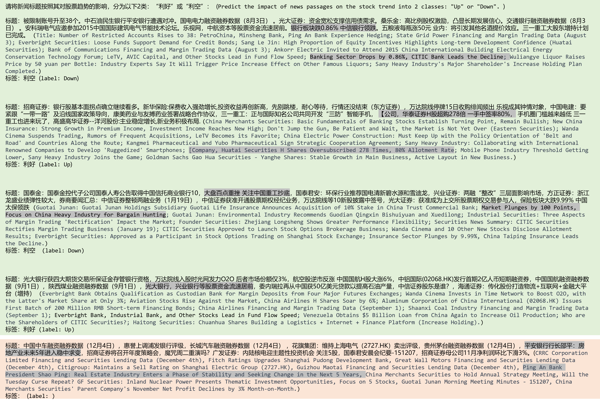

# 利用大型语言模型提升少量样本下的股票趋势预测能力

发布时间：2024年07月12日

`LLM应用`

> Enhancing Few-Shot Stock Trend Prediction with Large Language Models

# 摘要

> 股票趋势预测旨在预见市场未来走向，助力明智投资。传统方法依赖大量标注数据，但人工标注成本高昂且数据难求。借鉴大型语言模型（LLM）的少样本学习能力，我们提出在少样本场景下利用LLM，以缓解标签数据稀缺问题，使预测更贴近投资者需求。过往研究常合并财经新闻进行预测，这给LLM应用带来两大难题：新闻合并带来的噪音和输入限制导致的性能下降。为此，我们创新提出“去噪然后投票”的两步策略：首先引入“无关”类别，对单条新闻进行趋势预测，再通过多数投票整合预测结果。此法两大亮点：一是剔除噪音新闻对预测的干扰，二是规避LLM输入长度限制。实测显示，我们的方法在S&P 500、CSI-100及香港股市预测中准确率分别达66.59%、62.17%和61.17%，较传统少样本方法提升显著，且与顶尖监督方法不相上下。

> The goal of stock trend prediction is to forecast future market movements for informed investment decisions. Existing methods mostly focus on predicting stock trends with supervised models trained on extensive annotated data. However, human annotation can be resource-intensive and the annotated data are not readily available. Inspired by the impressive few-shot capability of Large Language Models (LLMs), we propose using LLMs in a few-shot setting to overcome the scarcity of labeled data and make prediction more feasible to investors. Previous works typically merge multiple financial news for predicting stock trends, causing two significant problems when using LLMs: (1) Merged news contains noise, and (2) it may exceed LLMs' input limits, leading to performance degradation. To overcome these issues, we propose a two-step method 'denoising-then-voting'. Specifically, we introduce an `Irrelevant' category, and predict stock trends for individual news instead of merged news. Then we aggregate these predictions using majority voting. The proposed method offers two advantages: (1) Classifying noisy news as irrelevant removes its impact on the final prediction. (2) Predicting for individual news mitigates LLMs' input length limits. Our method achieves 66.59% accuracy in S&P 500, 62.17% in CSI-100, and 61.17% in HK stock prediction, outperforming the standard few-shot counterparts by around 7%, 4%, and 4%. Furthermore, our proposed method performs on par with state-of-the-art supervised methods.

[Arxiv](https://arxiv.org/abs/2407.09003)