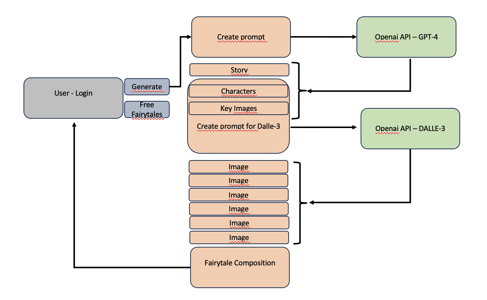

# FairyLandAI：借助 ChatGPT 与 DALLE-3，打造专属童话世界

发布时间：2024年07月12日

`LLM应用`

> FairyLandAI: Personalized Fairy Tales utilizing ChatGPT and DALLE-3

# 摘要

> 在AI叙事的丰富世界中，我们有机会通过定制和个性化的故事吸引年轻观众。本文介绍的FairyLandAI，是一款通过OpenAI的API精心打造的大型语言模型，专为儿童创作个性化童话。FairyLandAI的独特之处在于其双重功能：它不仅能生成适合儿童年龄、反映多元文化的引人故事，还能自动生成激发高级图像工具如GenAI和Dalle-3创造力的提示，从而丰富叙事体验。该模型特别设计，以契合儿童的想象世界，提供既寓教于乐又符合不同年龄道德观的叙事。其独特之处在于根据儿童的个人喜好和文化背景定制故事，开启了个性化叙事的新篇章。同时，它与图像生成技术的结合，为儿童提供了全面的叙事体验，激发他们的语言和视觉创造力。实证研究表明，FairyLandAI能有效创作出既娱乐又富含多元文化价值观的故事。对于家长和教育者而言，FairyLandAI是一个宝贵的工具，帮助他们通过吸引人的故事传递深刻的道德教育。该模型标志着利用LLM，特别是通过OpenAI的API，进行教育和文化提升的创新步伐，使复杂的道德叙事对年轻、富有想象力的儿童变得既易懂又享受。

> In the diverse world of AI-driven storytelling, there is a unique opportunity to engage young audiences with customized, and personalized narratives. This paper introduces FairyLandAI an innovative Large Language Model (LLM) developed through OpenAI's API, specifically crafted to create personalized fairytales for children. The distinctive feature of FairyLandAI is its dual capability: it not only generates stories that are engaging, age-appropriate, and reflective of various traditions but also autonomously produces imaginative prompts suitable for advanced image generation tools like GenAI and Dalle-3, thereby enriching the storytelling experience. FairyLandAI is expertly tailored to resonate with the imaginative worlds of children, providing narratives that are both educational and entertaining and in alignment with the moral values inherent in different ages. Its unique strength lies in customizing stories to match individual children's preferences and cultural backgrounds, heralding a new era in personalized storytelling. Further, its integration with image generation technology offers a comprehensive narrative experience that stimulates both verbal and visual creativity. Empirical evaluations of FairyLandAI demonstrate its effectiveness in crafting captivating stories for children, which not only entertain but also embody the values and teachings of diverse traditions. This model serves as an invaluable tool for parents and educators, supporting them in imparting meaningful moral lessons through engaging narratives. FairyLandAI represents a pioneering step in using LLMs, particularly through OpenAI's API, for educational and cultural enrichment, making complex moral narratives accessible and enjoyable for young, imaginative minds.

[Arxiv](https://arxiv.org/abs/2407.09467)