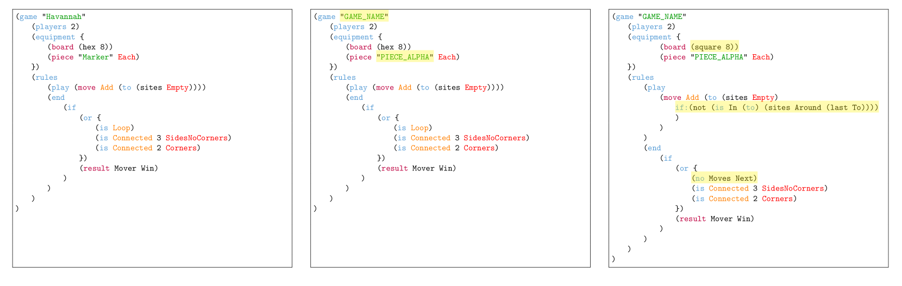

# GAVEL：借助进化与语言模型创造游戏

发布时间：2024年07月12日

`Agent` `游戏开发` `人工智能`

> GAVEL: Generating Games Via Evolution and Language Models

# 摘要

> 自动生成新颖有趣的游戏充满挑战，涉及规则表示、潜在游戏搜索及原创性与质量评估。过往研究多聚焦于有限规则并依赖特定领域启发。我们则利用Ludii游戏描述语言，涵盖千种棋盘游戏规则，结合大型语言模型与进化计算，训练智能变异与重组游戏机制的模型。实验证明，我们能创造新颖游戏，拓展规则空间边界，部分成果已在线开放体验。

> Automatically generating novel and interesting games is a complex task. Challenges include representing game rules in a computationally workable form, searching through the large space of potential games under most such representations, and accurately evaluating the originality and quality of previously unseen games. Prior work in automated game generation has largely focused on relatively restricted rule representations and relied on domain-specific heuristics. In this work, we explore the generation of novel games in the comparatively expansive Ludii game description language, which encodes the rules of over 1000 board games in a variety of styles and modes of play. We draw inspiration from recent advances in large language models and evolutionary computation in order to train a model that intelligently mutates and recombines games and mechanics expressed as code. We demonstrate both quantitatively and qualitatively that our approach is capable of generating new and interesting games, including in regions of the potential rules space not covered by existing games in the Ludii dataset. A sample of the generated games are available to play online through the Ludii portal.

[Arxiv](https://arxiv.org/abs/2407.09388)