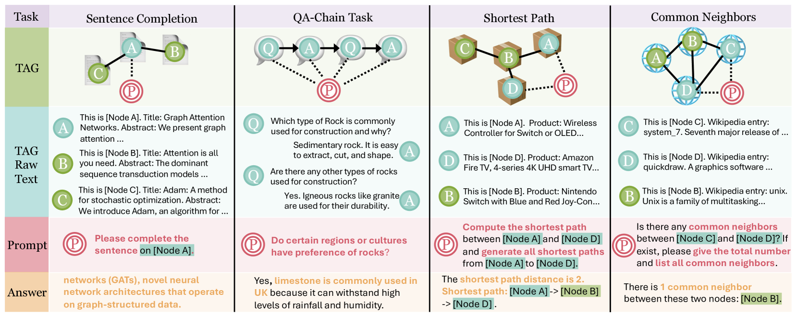
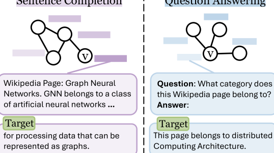
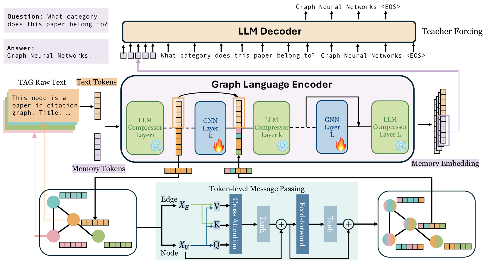
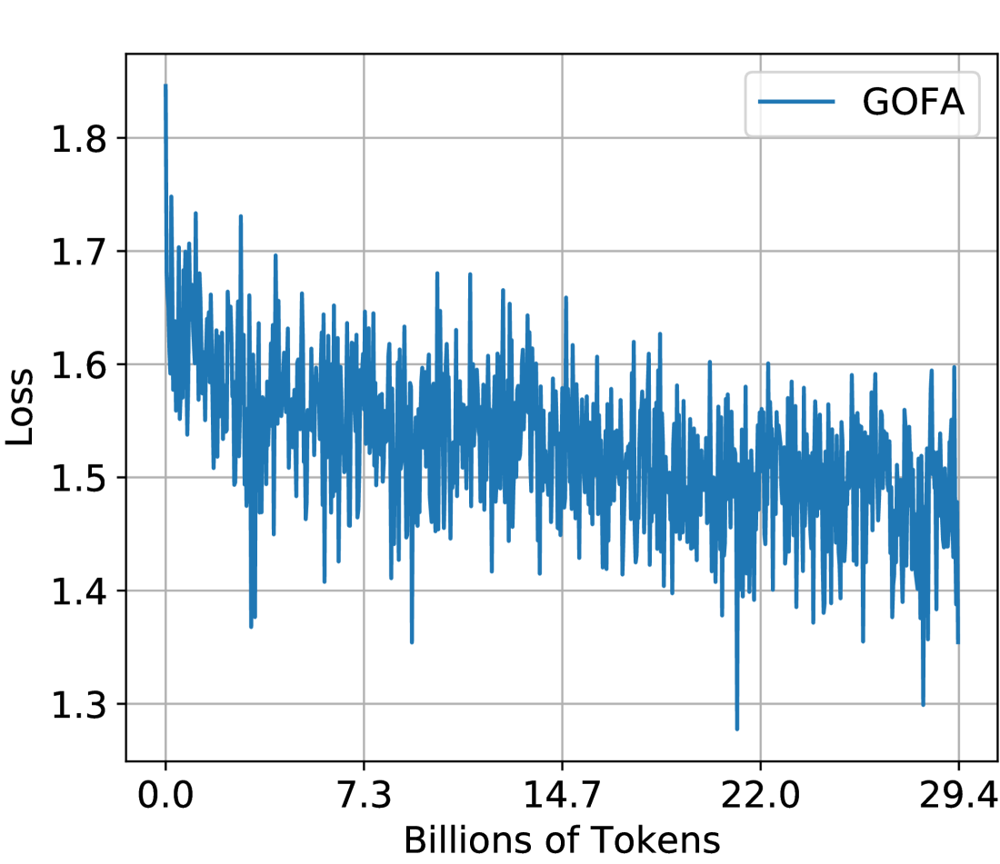
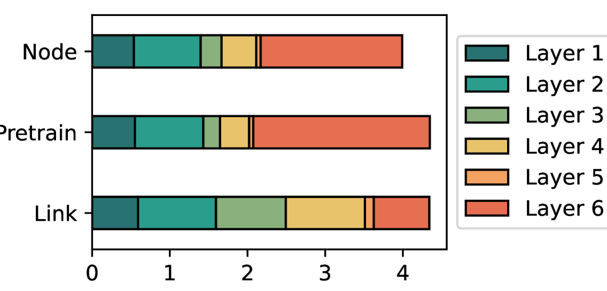

# GOFA：一款全能型生成模型，专为联合图语言建模设计。

发布时间：2024年07月12日

`LLM应用` `图数据` `人工智能`

> GOFA: A Generative One-For-All Model for Joint Graph Language Modeling

# 摘要

> 基础模型，如LLM和LVM，已成为各自领域的强大工具。然而，图数据的非结构化特性为开发GFM带来了挑战。现有方法要么将图数据转换为语言格式，要么依赖LLM辅助的GNN模型，但无法同时兼顾任务多样性和结构捕捉。本文提出GFM的三个关键属性：自监督预训练、任务适应性和图意识。为此，我们创新性地将语言建模扩展至图领域，并设计了GOFA模型，通过将GNN层与预训练LLM结合，实现了语义与结构的融合。GOFA在图级任务上预训练，并在下游任务上微调，展现了在零-shot场景中解决复杂问题的能力。代码已公开，供研究者参考。

> Foundation models, such as Large Language Models (LLMs) or Large Vision Models (LVMs), have emerged as one of the most powerful tools in the respective fields. However, unlike text and image data, graph data do not have a definitive structure, posing great challenges to developing a Graph Foundation Model (GFM). For example, current attempts at designing general graph models either transform graph data into a language format for LLM-based prediction or still train a GNN model with LLM as an assistant. The former can handle unlimited tasks, while the latter captures graph structure much better -- yet, no existing work can achieve both simultaneously. In this paper, we identify three key desirable properties of a GFM: self-supervised pretraining, fluidity in tasks, and graph awareness. To account for these properties, we extend the conventional language modeling to the graph domain and propose a novel generative graph language model GOFA to solve the problem. The model interleaves randomly initialized GNN layers into a frozen pre-trained LLM so that the semantic and structural modeling abilities are organically combined. GOFA is pre-trained on newly proposed graph-level next-word prediction, question-answering, and structural tasks to obtain the above GFM properties. The pre-trained model is further fine-tuned on downstream tasks to obtain task-solving ability. The fine-tuned model is evaluated on various downstream tasks, demonstrating a strong ability to solve structural and contextual problems in zero-shot scenarios. The code is available at https://github.com/JiaruiFeng/GOFA.

[Arxiv](https://arxiv.org/abs/2407.09709)