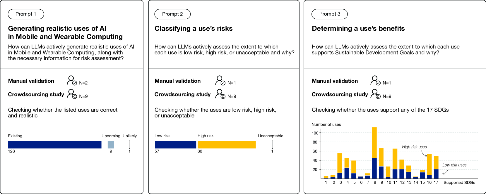
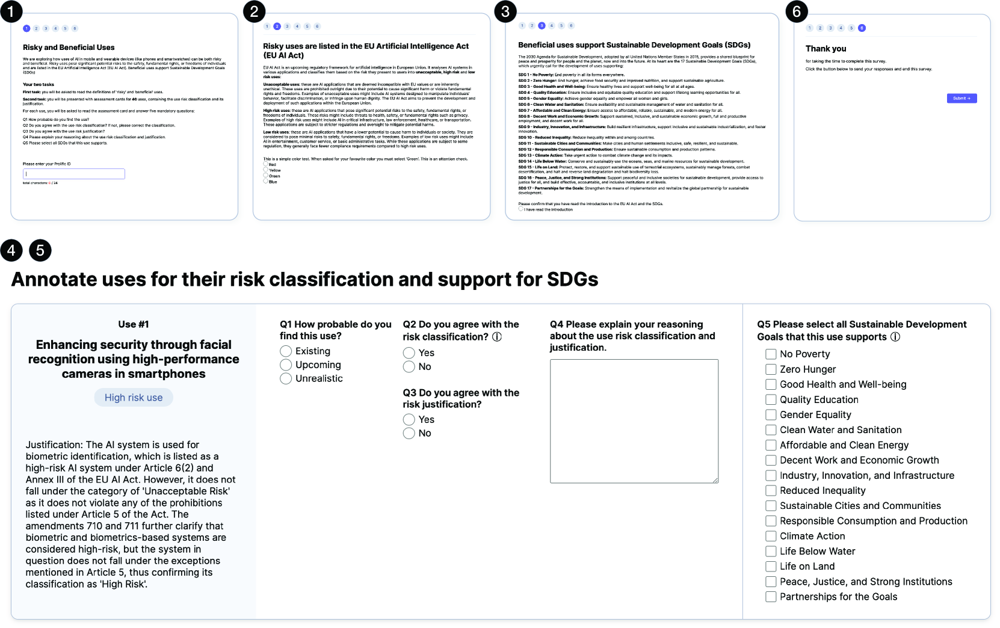
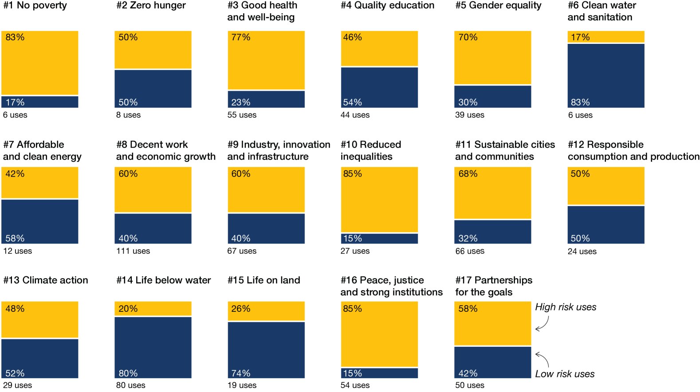
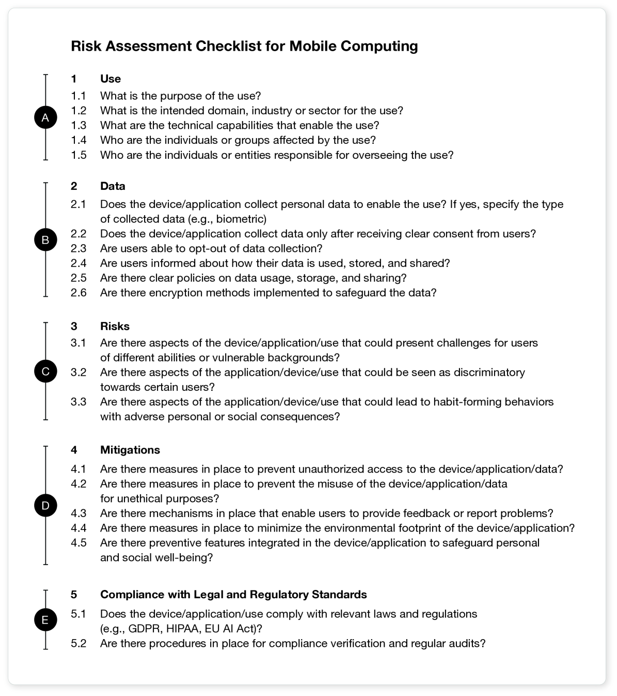

# 善意的创新，风险并存：评估 AI 在移动与穿戴设备中利弊的方法

发布时间：2024年07月12日

`LLM应用` `移动设备` `可穿戴设备`

> Good Intentions, Risky Inventions: A Method for Assessing the Risks and Benefits of AI in Mobile and Wearable Uses

# 摘要

> 将AI融入移动设备和可穿戴设备，不仅带来多重益处，也引发了对新兴风险的关切。传统的风险与利益评估零散且成本高昂。我们创新了一种半自动方法，借助LLMs识别AI应用，依据欧盟AI法案分类风险，并确保利益符合全球可持续发展目标。经移动与可穿戴技术、法律合规专家及法律背景人士的手动验证，该方法准确率超85%。我们揭示了移动计算在提升福祉、安全与社会平等方面潜力巨大，但这些应用也伴随着敏感数据、弱势群体与自动化决策的风险。为避免错失这些虽有风险但极具影响力的应用，我们为移动HCI社区设计了风险评估清单。

> Integrating Artificial Intelligence (AI) into mobile and wearables offers numerous benefits at individual, societal, and environmental levels. Yet, it also spotlights concerns over emerging risks. Traditional assessments of risks and benefits have been sporadic, and often require costly expert analysis. We developed a semi-automatic method that leverages Large Language Models (LLMs) to identify AI uses in mobile and wearables, classify their risks based on the EU AI Act, and determine their benefits that align with globally recognized long-term sustainable development goals; a manual validation of our method by two experts in mobile and wearable technologies, a legal and compliance expert, and a cohort of nine individuals with legal backgrounds who were recruited from Prolific, confirmed its accuracy to be over 85\%. We uncovered that specific applications of mobile computing hold significant potential in improving well-being, safety, and social equality. However, these promising uses are linked to risks involving sensitive data, vulnerable groups, and automated decision-making. To avoid rejecting these risky yet impactful mobile and wearable uses, we propose a risk assessment checklist for the Mobile HCI community.

[Arxiv](https://arxiv.org/abs/2407.09322)