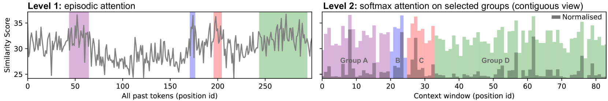
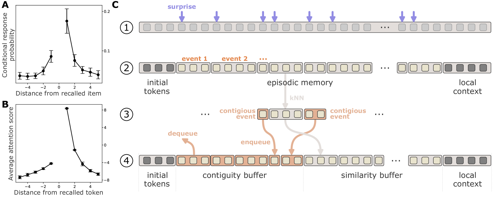
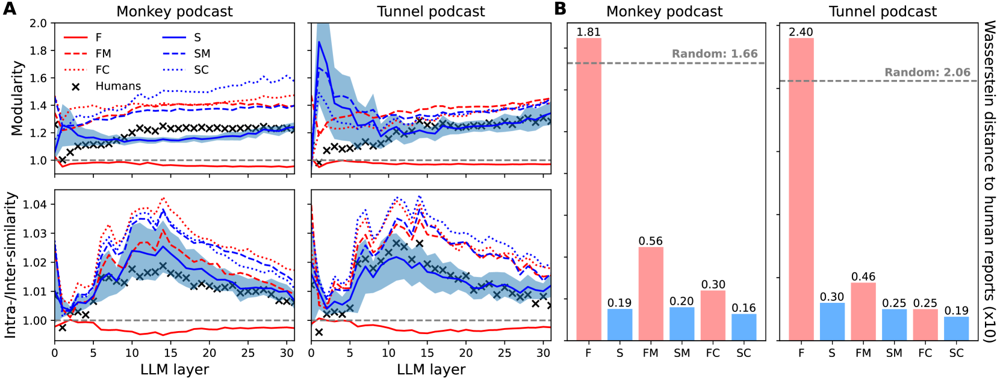
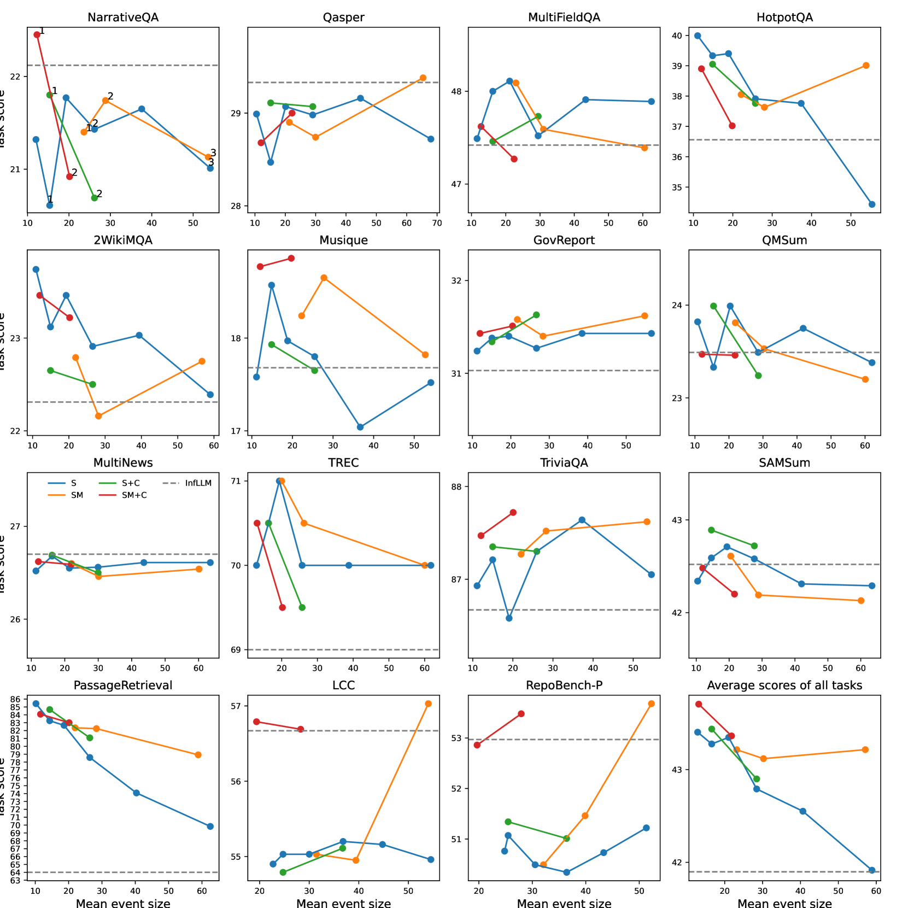
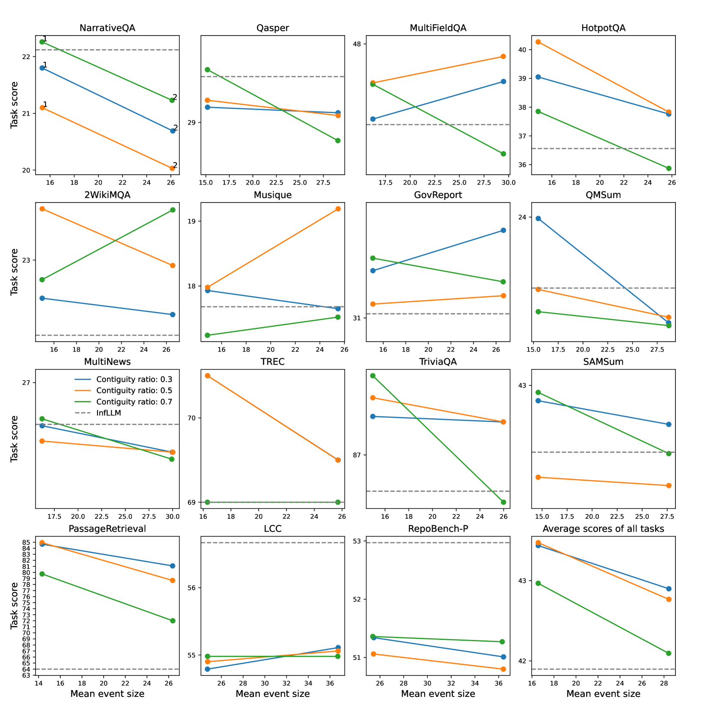

# 为无限上下文 LLM 设计类人情节记忆

发布时间：2024年07月12日

`LLM应用` `人工智能` `认知科学`

> Human-like Episodic Memory for Infinite Context LLMs

# 摘要

> 尽管大型语言模型 (LLM) 展现了卓越能力，但在处理广泛上下文时仍显不足，影响了长序列的连贯性与准确性。相比之下，人脑在组织和检索一生中的情节体验方面表现出色。为此，我们提出了 EM-LLM，一种创新方法，将人类情节记忆与事件认知融入 LLM，使其能高效处理无限长度的上下文。EM-LLM 利用贝叶斯惊奇与图论边界细化在线组织令牌序列为连贯情节事件，并通过两阶段记忆过程，结合相似性与时间连续性检索，实现类人高效信息访问。实验表明，EM-LLM 在 LongBench 数据集上超越了 InfLLM 模型，总体性能提升 4.3%，尤其在 PassageRetrieval 任务上提高了 33%。分析还显示，EM-LLM 的事件分割与人类感知高度一致，架起了人工与生物系统的桥梁。此研究不仅增强了 LLM 的上下文处理能力，还为探索人类记忆机制提供了计算框架，推动了 AI 与认知科学的交叉研究。

> Large language models (LLMs) have shown remarkable capabilities, but still struggle with processing extensive contexts, limiting their ability to maintain coherence and accuracy over long sequences. In contrast, the human brain excels at organising and retrieving episodic experiences across vast temporal scales, spanning a lifetime. In this work, we introduce EM-LLM, a novel approach that integrates key aspects of human episodic memory and event cognition into LLMs, enabling them to effectively handle practically infinite context lengths while maintaining computational efficiency. EM-LLM organises sequences of tokens into coherent episodic events using a combination of Bayesian surprise and graph-theoretic boundary refinement in an on-line fashion. When needed, these events are retrieved through a two-stage memory process, combining similarity-based and temporally contiguous retrieval for efficient and human-like access to relevant information. Experiments on the LongBench dataset demonstrate EM-LLM's superior performance, outperforming the state-of-the-art InfLLM model with an overall relative improvement of 4.3% across various tasks, including a 33% improvement on the PassageRetrieval task. Furthermore, our analysis reveals strong correlations between EM-LLM's event segmentation and human-perceived events, suggesting a bridge between this artificial system and its biological counterpart. This work not only advances LLM capabilities in processing extended contexts but also provides a computational framework for exploring human memory mechanisms, opening new avenues for interdisciplinary research in AI and cognitive science.

[Arxiv](https://arxiv.org/abs/2407.09450)