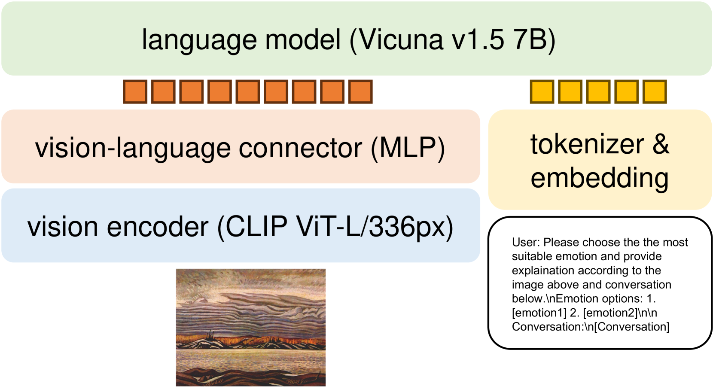

# ICCV23 视觉对话情感解释挑战：SEU_309 团队技术报告

发布时间：2024年07月12日

`RAG` `人工智能`

> ICCV23 Visual-Dialog Emotion Explanation Challenge: SEU_309 Team Technical Report

# 摘要

> 我们通过结合尖端的多模态技术，如语言模型和大型视觉语言模型，在基于视觉对话的情感解释生成挑战中脱颖而出。这一创新方法不仅超越了行业标准，更在ICCV23挑战赛中荣登榜首，成为视觉与语言闭环研讨会（CLCV）的亮点。在F1和BLEU评分上的显著成绩，证明了我们方法在精准捕捉艺术情感方面的非凡实力，深化了我们对艺术情感表达的理解。

> The Visual-Dialog Based Emotion Explanation Generation Challenge focuses on generating emotion explanations through visual-dialog interactions in art discussions. Our approach combines state-of-the-art multi-modal models, including Language Model (LM) and Large Vision Language Model (LVLM), to achieve superior performance. By leveraging these models, we outperform existing benchmarks, securing the top rank in the ICCV23 Visual-Dialog Based Emotion Explanation Generation Challenge, which is part of the 5th Workshop On Closing The Loop Between Vision And Language (CLCV) with significant scores in F1 and BLEU metrics. Our method demonstrates exceptional ability in generating accurate emotion explanations, advancing our understanding of emotional impacts in art.

[Arxiv](https://arxiv.org/abs/2407.09760)