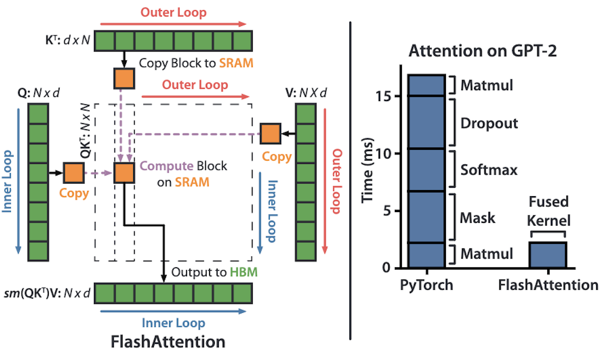
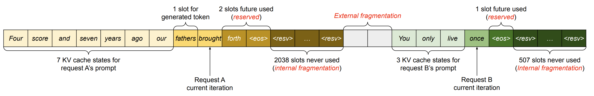
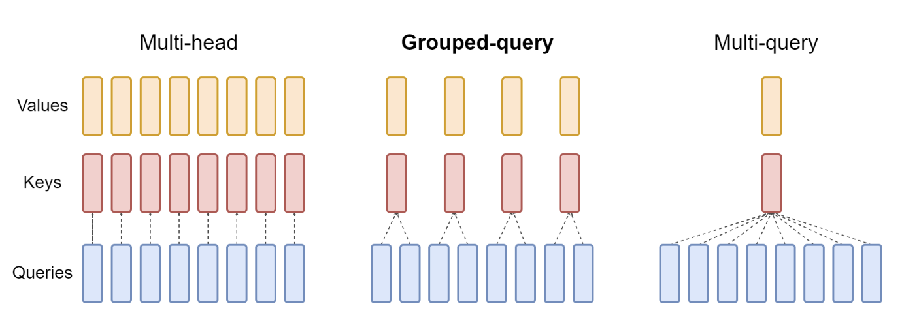
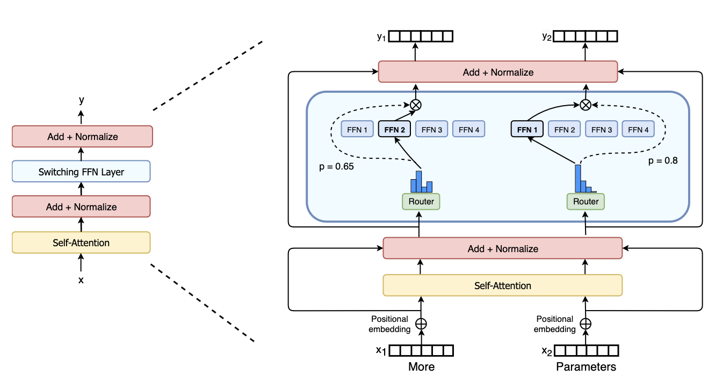
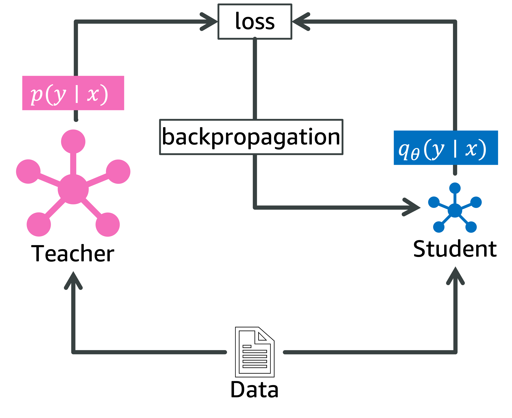

# AI加速器上基础模型的推理优化

发布时间：2024年07月12日

`LLM应用` `人工智能` `计算机硬件`

> Inference Optimization of Foundation Models on AI Accelerators

# 摘要

> Transformer架构的大型语言模型（LLMs）等强大基础模型，已引领生成式AI进入各行业的新时代。基于这些模型的应用层出不穷，涵盖问答、客户服务、图像视频生成及代码补全等。但模型参数激增至数千亿，导致实际部署成本高昂、延迟显著。因此，高效利用AI加速器进行快速推理的需求日益迫切。本教程深入探讨AI加速器在推理优化中的应用，从Transformer基础架构与深度学习系统出发，详述快速内存高效注意力计算的优化策略，并展示其在加速器上的高效实现。此外，教程还剖析了加速Transformer推理的核心架构要素，并探讨了模型压缩与快速解码的多重策略。

> Powerful foundation models, including large language models (LLMs), with Transformer architectures have ushered in a new era of Generative AI across various industries. Industry and research community have witnessed a large number of new applications, based on those foundation models. Such applications include question and answer, customer services, image and video generation, and code completions, among others. However, as the number of model parameters reaches to hundreds of billions, their deployment incurs prohibitive inference costs and high latency in real-world scenarios. As a result, the demand for cost-effective and fast inference using AI accelerators is ever more higher. To this end, our tutorial offers a comprehensive discussion on complementary inference optimization techniques using AI accelerators. Beginning with an overview of basic Transformer architectures and deep learning system frameworks, we deep dive into system optimization techniques for fast and memory-efficient attention computations and discuss how they can be implemented efficiently on AI accelerators. Next, we describe architectural elements that are key for fast transformer inference. Finally, we examine various model compression and fast decoding strategies in the same context.

[Arxiv](https://arxiv.org/abs/2407.09111)