# 虚拟环境中，指令遵循与目标条件强化学习相结合

发布时间：2024年07月12日

`Agent` `人工智能`

> Instruction Following with Goal-Conditioned Reinforcement Learning in Virtual Environments

# 摘要

> 本研究旨在让AI代理在虚拟环境中顺利执行复杂语言指令。我们设计了一个分层框架，融合了大型语言模型的深度理解和强化学习代理的灵活行动能力。语言模块将指令转化为行动蓝图，由强化学习代理执行。我们在IGLU和Crafter两个环境中验证了这一方法的有效性，无论是构建结构还是执行任务与环境互动，均表现出色。

> In this study, we address the issue of enabling an artificial intelligence agent to execute complex language instructions within virtual environments. In our framework, we assume that these instructions involve intricate linguistic structures and multiple interdependent tasks that must be navigated successfully to achieve the desired outcomes. To effectively manage these complexities, we propose a hierarchical framework that combines the deep language comprehension of large language models with the adaptive action-execution capabilities of reinforcement learning agents. The language module (based on LLM) translates the language instruction into a high-level action plan, which is then executed by a pre-trained reinforcement learning agent. We have demonstrated the effectiveness of our approach in two different environments: in IGLU, where agents are instructed to build structures, and in Crafter, where agents perform tasks and interact with objects in the surrounding environment according to language commands.

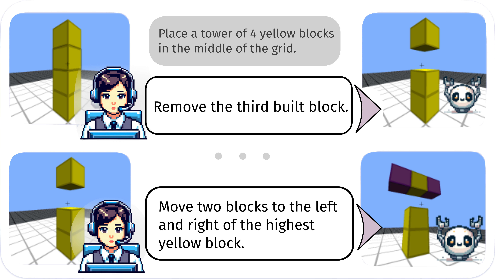

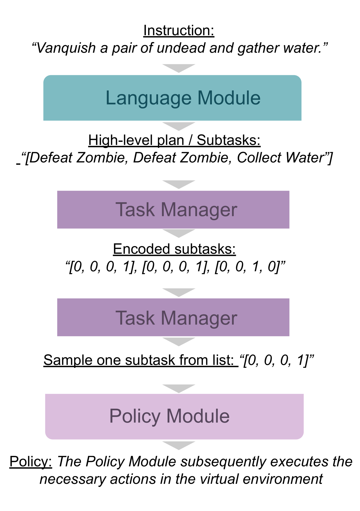

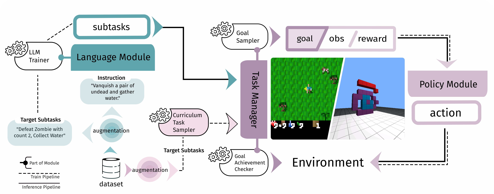

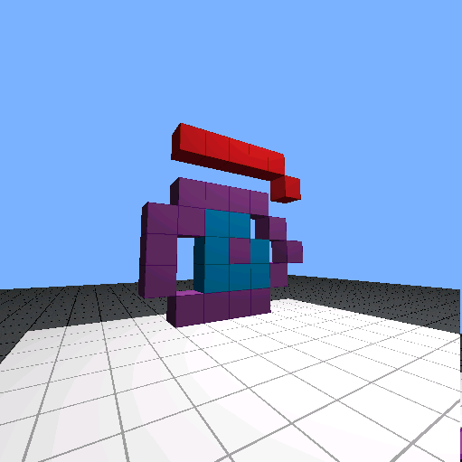

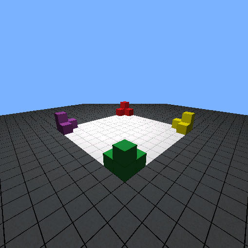

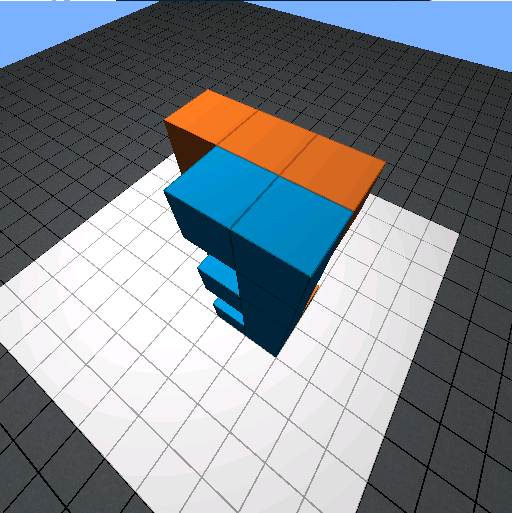

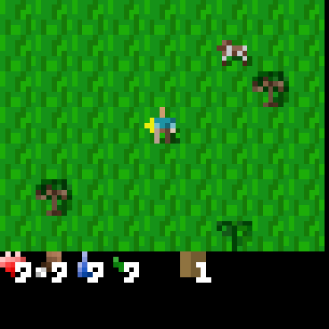

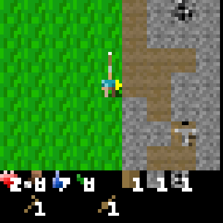

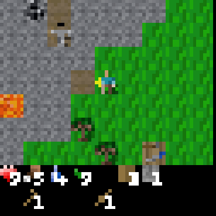

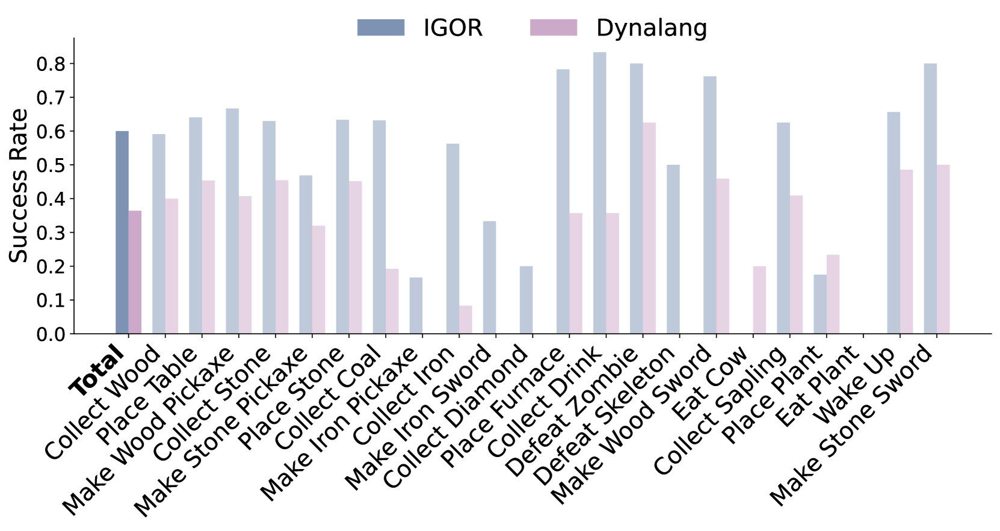

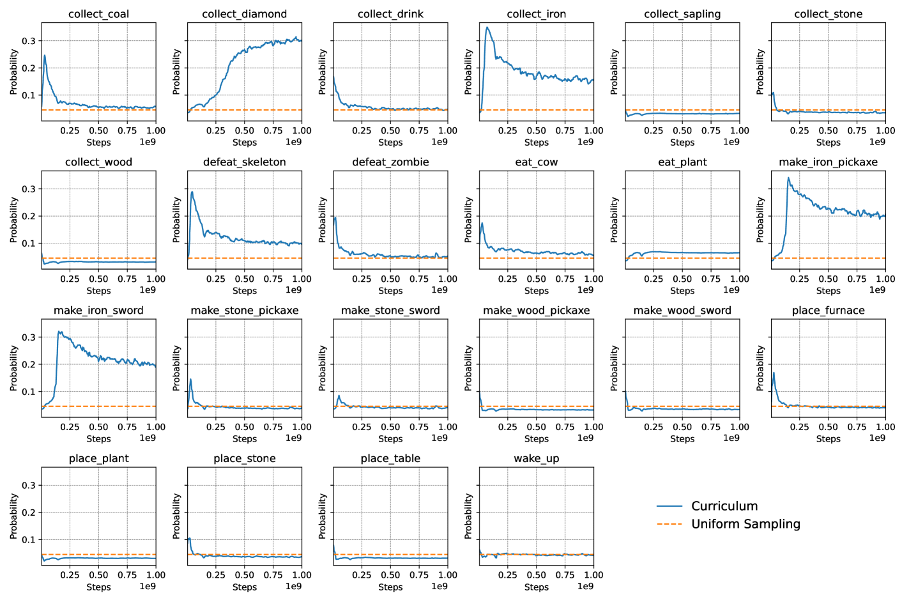

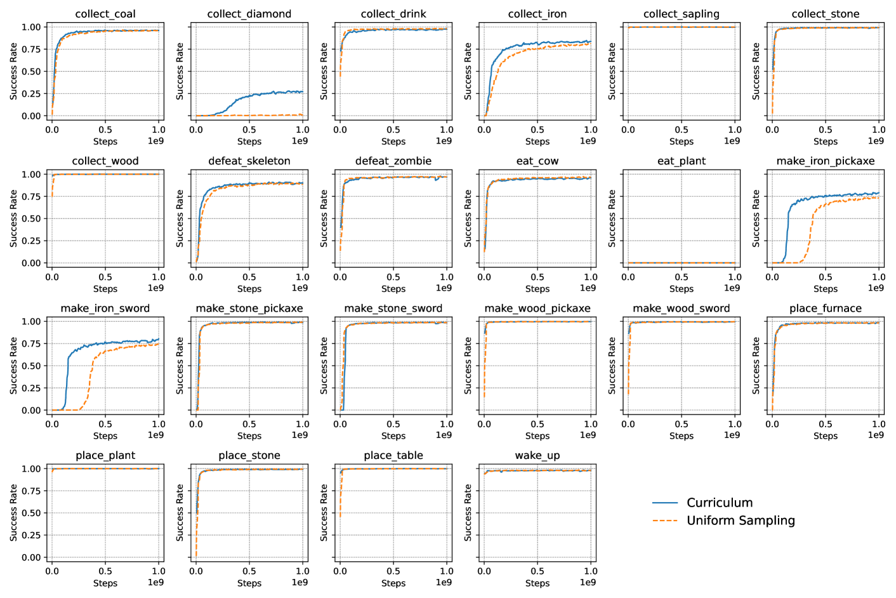

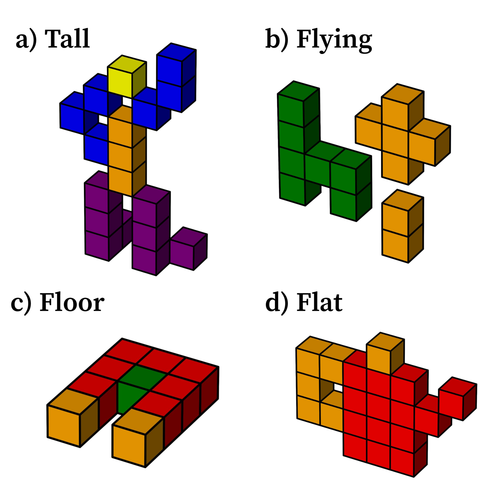

[Arxiv](https://arxiv.org/abs/2407.09287)