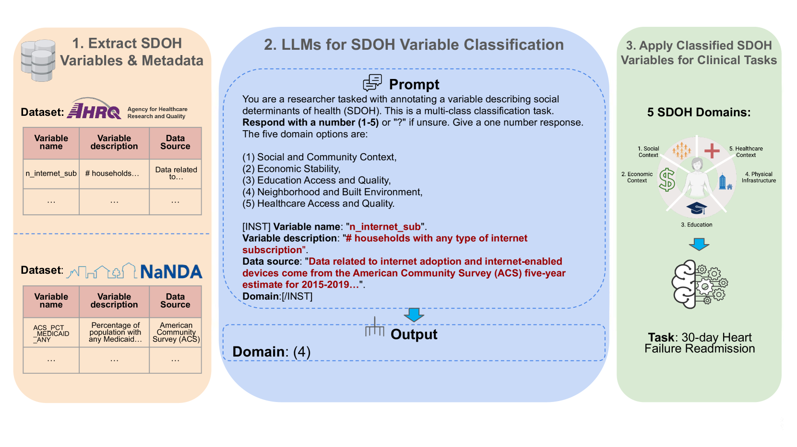

# 利用大型语言模型整合健康社会决定因素数据：心力衰竭30天再入院预测案例研究

发布时间：2024年07月12日

`LLM应用` `社会科学`

> Large Language Models for Integrating Social Determinant of Health Data: A Case Study on Heart Failure 30-Day Readmission Prediction

# 摘要

> 健康社会决定因素（SDOH）对健康结果有重要影响，但现有模型多仅使用SDOH的代理特征。开放数据倡议提供了构建更全面SDOH视图的机会，但随着数据量和多样性的增加，手动整合相关数据变得更具挑战性。大型语言模型（LLMs）在自动注释结构化数据方面显示出潜力。我们进行了一项端到端研究，评估LLMs整合SDOH数据的可行性及其在临床预测中的实用性。我们首先手动将700多个变量分类到五个SDOH语义类别，然后测试了9个开源LLMs的分类性能。接着，我们训练模型预测心力衰竭患者30天再入院，并比较了SDOH变量与标准临床变量的预测性能。此外，我们研究了少量样本提示对LLM注释性能的影响，并进行了元数据消融研究，以确定哪些信息有助于准确注释。研究发现，某些开源LLMs无需微调即可通过零-shot提示有效注释SDOH变量。当与标准临床特征结合时，LLM注释的邻里和建筑环境子集在预测心力衰竭患者30天再入院方面表现最佳。

> Social determinants of health (SDOH) $-$ the myriad of circumstances in which people live, grow, and age $-$ play an important role in health outcomes. However, existing outcome prediction models often only use proxies of SDOH as features. Recent open data initiatives present an opportunity to construct a more comprehensive view of SDOH, but manually integrating the most relevant data for individual patients becomes increasingly challenging as the volume and diversity of public SDOH data grows. Large language models (LLMs) have shown promise at automatically annotating structured data. Here, we conduct an end-to-end case study evaluating the feasibility of using LLMs to integrate SDOH data, and the utility of these SDOH features for clinical prediction. We first manually label 700+ variables from two publicly-accessible SDOH data sources to one of five semantic SDOH categories. Then, we benchmark performance of 9 open-source LLMs on this classification task. Finally, we train ML models to predict 30-day hospital readmission among 39k heart failure (HF) patients, and we compare the prediction performance of the categorized SDOH variables with standard clinical variables. Additionally, we investigate the impact of few-shot LLM prompting on LLM annotation performance, and perform a metadata ablation study on prompts to evaluate which information helps LLMs accurately annotate these variables. We find that some open-source LLMs can effectively, accurately annotate SDOH variables with zero-shot prompting without the need for fine-tuning. Crucially, when combined with standard clinical features, the LLM-annotated Neighborhood and Built Environment subset of the SDOH variables shows the best performance predicting 30-day readmission of HF patients.

[Arxiv](https://arxiv.org/abs/2407.09688)