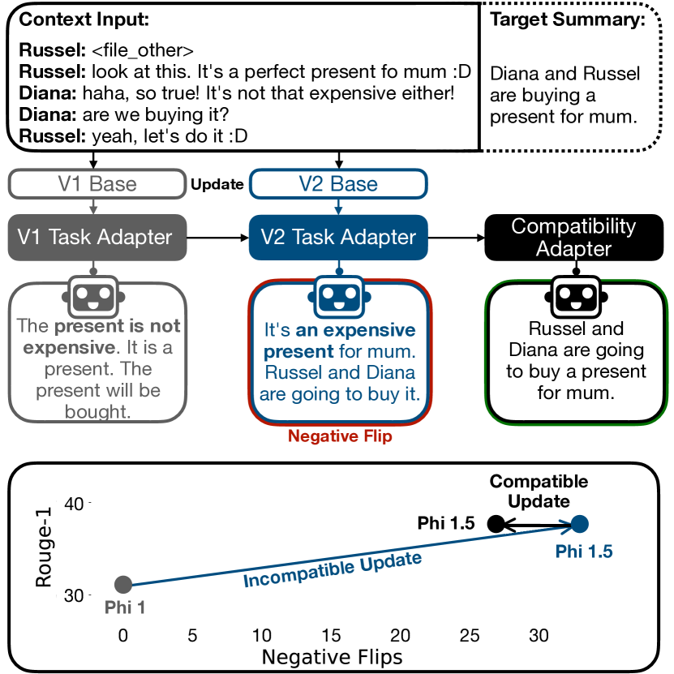
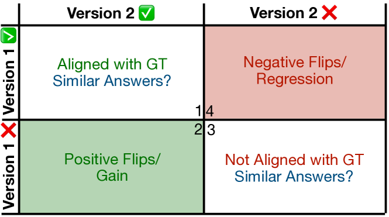
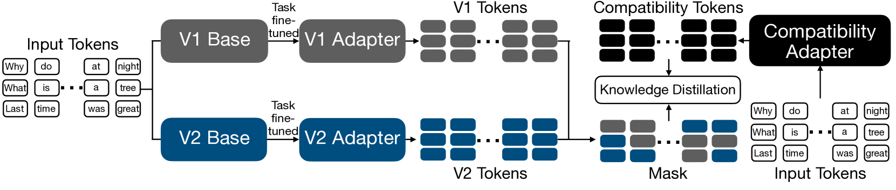
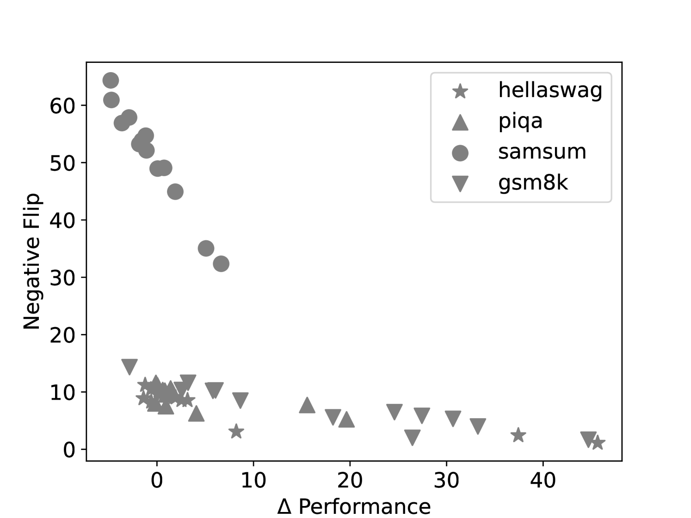
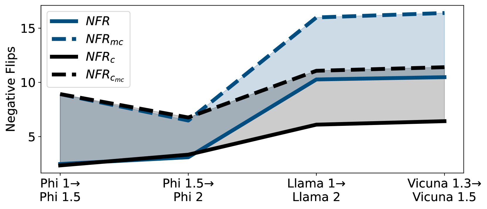

# MUSCLE：一种促进 LLM 兼容进化的模型更新策略

发布时间：2024年07月12日

`LLM理论` `软件开发` `人工智能`

> MUSCLE: A Model Update Strategy for Compatible LLM Evolution

# 摘要

> 大型语言模型 (LLM) 因数据或架构的改进而频繁更新，以提升性能。然而，开发者往往更注重提升性能指标，而忽视了与旧版本的兼容性。用户在与模型互动时会形成心理模型，每次更新都需调整，这可能导致不满。实际应用中，微调的下游任务模型依赖于预训练的 LLM 基础模型，更新后常出现实例回归或预测错误。我们的工作旨在通过两种方式实现无缝更新：首先，我们提供兼容性评估指标，特别针对生成任务；其次，我们提出训练策略，通过兼容性模型减少不一致性，从 Llama 1 到 Llama 2 减少高达 40% 的负面翻转。

> Large Language Models (LLMs) are frequently updated due to data or architecture changes to improve their performance. When updating models, developers often focus on increasing overall performance metrics with less emphasis on being compatible with previous model versions. However, users often build a mental model of the functionality and capabilities of a particular machine learning model they are interacting with. They have to adapt their mental model with every update -- a draining task that can lead to user dissatisfaction. In practice, fine-tuned downstream task adapters rely on pretrained LLM base models. When these base models are updated, these user-facing downstream task models experience instance regression or negative flips -- previously correct instances are now predicted incorrectly. This happens even when the downstream task training procedures remain identical. Our work aims to provide seamless model updates to a user in two ways. First, we provide evaluation metrics for a notion of compatibility to prior model versions, specifically for generative tasks but also applicable for discriminative tasks. We observe regression and inconsistencies between different model versions on a diverse set of tasks and model updates. Second, we propose a training strategy to minimize the number of inconsistencies in model updates, involving training of a compatibility model that can enhance task fine-tuned language models. We reduce negative flips -- instances where a prior model version was correct, but a new model incorrect -- by up to 40% from Llama 1 to Llama 2.

[Arxiv](https://arxiv.org/abs/2407.09435)