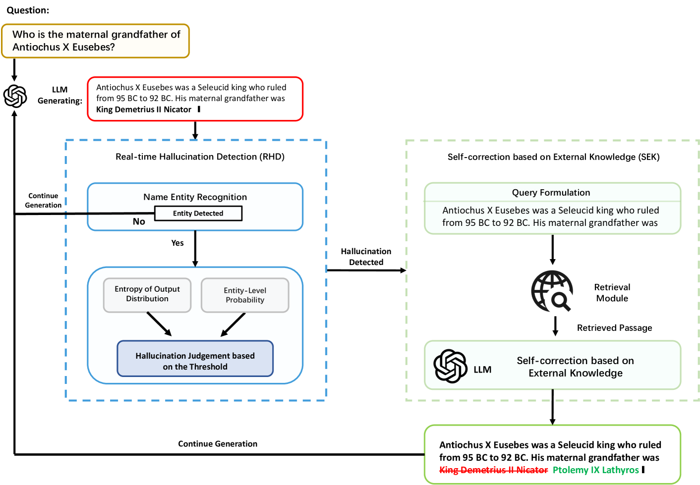
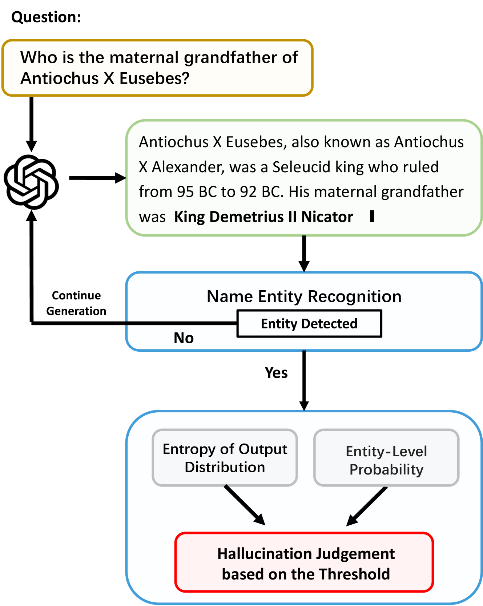
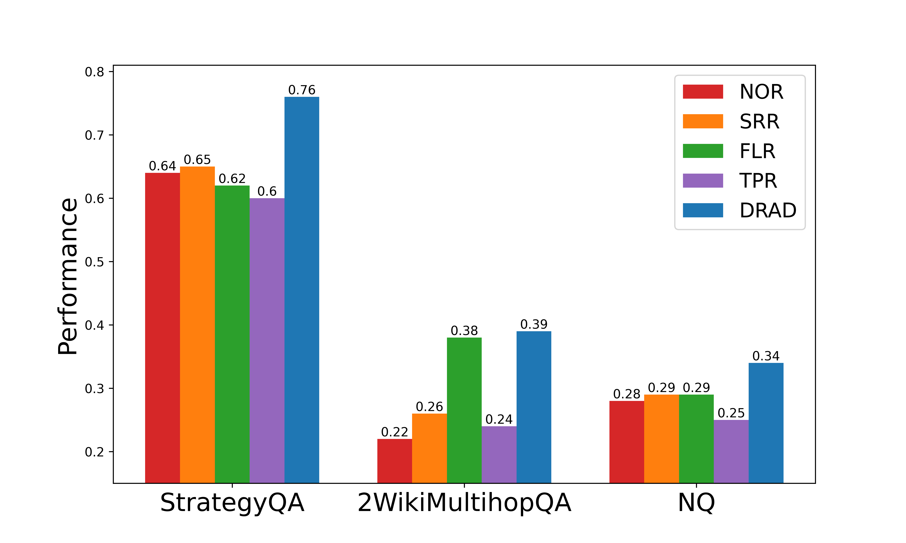

# 缓解大型语言模型中的实体级幻觉问题

发布时间：2024年07月12日

`LLM应用` `信息检索` `人工智能`

> Mitigating Entity-Level Hallucination in Large Language Models

# 摘要

> 随着大型语言模型 (LLM) 的兴起，用户获取信息的方式已从传统搜索引擎转向与 LLM 的直接问答交互。然而，LLM 的普及也暴露出一个严重问题——幻觉现象，即生成看似合理但事实错误的信息。这引发了用户对基于 LLM 的信息检索系统的疑虑。为此，本文提出了一种基于幻觉检测的动态检索增强方法 (DRAD)，旨在有效识别并修正 LLM 中的幻觉。DRAD 通过实时幻觉检测 (RHD) 和基于外部知识的自我修正 (SEK) 两大核心机制，动态优化检索过程，显著提升了幻觉检测与修正的效率。实验证明，DRAD 在这两方面均表现卓越。相关代码与数据已开源，详见 https://github.com/oneal2000/EntityHallucination。

> The emergence of Large Language Models (LLMs) has revolutionized how users access information, shifting from traditional search engines to direct question-and-answer interactions with LLMs. However, the widespread adoption of LLMs has revealed a significant challenge known as hallucination, wherein LLMs generate coherent yet factually inaccurate responses. This hallucination phenomenon has led to users' distrust in information retrieval systems based on LLMs. To tackle this challenge, this paper proposes Dynamic Retrieval Augmentation based on hallucination Detection (DRAD) as a novel method to detect and mitigate hallucinations in LLMs. DRAD improves upon traditional retrieval augmentation by dynamically adapting the retrieval process based on real-time hallucination detection. It features two main components: Real-time Hallucination Detection (RHD) for identifying potential hallucinations without external models, and Self-correction based on External Knowledge (SEK) for correcting these errors using external knowledge. Experiment results show that DRAD demonstrates superior performance in both detecting and mitigating hallucinations in LLMs. All of our code and data are open-sourced at https://github.com/oneal2000/EntityHallucination.

[Arxiv](https://arxiv.org/abs/2407.09417)