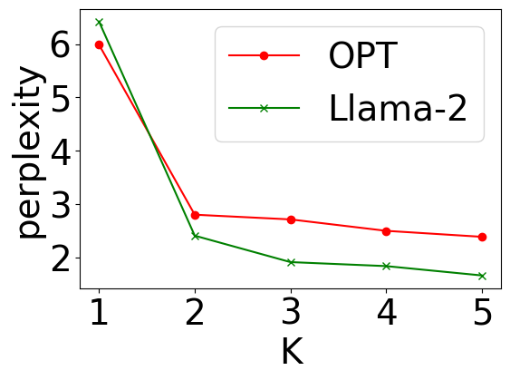
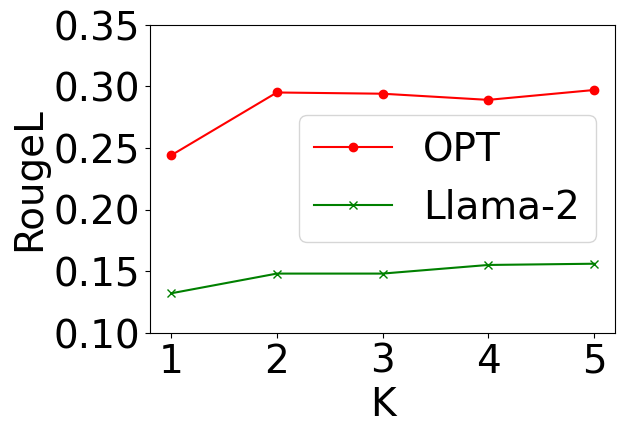
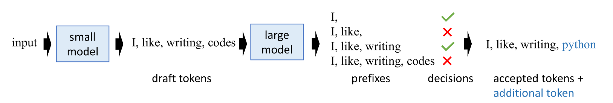
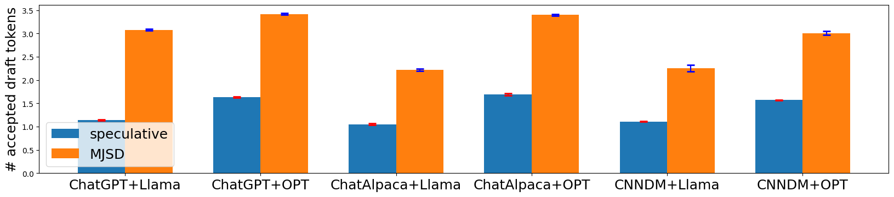
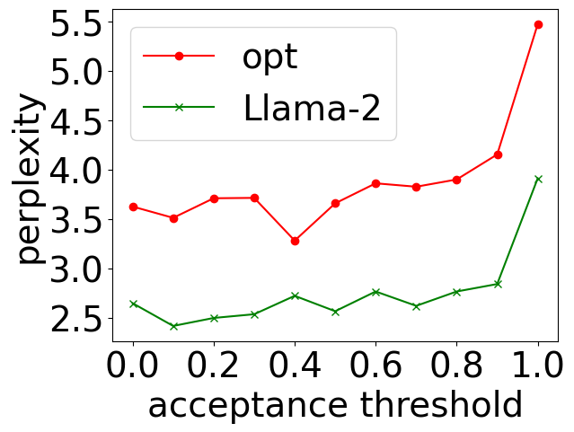
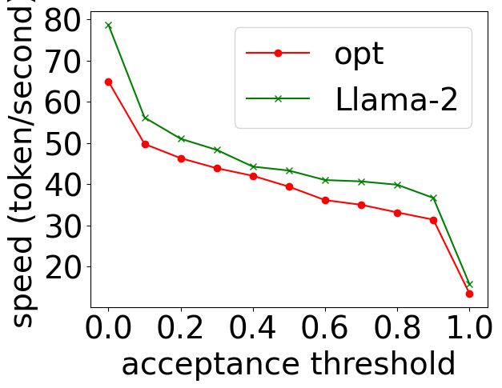

# 通过多令牌联合推测解码技术，我们旨在加速大型语言模型的推理过程。

发布时间：2024年07月12日

`LLM理论` `人工智能`

> Multi-Token Joint Speculative Decoding for Accelerating Large Language Model Inference

# 摘要

> 基于Transformer的LLM在多任务中展现了强大实力，但其推理过程耗时耗能。推测性解码通过小模型预提令牌，再由大模型批量验证，相比自回归解码，以更少运行次数生成等量令牌，提速1-2倍。然而，贪婪解码在输出质量上并非最优。为追求更高输出质量和效率，我们提出多令牌联合贪婪解码（MJGD），每步基于联合困惑度生成多令牌，提升整体输出质量。但MJGD计算成本过高。为此，我们创新多令牌联合推测性解码（MJSD），通过小模型近似大模型联合分布并验证，结合束解码加速序列生成。MJSD不仅近似MJGD，提升输出质量，还通过联合似然验证，优化令牌前缀选择，增强效率...

> Transformer-based Large language models (LLMs) have demonstrated their power in various tasks, but their inference incurs significant time and energy costs. To accelerate LLM inference, speculative decoding uses a smaller model to propose one sequence of tokens, which are subsequently validated in batch by the target large model. Compared with autoregressive decoding, speculative decoding generates the same number of tokens with fewer runs of the large model, hence accelerating the overall inference by $1$-$2\times$. However, greedy decoding is not the optimal decoding algorithm in terms of output perplexity, which is a direct measurement of the effectiveness of a decoding algorithm. An algorithm that has better output perplexity and even better efficiency than speculative decoding can be more useful in practice. To achieve this seemingly contradictory goal, we first introduce multi-token joint greedy decoding (MJGD), which greedily generates multiple tokens at each step based on their joint perplexity. We show that it leads to better perplexity for the whole output. But the computation cost of MJGD is infeasible in practice. So we further propose multi-token joint speculative decoding (MJSD), which approximates and accelerates the MJGD from two aspects: it approximates the joint distribution of the large model with that of a small model, and uses a verification step to guarantee the accuracy of approximation; then it uses beam decoding to accelerate the sequence generation from the joint distribution. Compared with vanilla speculative decoding, MJSD has two advantages: (1) it is an approximation of MJGD, thus achieving better output perplexity; (2) verification with joint likelihood allows it to accept the longest prefix sub-sequence of the draft tokens with valid perplexity, leading to better efficiency...

[Arxiv](https://arxiv.org/abs/2407.09722)