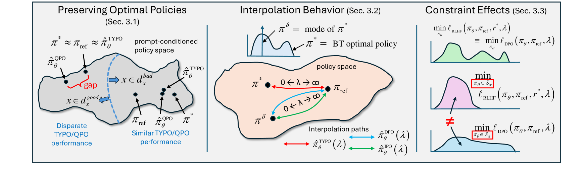
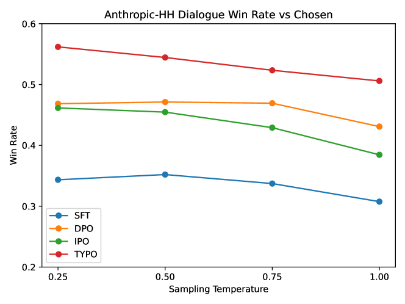

# 直接偏好优化的新要求

发布时间：2024年07月12日

`LLM理论` `人工智能` `机器学习`

> New Desiderata for Direct Preference Optimization

# 摘要

> 过去，大型语言模型常借助人类反馈的强化学习（RLHF）来调整输出以符合人类偏好。但RLHF实施中的不稳定性促使近期采用重新参数化技术，避免独立学习奖励模型，而是通过简化训练目标直接优化人类偏好，即直接偏好优化（DPO）。尽管DPO在某些场景中表现出色，我们提出的新评估标准揭示了其在融合预训练模型与人类偏好间的不足，以及在响应质量和约束处理上的权衡。基于这些洞察，我们设计了一种改进的DPO式损失函数，有效缓解了上述问题，并通过实证验证了其优势。

> Large language models in the past have typically relied on some form of reinforcement learning with human feedback (RLHF) to better align model responses with human preferences. However, because of oft-observed instabilities when implementing these RLHF pipelines, various reparameterization techniques have recently been introduced to sidestep the need for separately learning an RL reward model. Instead, directly fine-tuning for human preferences is achieved via the minimization of a single closed-form training objective, a process originally referred to as direct preference optimization (DPO) and followed by several notable descendants. Although effective in certain real-world settings, we introduce new evaluation criteria that serve to highlight unresolved shortcomings in the ability of existing DPO methods to interpolate between a pre-trained reference model and empirical measures of human preferences, as well as unavoidable trade-offs in how low- and high-quality responses are regularized and constraints are handled. Our insights then motivate an alternative DPO-like loss that provably mitigates these limitations. Empirical results serve to corroborate notable aspects of our analyses.

[Arxiv](https://arxiv.org/abs/2407.09072)