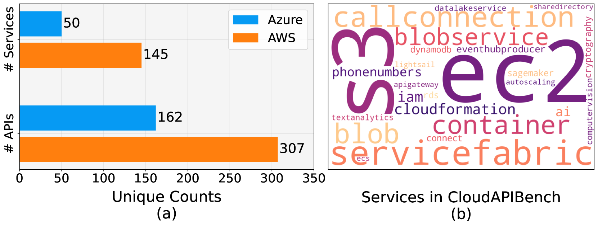
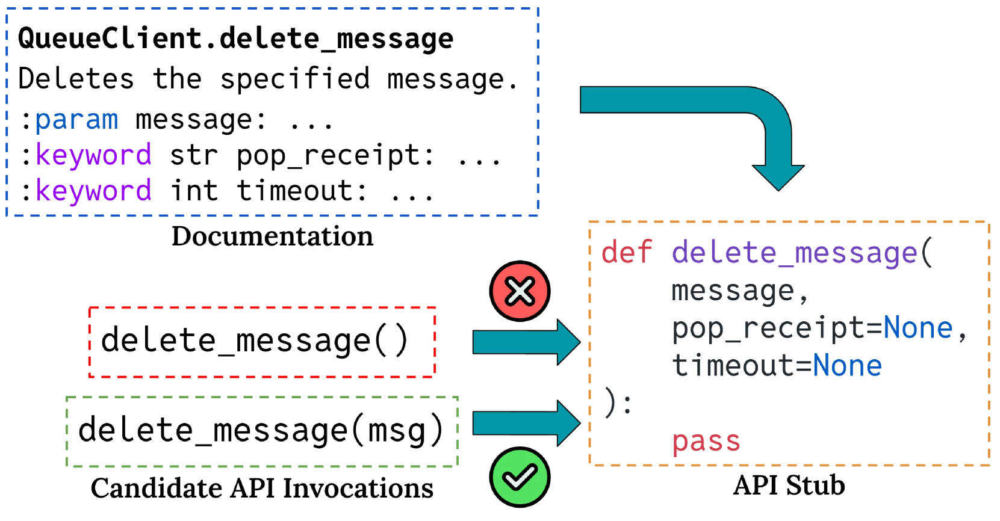
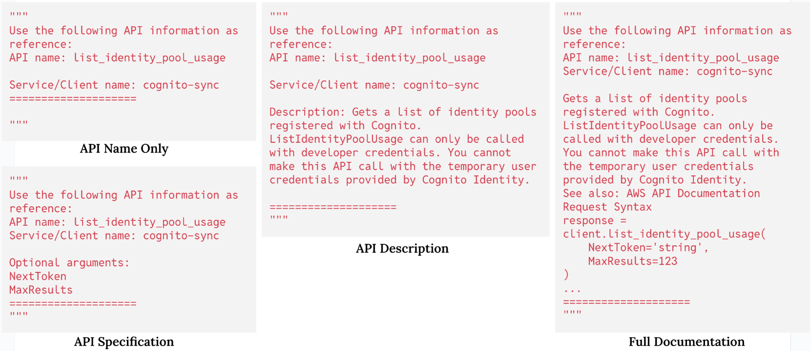

# 利用 API 文档减轻代码 LLM 的幻觉问题

发布时间：2024年07月12日

`LLM应用` `软件工程` `人工智能`

> On Mitigating Code LLM Hallucinations with API Documentation

# 摘要

> 本研究聚焦于软件工程中的API幻觉问题，并推出了CloudAPIBench基准，用于量化API幻觉现象。该基准还提供了公共领域API频率的详细注释，助力我们在不同频率层面深入探究API幻觉。研究发现，代码LLM在处理低频API时表现不佳，如GPT-4o仅能实现38.58%的有效调用。通过引入文档增强生成（DAG），我们显著提升了低频API的性能至47.94%，但若检索器选择不当，高频API性能会大幅下降39.02%。为此，我们提出智能触发DAG策略，通过API索引或LLM置信度分数进行精准检索，以平衡高低频API性能，最终实现更可靠的API调用，GPT-4o在CloudAPIBench上的性能提升了8.20%。

> In this study, we address the issue of API hallucinations in various software engineering contexts. We introduce CloudAPIBench, a new benchmark designed to measure API hallucination occurrences. CloudAPIBench also provides annotations for frequencies of API occurrences in the public domain, allowing us to study API hallucinations at various frequency levels. Our findings reveal that Code LLMs struggle with low frequency APIs: for e.g., GPT-4o achieves only 38.58% valid low frequency API invocations. We demonstrate that Documentation Augmented Generation (DAG) significantly improves performance for low frequency APIs (increase to 47.94% with DAG) but negatively impacts high frequency APIs when using sub-optimal retrievers (a 39.02% absolute drop). To mitigate this, we propose to intelligently trigger DAG where we check against an API index or leverage Code LLMs' confidence scores to retrieve only when needed. We demonstrate that our proposed methods enhance the balance between low and high frequency API performance, resulting in more reliable API invocations (8.20% absolute improvement on CloudAPIBench for GPT-4o).

[Arxiv](https://arxiv.org/abs/2407.09726)