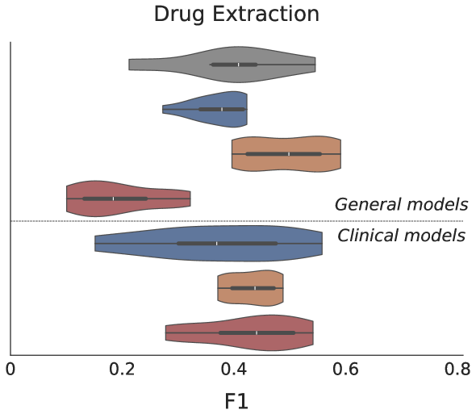
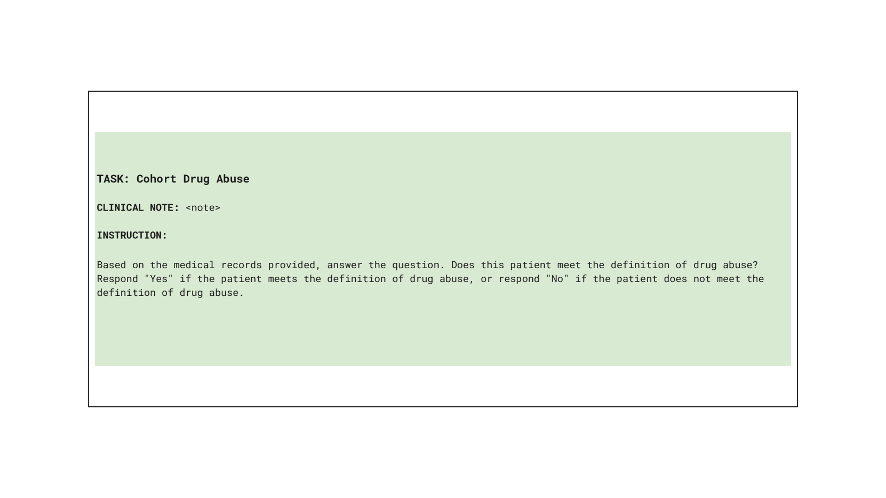
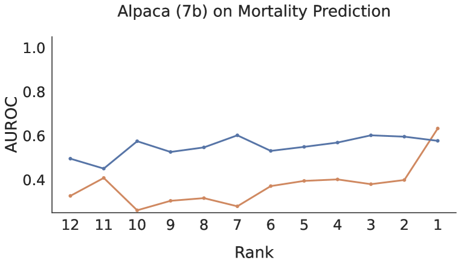

# 临床大型语言模型对指令的表述方式颇为敏感。

发布时间：2024年07月12日

`LLM应用` `人工智能`

> Open (Clinical) LLMs are Sensitive to Instruction Phrasings

# 摘要

> 指令调整的 LLM 虽能执行多样任务，但对其指令的表述极为敏感。在医疗领域，这一问题尤为突出，因为临床医生通常不具备设计精准指令的技能，而错误输出的风险在此领域尤为严重。  我们面临的实际问题是：这些模型对临床任务指令的自然变化有多强的适应性？我们收集了来自医生们的各种任务提示，并评估了七种 LLM（包括通用与专业模型）对自然指令表述的敏感度。结果显示，所有模型的性能差异显著，且令人意外的是，那些专门针对临床数据训练的模型尤为脆弱，相比之下，通用模型表现更为稳健。此外，指令表述的微小差异也可能影响模型的公平性，例如，针对死亡率预测的不同但合理的指令，不仅在整体性能上有所差异，还可能导致不同群体间的结果偏差。

> Instruction-tuned Large Language Models (LLMs) can perform a wide range of tasks given natural language instructions to do so, but they are sensitive to how such instructions are phrased. This issue is especially concerning in healthcare, as clinicians are unlikely to be experienced prompt engineers and the potential consequences of inaccurate outputs are heightened in this domain.
  This raises a practical question: How robust are instruction-tuned LLMs to natural variations in the instructions provided for clinical NLP tasks? We collect prompts from medical doctors across a range of tasks and quantify the sensitivity of seven LLMs -- some general, others specialized -- to natural (i.e., non-adversarial) instruction phrasings. We find that performance varies substantially across all models, and that -- perhaps surprisingly -- domain-specific models explicitly trained on clinical data are especially brittle, compared to their general domain counterparts. Further, arbitrary phrasing differences can affect fairness, e.g., valid but distinct instructions for mortality prediction yield a range both in overall performance, and in terms of differences between demographic groups.

[Arxiv](https://arxiv.org/abs/2407.09429)