# 开放词汇多标签视频分类技术

发布时间：2024年07月12日

`LLM应用` `计算机视觉` `视频处理`

> Open Vocabulary Multi-Label Video Classification

# 摘要

> 预训练的视觉-语言模型（VLMs）在图像分类、目标检测等开放词汇计算机视觉任务中取得了显著进展。近期研究还将VLMs应用于视频中的开放词汇单标签动作分类。然而，在需要同时识别视频中多个动作和实体的全面视频理解方面，现有方法尚显不足。为此，我们提出了开放词汇多标签视频分类问题，并设计了一种方法，使预训练的VLM（如CLIP）能够适应这一挑战。我们借助大型语言模型（LLMs）为VLM提供类别标签的语义指导，以提升其开放词汇性能。具体来说，我们设计了一种端到端架构，引导LLM生成软属性，帮助CLIP文本编码器识别新类别；同时，我们为CLIP视觉编码器引入了时间建模模块，有效捕捉视频概念的时空动态，并通过一种新颖的正则化微调技术，确保视频领域中卓越的开放词汇分类性能。实验结果表明，我们的方法在多个基准数据集上表现出色。

> Pre-trained vision-language models (VLMs) have enabled significant progress in open vocabulary computer vision tasks such as image classification, object detection and image segmentation. Some recent works have focused on extending VLMs to open vocabulary single label action classification in videos. However, previous methods fall short in holistic video understanding which requires the ability to simultaneously recognize multiple actions and entities e.g., objects in the video in an open vocabulary setting. We formulate this problem as open vocabulary multilabel video classification and propose a method to adapt a pre-trained VLM such as CLIP to solve this task. We leverage large language models (LLMs) to provide semantic guidance to the VLM about class labels to improve its open vocabulary performance with two key contributions. First, we propose an end-to-end trainable architecture that learns to prompt an LLM to generate soft attributes for the CLIP text-encoder to enable it to recognize novel classes. Second, we integrate a temporal modeling module into CLIP's vision encoder to effectively model the spatio-temporal dynamics of video concepts as well as propose a novel regularized finetuning technique to ensure strong open vocabulary classification performance in the video domain. Our extensive experimentation showcases the efficacy of our approach on multiple benchmark datasets.

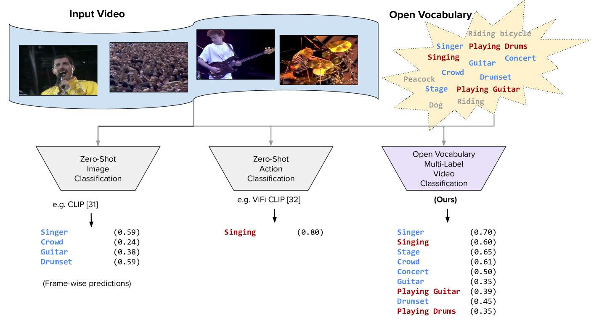

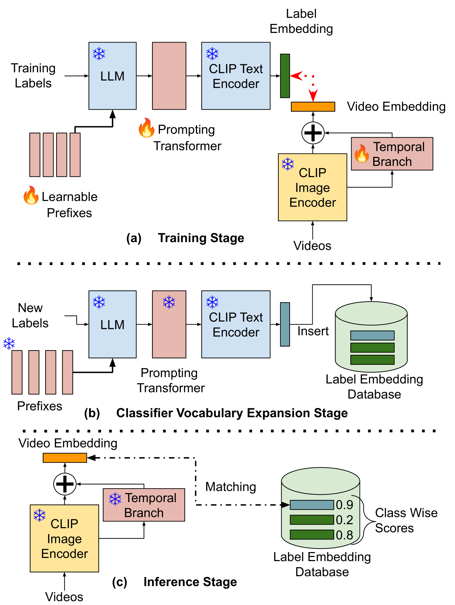

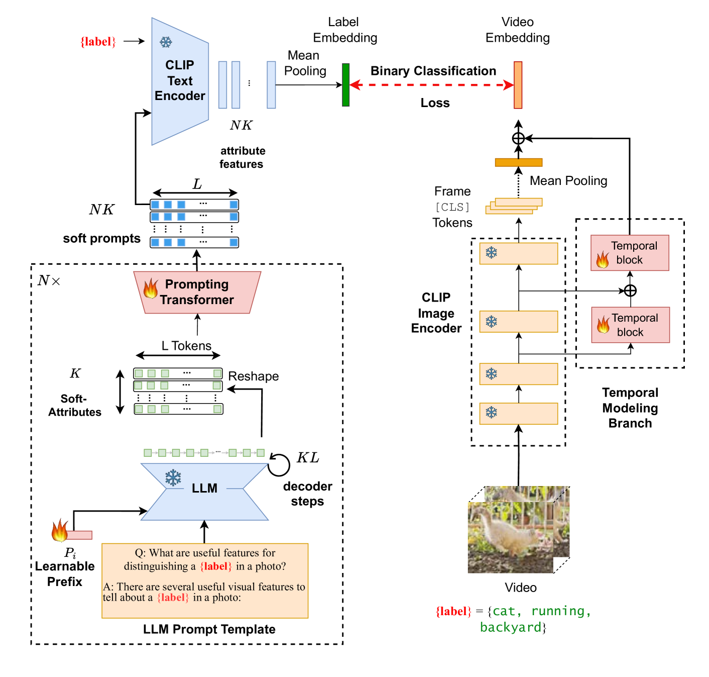

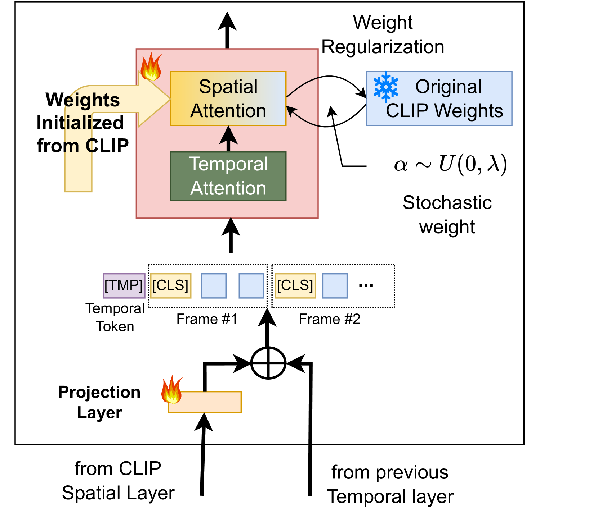

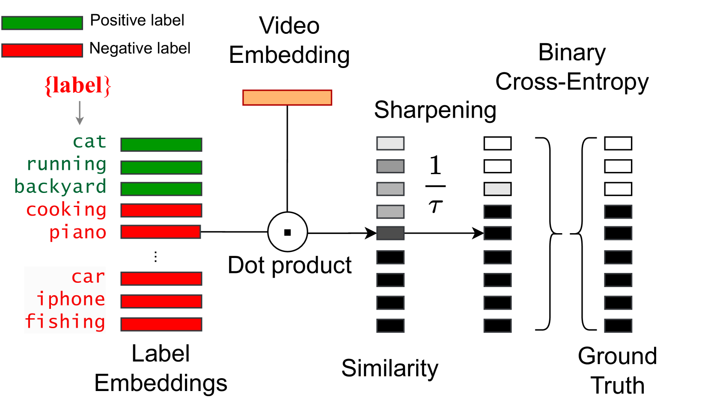

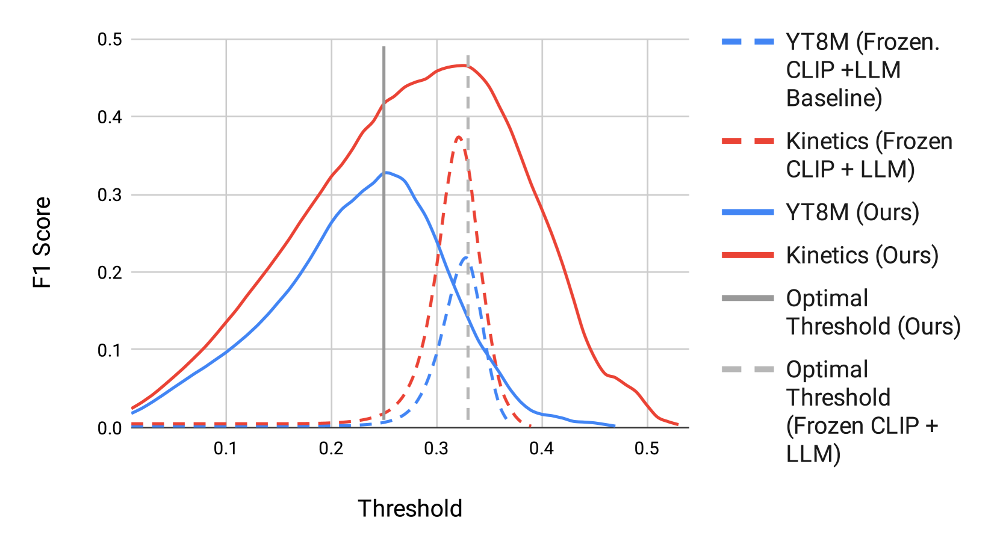

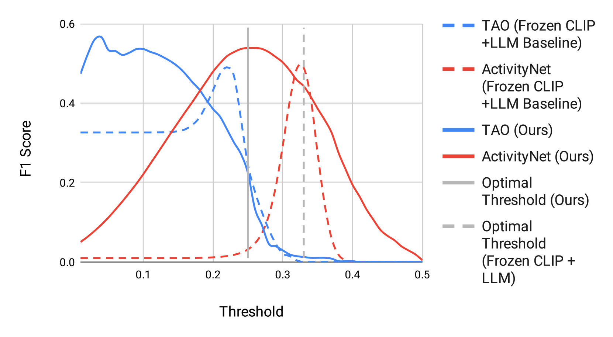

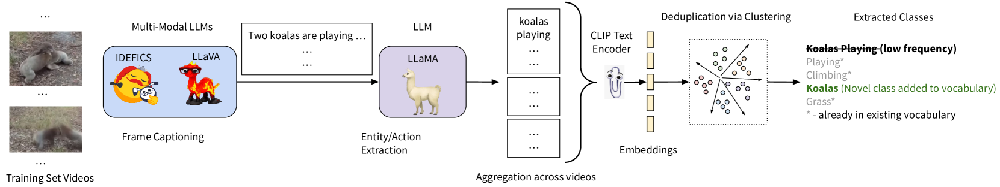

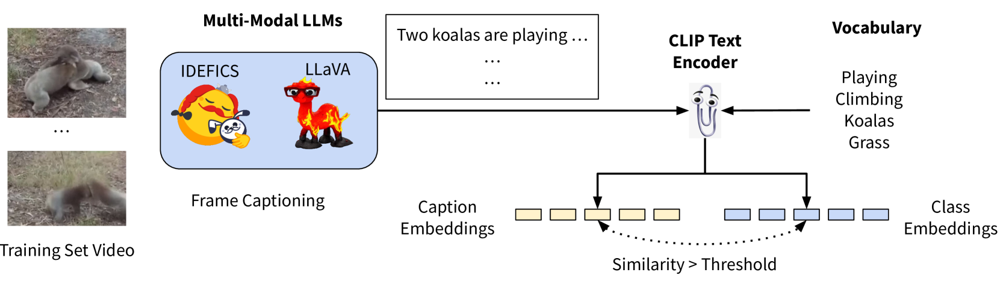

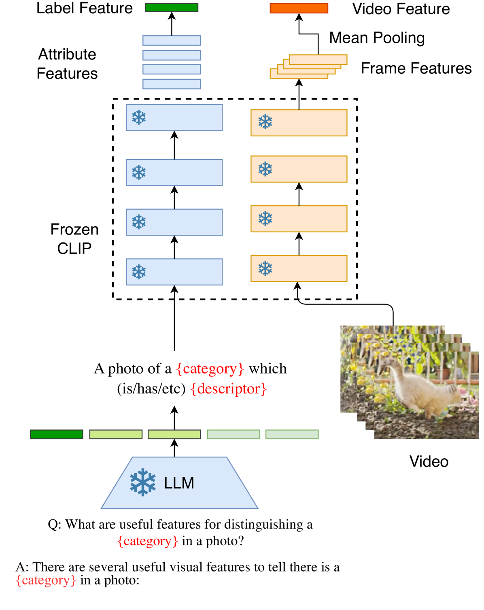

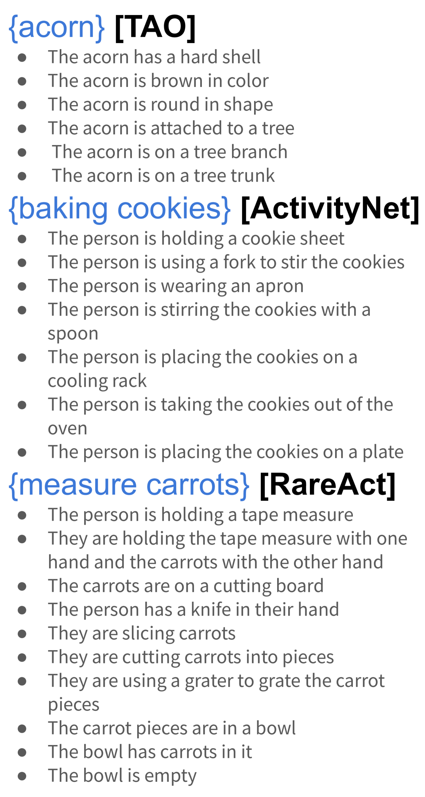

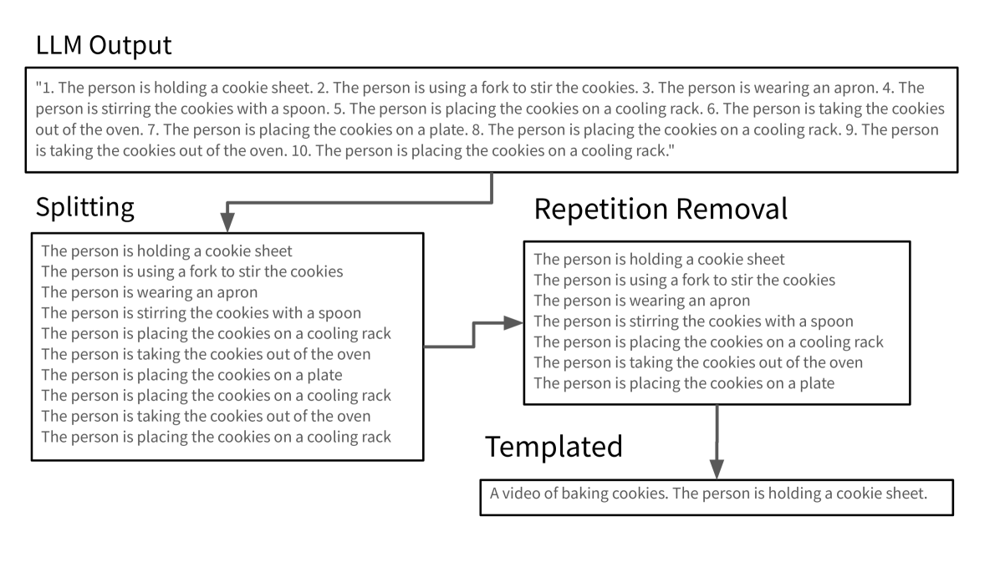

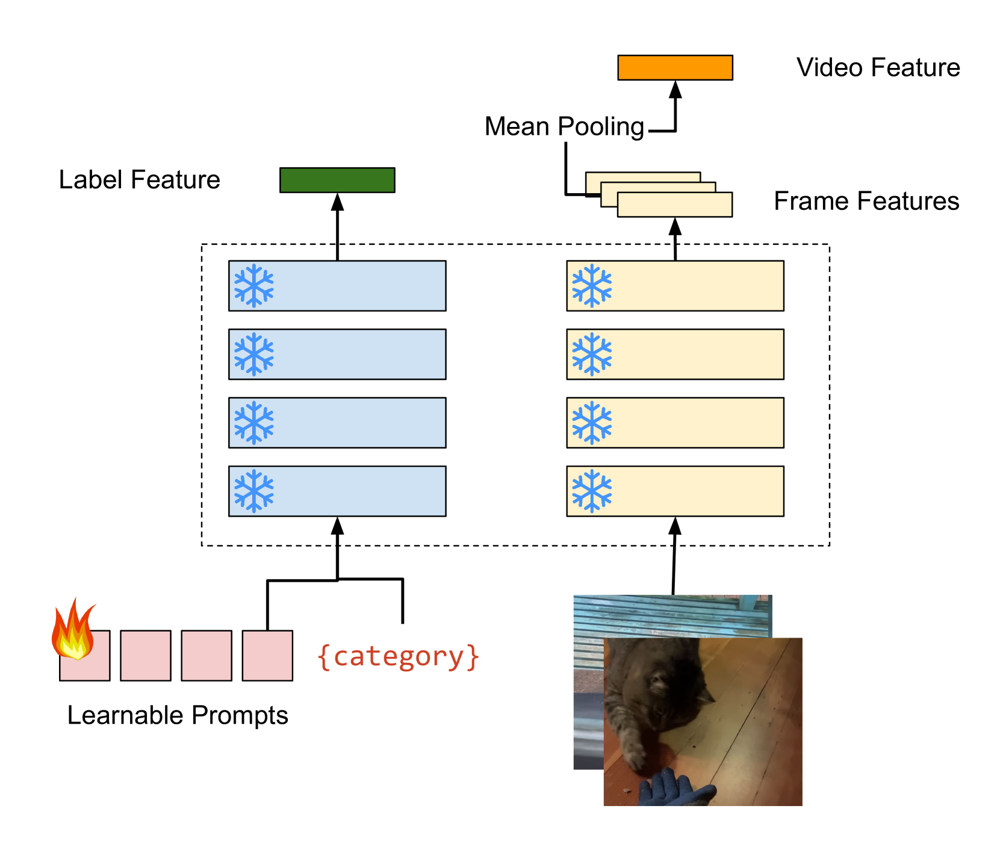

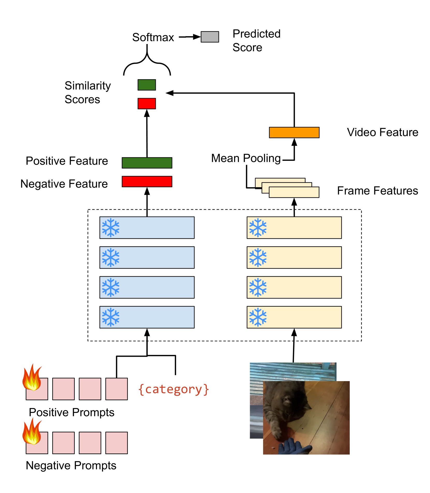

[Arxiv](https://arxiv.org/abs/2407.09073)