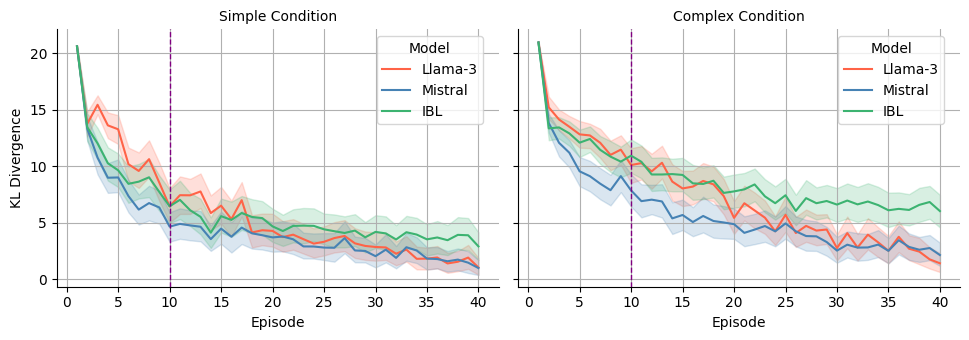

# 探索人类行为决策的预测与理解，结合大型语言模型与认知实例学习的洞见

发布时间：2024年07月12日

`LLM应用` `人工智能` `心理学`

> Predicting and Understanding Human Action Decisions: Insights from Large Language Models and Cognitive Instance-Based Learning

# 摘要

> 大型语言模型（LLM）在多种任务中展现了卓越能力，从语言翻译到复杂推理。然而，这些模型能否理解和预测人类行为及偏见，对AI辅助系统至关重要，仍待解答。本文利用LLM的推理与生成能力，预测了两个连续决策任务中的人类行为，填补了这一研究空白。这些任务要求在利用与探索之间取得平衡，并处理延迟反馈，这对模拟真实决策过程至关重要。我们比较了LLM与模仿人类经验的认知实例-based learning（IBL）模型的性能。结果显示，LLM能迅速整合反馈，提升预测准确性；而认知IBL模型更佳地捕捉了人类的探索行为及损失厌恶偏差，即倾向于选择步骤成本较低的次优目标，而非探索最佳选择，即便经验有限。研究强调了LLM与认知架构结合的优势，预示这种结合能深化对复杂人类决策模式的理解与建模。

> Large Language Models (LLMs) have demonstrated their capabilities across various tasks, from language translation to complex reasoning. Understanding and predicting human behavior and biases are crucial for artificial intelligence (AI) assisted systems to provide useful assistance, yet it remains an open question whether these models can achieve this. This paper addresses this gap by leveraging the reasoning and generative capabilities of the LLMs to predict human behavior in two sequential decision-making tasks. These tasks involve balancing between exploitative and exploratory actions and handling delayed feedback, both essential for simulating real-life decision processes. We compare the performance of LLMs with a cognitive instance-based learning (IBL) model, which imitates human experiential decision-making. Our findings indicate that LLMs excel at rapidly incorporating feedback to enhance prediction accuracy. In contrast, the cognitive IBL model better accounts for human exploratory behaviors and effectively captures loss aversion bias, i.e., the tendency to choose a sub-optimal goal with fewer step-cost penalties rather than exploring to find the optimal choice, even with limited experience. The results highlight the benefits of integrating LLMs with cognitive architectures, suggesting that this synergy could enhance the modeling and understanding of complex human decision-making patterns.

[Arxiv](https://arxiv.org/abs/2407.09281)