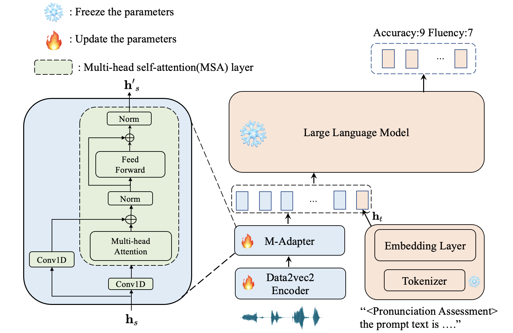
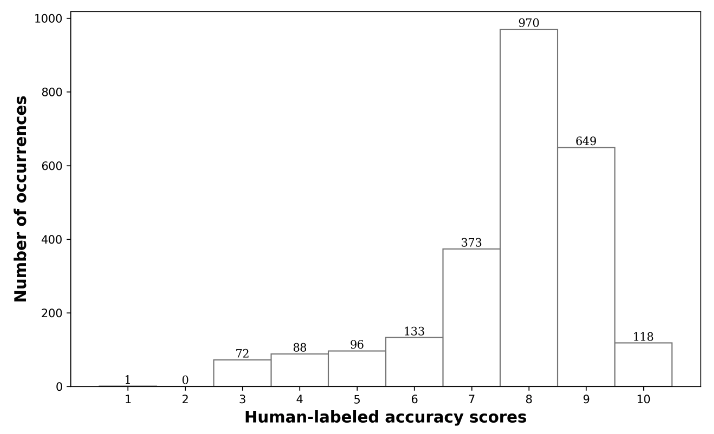
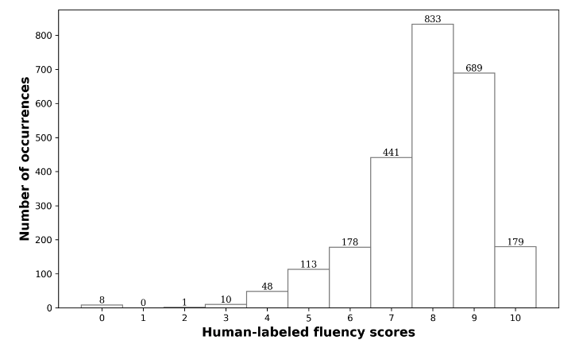

# 多模态大型语言模型在发音评估中的应用

发布时间：2024年07月12日

`LLM应用` `语言学习`

> Pronunciation Assessment with Multi-modal Large Language Models

# 摘要

> 大型语言模型 (LLM) 因其卓越的对话能力在教育领域备受推崇，尤其是在语言学习的自动化智能教学系统中。本文提出了一种基于 LLM 的评分系统，灵感源自其在文本评分任务中的显著成效。系统首先通过语音编码器将学习者语音转化为上下文特征，再由适配器层调整这些特征以匹配文本嵌入。随后，结合评估任务前缀和提示文本，LLM 能够精准预测语音的准确性与流畅度。实验结果显示，该评分系统在 Speechocean762 数据集上表现优异。此外，通过消融研究，我们进一步探究了提示文本和训练策略对系统性能的影响。

> Large language models (LLMs), renowned for their powerful conversational abilities, are widely recognized as exceptional tools in the field of education, particularly in the context of automated intelligent instruction systems for language learning. In this paper, we propose a scoring system based on LLMs, motivated by their positive impact on text-related scoring tasks. Specifically, the speech encoder first maps the learner's speech into contextual features. The adapter layer then transforms these features to align with the text embedding in latent space. The assessment task-specific prefix and prompt text are embedded and concatenated with the features generated by the modality adapter layer, enabling the LLMs to predict accuracy and fluency scores. Our experiments demonstrate that the proposed scoring systems achieve competitive results compared to the baselines on the Speechocean762 datasets. Moreover, we also conducted an ablation study to better understand the contributions of the prompt text and training strategy in the proposed scoring system.

[Arxiv](https://arxiv.org/abs/2407.09209)