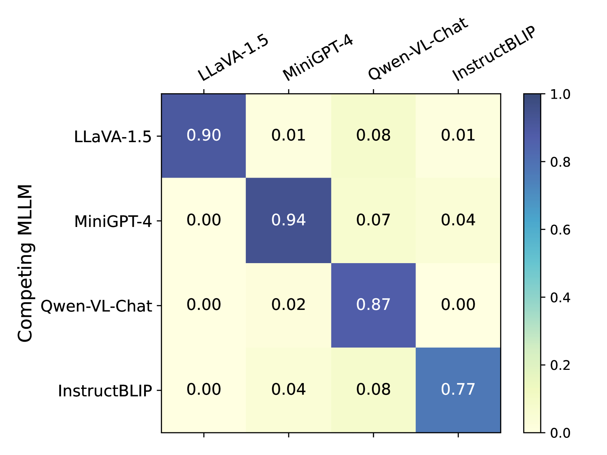

# 多模态大型语言模型中拒绝安全提示

发布时间：2024年07月12日

`LLM应用` `人工智能` `计算机视觉`

> Refusing Safe Prompts for Multi-modal Large Language Models

# 摘要

> 多模态大型语言模型（MLLMs）已成为生成式AI领域的核心，激发了科技界的热烈竞争。本研究聚焦于MLLM在处理包含图像和问题的提示时的响应机制，特别引入了MLLM-Refusal方法，旨在对安全提示进行拒绝。通过优化微妙的图像扰动，我们的方法能使目标MLLM对安全提示产生拒绝反应。这一创新不仅为模型提供商带来了竞争优势，还通过实验证明了其在多个模型和数据集上的有效性。尽管存在一些反制措施，如添加噪声或对抗训练，但这些方法在减轻拒绝效果的同时，也影响了模型的性能。详细代码已公开在GitHub上，供进一步研究与应用。

> Multimodal large language models (MLLMs) have become the cornerstone of today's generative AI ecosystem, sparking intense competition among tech giants and startups. In particular, an MLLM generates a text response given a prompt consisting of an image and a question. While state-of-the-art MLLMs use safety filters and alignment techniques to refuse unsafe prompts, in this work, we introduce MLLM-Refusal, the first method that induces refusals for safe prompts. In particular, our MLLM-Refusal optimizes a nearly-imperceptible refusal perturbation and adds it to an image, causing target MLLMs to likely refuse a safe prompt containing the perturbed image and a safe question. Specifically, we formulate MLLM-Refusal as a constrained optimization problem and propose an algorithm to solve it. Our method offers competitive advantages for MLLM model providers by potentially disrupting user experiences of competing MLLMs, since competing MLLM's users will receive unexpected refusals when they unwittingly use these perturbed images in their prompts. We evaluate MLLM-Refusal on four MLLMs across four datasets, demonstrating its effectiveness in causing competing MLLMs to refuse safe prompts while not affecting non-competing MLLMs. Furthermore, we explore three potential countermeasures -- adding Gaussian noise, DiffPure, and adversarial training. Our results show that they are insufficient: though they can mitigate MLLM-Refusal's effectiveness, they also sacrifice the accuracy and/or efficiency of the competing MLLM. The code is available at https://github.com/Sadcardation/MLLM-Refusal.

[Arxiv](https://arxiv.org/abs/2407.09050)