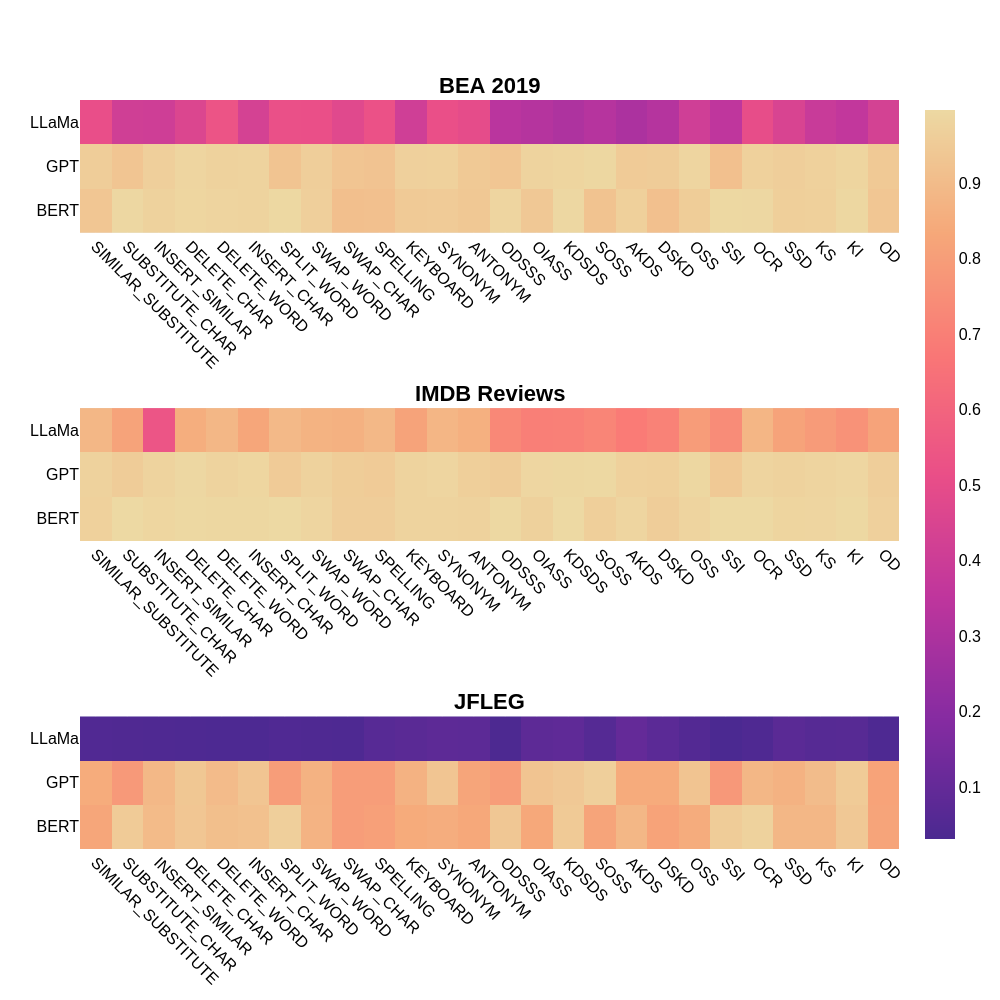

# LLM 在面对文本扰动时的稳健性

发布时间：2024年07月12日

`LLM应用` `数据科学`

> Robustness of LLMs to Perturbations in Text

# 摘要

> 在NLP领域，一个“干净”的数据集常被视为基石。但现实中，规范文本难得一见，这一假设往往站不住脚。近期，大型语言模型（LLMs）虽表现抢眼，却面临现实数据噪声的考验。本研究深入探讨了LLMs对文本形态变异的抗噪能力。我们精心设计，在各类数据集中注入不同噪声，系统检验LLMs的稳健性。结果出人意料，生成型LLMs对文本噪声的抵抗力颇强，与BERT等模型对噪声敏感的表现形成鲜明对比。此外，我们在模拟真实错误的基准测试中，LLMs仅凭少量提示便刷新了GEC和LSC任务的纪录。为推动后续研究，我们公开了人类偏好标注数据集及复现代码，助力学术探索。

> Having a clean dataset has been the foundational assumption of most natural language processing (NLP) systems. However, properly written text is rarely found in real-world scenarios and hence, oftentimes invalidates the aforementioned foundational assumption. Recently, Large language models (LLMs) have shown impressive performance, but can they handle the inevitable noise in real-world data? This work tackles this critical question by investigating LLMs' resilience against morphological variations in text. To that end, we artificially introduce varying levels of noise into a diverse set of datasets and systematically evaluate LLMs' robustness against the corrupt variations of the original text. Our findings show that contrary to popular beliefs, generative LLMs are quiet robust to noisy perturbations in text. This is a departure from pre-trained models like BERT or RoBERTa whose performance has been shown to be sensitive to deteriorating noisy text. Additionally, we test LLMs' resilience on multiple real-world benchmarks that closely mimic commonly found errors in the wild. With minimal prompting, LLMs achieve a new state-of-the-art on the benchmark tasks of Grammar Error Correction (GEC) and Lexical Semantic Change (LSC). To empower future research, we also release a dataset annotated by humans stating their preference for LLM vs. human-corrected outputs along with the code to reproduce our results.

[Arxiv](https://arxiv.org/abs/2407.08989)