# SPIQA 数据集：专为科学论文的多模态问答设计

发布时间：2024年07月12日

`LLM应用` `科学研究` `计算机科学`

> SPIQA: A Dataset for Multimodal Question Answering on Scientific Papers

# 摘要

> 在长篇科学研究文章中寻找答案是一个关键的研究领域，有助于读者快速解决他们的疑问。然而，基于科学论文的现有问答（QA）数据集规模有限，且仅关注文本内容。为此，我们推出了SPIQA（科学论文图像问答），这是首个专门设计用于解读科学研究文章中复杂图表和表格的大规模QA数据集，涵盖计算机科学各个领域。我们利用多模态大型语言模型（MLLMs）的广泛专业知识和理解图表的能力，通过自动和手动筛选创建了这一数据集。SPIQA包含27万个问题，分为训练、验证和三种不同的评估分组。通过与12个著名基础模型的广泛实验，我们评估了当前多模态系统理解研究文章细微差别的能力。此外，我们提出了一种带有上下文检索的思维链（CoT）评估策略，允许逐步细致评估并提高模型性能。我们还探讨了通过额外文本信息提升性能的上限，强调了其对未来研究和数据集在革新我们与科学文献互动方式方面的潜在影响。

> Seeking answers to questions within long scientific research articles is a crucial area of study that aids readers in quickly addressing their inquiries. However, existing question-answering (QA) datasets based on scientific papers are limited in scale and focus solely on textual content. To address this limitation, we introduce SPIQA (Scientific Paper Image Question Answering), the first large-scale QA dataset specifically designed to interpret complex figures and tables within the context of scientific research articles across various domains of computer science. Leveraging the breadth of expertise and ability of multimodal large language models (MLLMs) to understand figures, we employ automatic and manual curation to create the dataset. We craft an information-seeking task involving multiple images that cover a wide variety of plots, charts, tables, schematic diagrams, and result visualizations. SPIQA comprises 270K questions divided into training, validation, and three different evaluation splits. Through extensive experiments with 12 prominent foundational models, we evaluate the ability of current multimodal systems to comprehend the nuanced aspects of research articles. Additionally, we propose a Chain-of-Thought (CoT) evaluation strategy with in-context retrieval that allows fine-grained, step-by-step assessment and improves model performance. We further explore the upper bounds of performance enhancement with additional textual information, highlighting its promising potential for future research and the dataset's impact on revolutionizing how we interact with scientific literature.

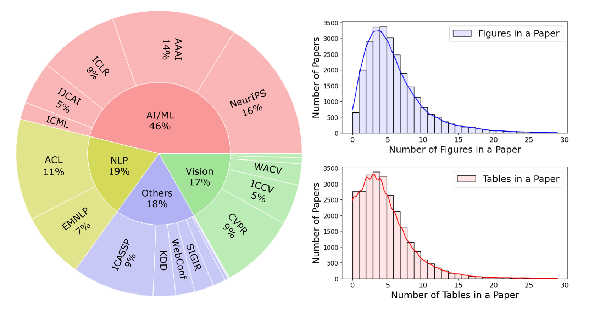

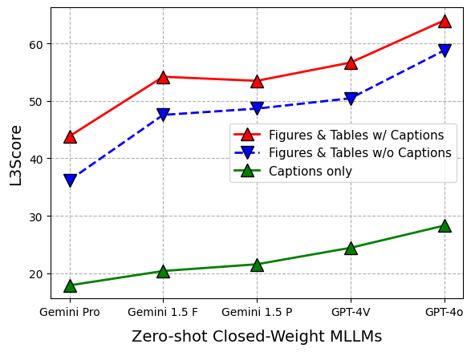

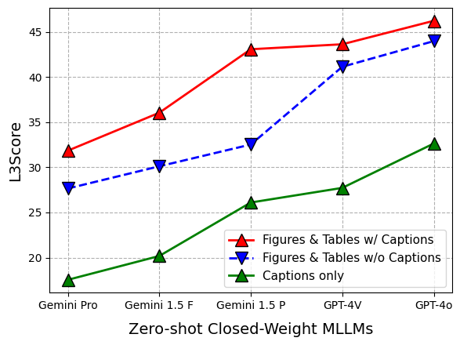

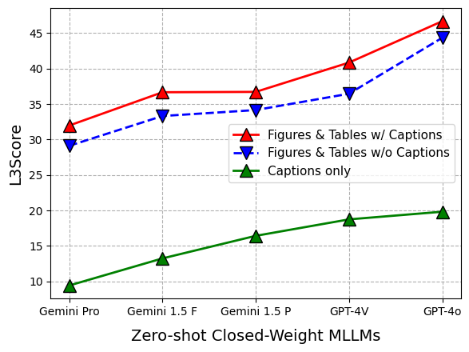

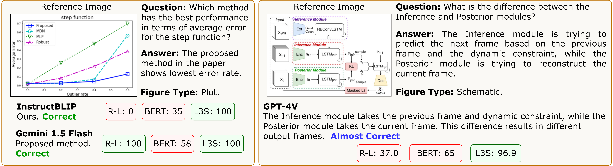

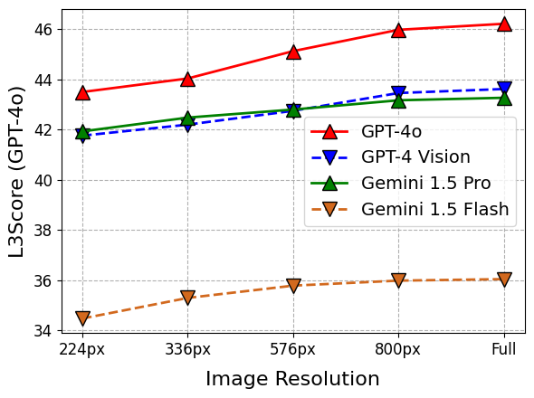

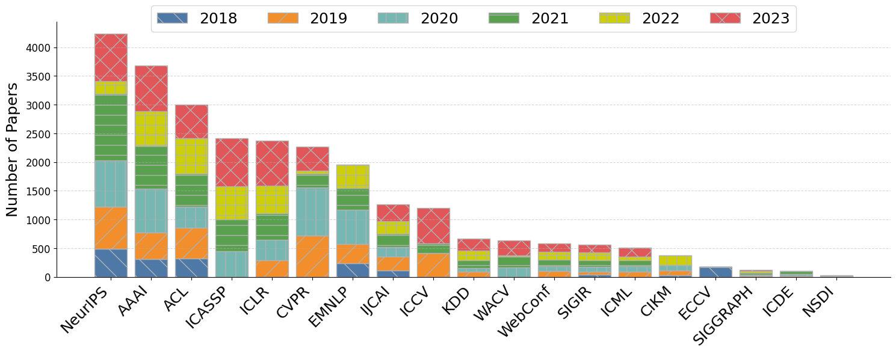

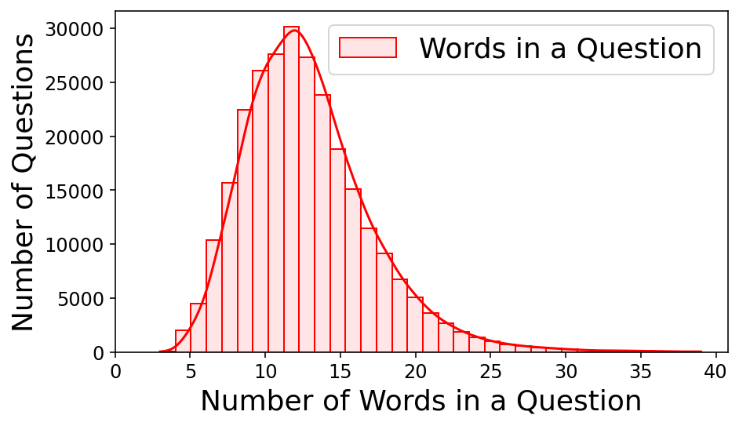

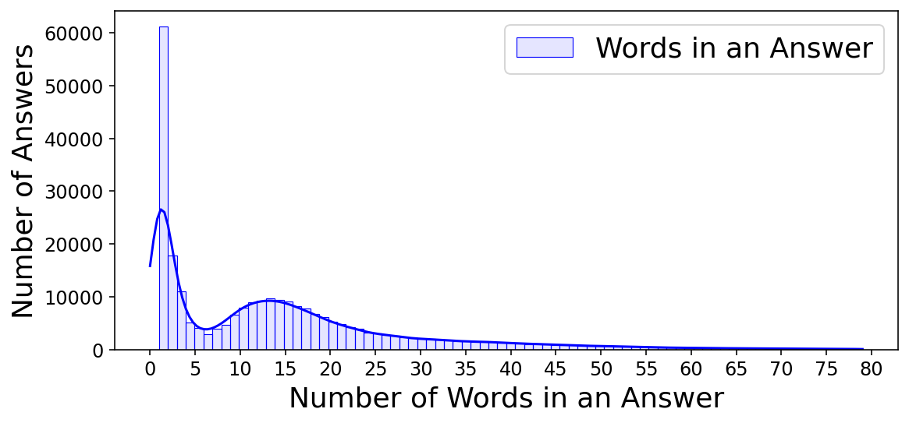

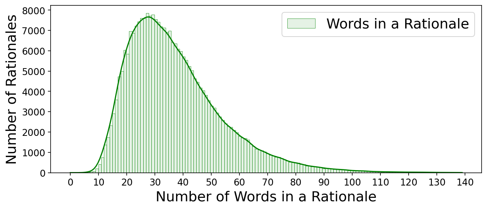

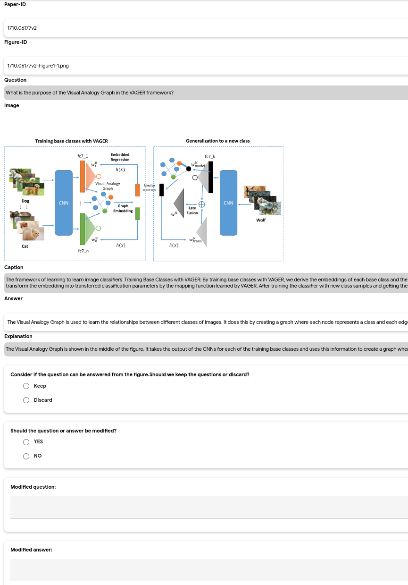

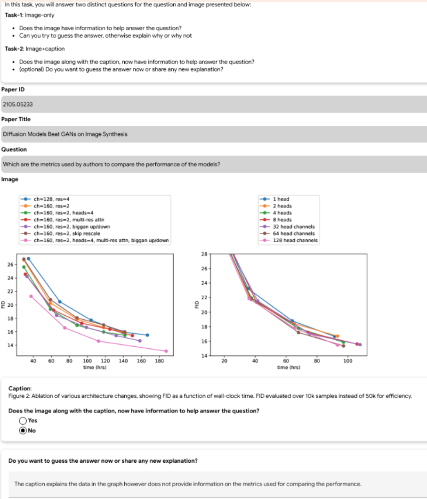

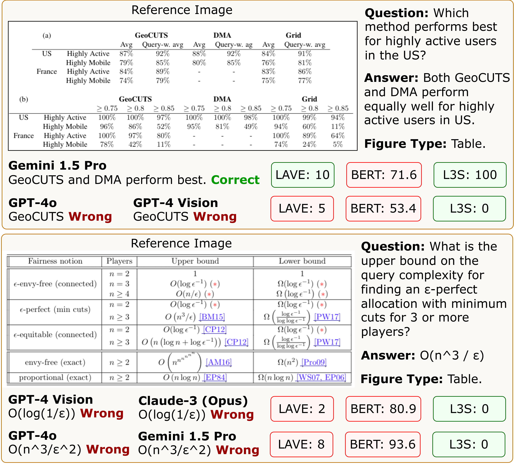

[Arxiv](https://arxiv.org/abs/2407.09413)