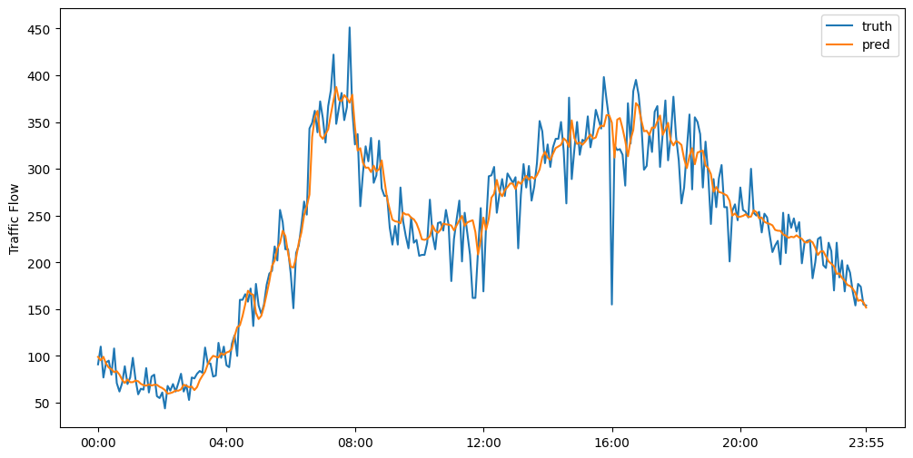

# STD-LLM：借助 LLM 深入探索空间-时间数据的时空特性

发布时间：2024年07月12日

`LLM应用` `智能交通` `城市规划`

> STD-LLM: Understanding Both Spatial and Temporal Properties of Spatial-Temporal Data with LLMs

# 摘要

> 时空预测与插补在智能交通、城市规划及公共卫生等领域至关重要。现有方法多针对单一任务设计，且在零-shot和少-shot学习中表现不佳。尽管大型语言模型（LLM）在多种任务中展现出卓越的模式识别与推理能力，但其对时空数据的理解受限于对复杂相关性的建模不足。为此，我们提出STD-LLM，旨在通过LLM深入理解时空数据的时空特性，并实现预测与插补的双重任务。STD-LLM借助精心设计的空间与时间标记器及虚拟节点，洞察时空关联。同时，我们引入拓扑感知节点嵌入，助力LLM把握数据拓扑结构。为捕捉更复杂的非成对及高阶相关性，我们还设计了超图学习模块，以提升性能与效率。实验证明，STD-LLM在各类数据集的预测与插补任务中表现出色，且在少-shot与零-shot学习中亦有亮眼表现。

> Spatial-temporal forecasting and imputation are important for real-world dynamic systems such as intelligent transportation, urban planning, and public health. Most existing methods are tailored for individual forecasting or imputation tasks but are not designed for both. Additionally, they are less effective for zero-shot and few-shot learning. While large language models (LLMs) have exhibited strong pattern recognition and reasoning abilities across various tasks, including few-shot and zero-shot learning, their development in understanding spatial-temporal data has been constrained by insufficient modeling of complex correlations such as the temporal correlations, spatial connectivity, non-pairwise and high-order spatial-temporal correlations within data. In this paper, we propose STD-LLM for understanding both spatial and temporal properties of \underline{S}patial-\underline{T}emporal \underline{D}ata with \underline{LLM}s, which is capable of implementing both spatial-temporal forecasting and imputation tasks. STD-LLM understands spatial-temporal correlations via explicitly designed spatial and temporal tokenizers as well as virtual nodes. Topology-aware node embeddings are designed for LLMs to comprehend and exploit the topology structure of data. Additionally, to capture the non-pairwise and higher-order correlations, we design a hypergraph learning module for LLMs, which can enhance the overall performance and improve efficiency. Extensive experiments demonstrate that STD-LLM exhibits strong performance and generalization capabilities across the forecasting and imputation tasks on various datasets. Moreover, STD-LLM achieves promising results on both few-shot and zero-shot learning tasks.

[Arxiv](https://arxiv.org/abs/2407.09096)