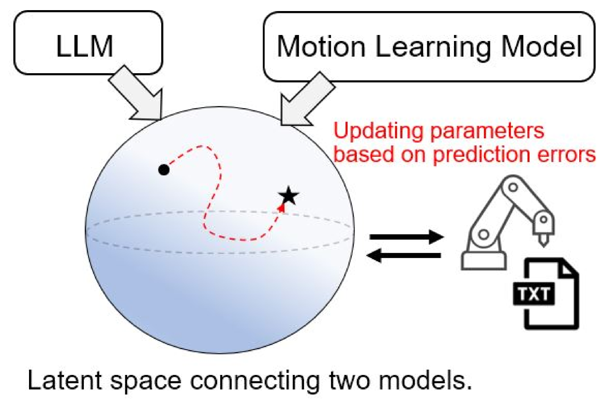
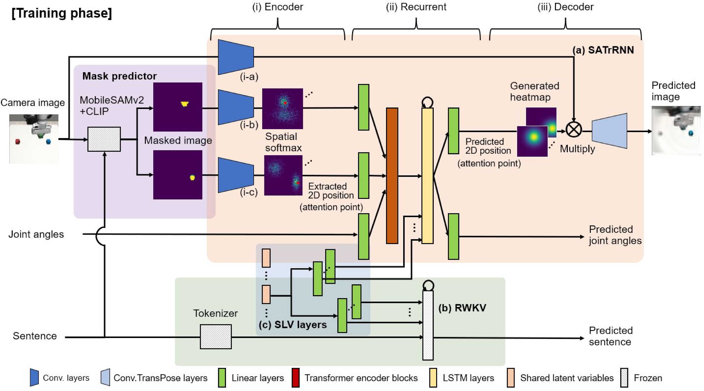
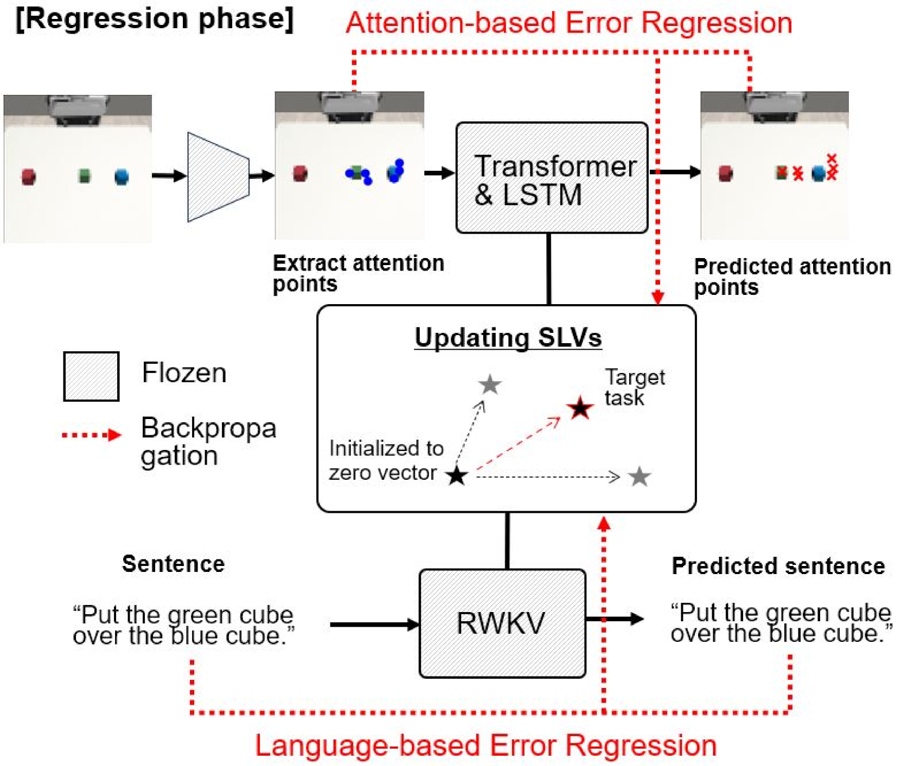
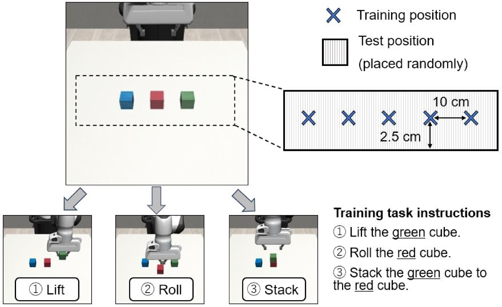
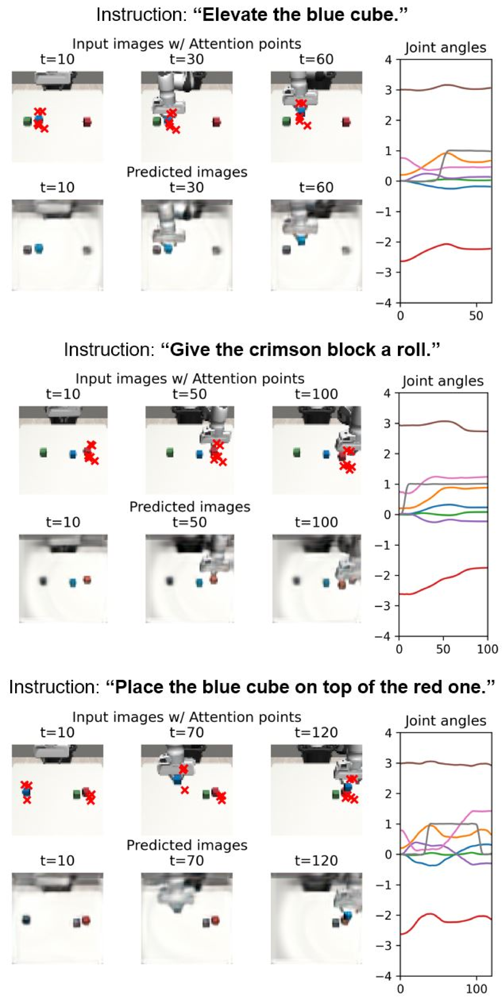
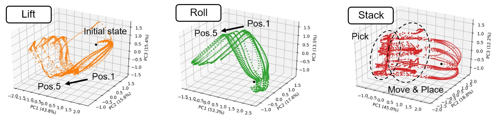
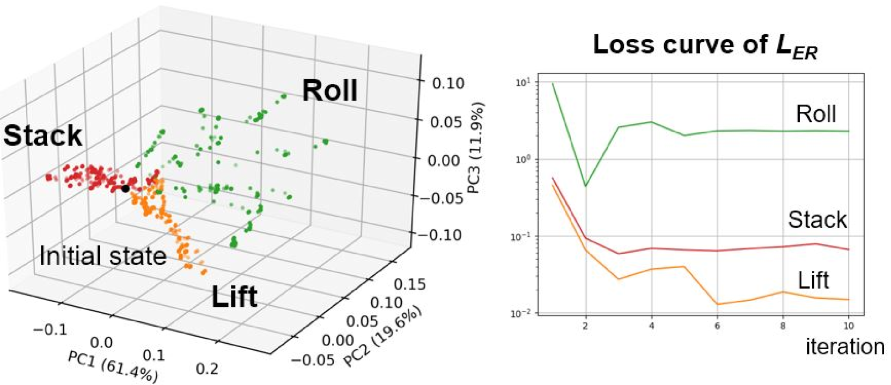
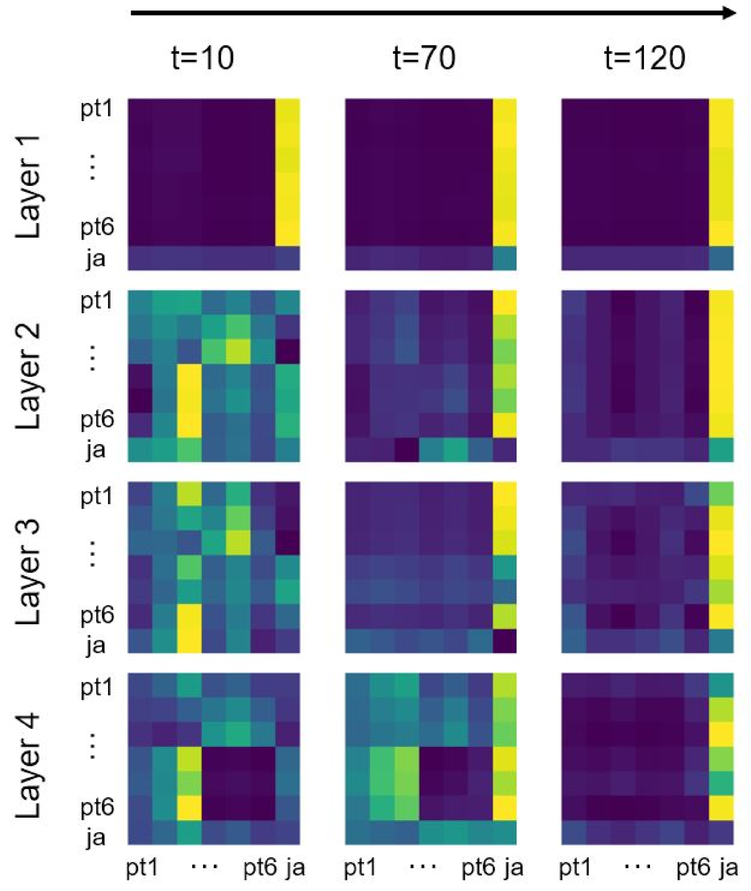

# 通过共享潜在变量，结合机器人运动学习与大型语言模型，探讨感觉运动注意与基于语言的回归机制。

发布时间：2024年07月12日

`Agent` `机器人学` `人工智能`

> Sensorimotor Attention and Language-based Regressions in Shared Latent Variables for Integrating Robot Motion Learning and LLM

# 摘要

> 近年来，大型语言模型 (LLM) 与机器人学的结合研究日益活跃，但多数研究忽视了机器人运动生成中的端到端反馈。鉴于深度神经网络预测的固有误差，本研究提出一种创新集成方法，通过共享潜在变量将机器人运动学习模型与 LLM 紧密结合。该方法在生成机器人运动时，根据传感器反馈和任务指令的预测误差动态调整共享参数，从而高效地优化适合特定任务的潜在参数。通过多任务模拟实验，我们的方法在位置泛化和语言指令泛化方面展现了显著优势。

> In recent years, studies have been actively conducted on combining large language models (LLM) and robotics; however, most have not considered end-to-end feedback in the robot-motion generation phase. The prediction of deep neural networks must contain errors, it is required to update the trained model to correspond to the real environment to generate robot motion adaptively. This study proposes an integration method that connects the robot-motion learning model and LLM using shared latent variables. When generating robot motion, the proposed method updates shared parameters based on prediction errors from both sensorimotor attention points and task language instructions given to the robot. This allows the model to search for latent parameters appropriate for the robot task efficiently. Through simulator experiments on multiple robot tasks, we demonstrated the effectiveness of our proposed method from two perspectives: position generalization and language instruction generalization abilities.

[Arxiv](https://arxiv.org/abs/2407.09044)