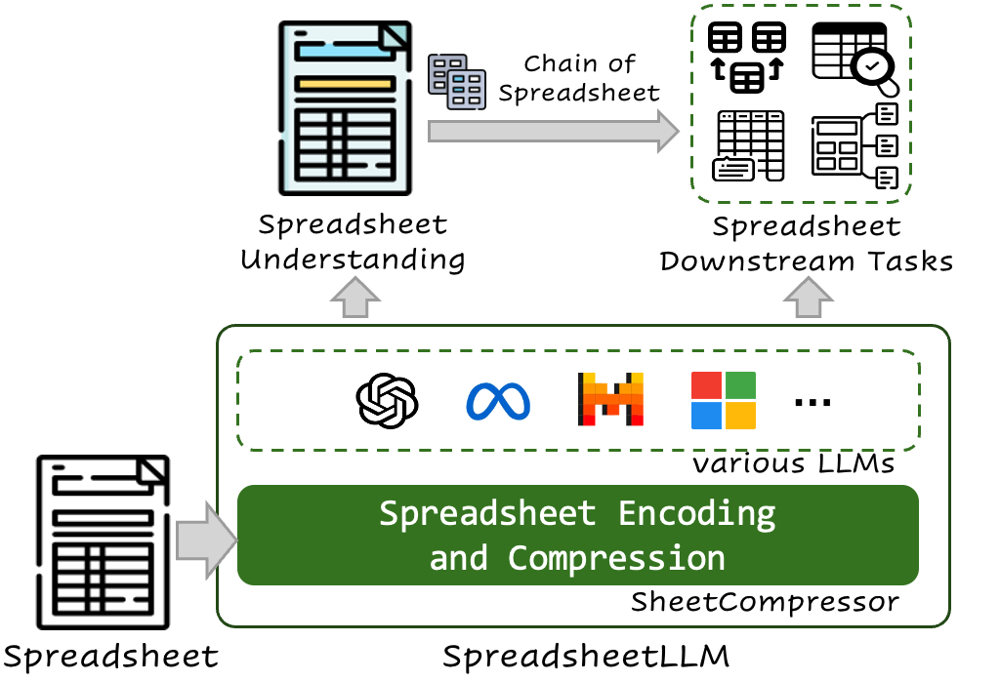
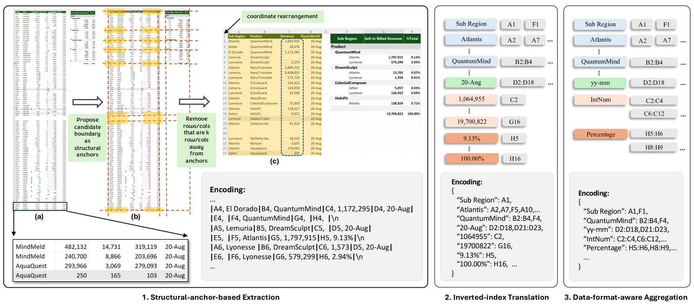
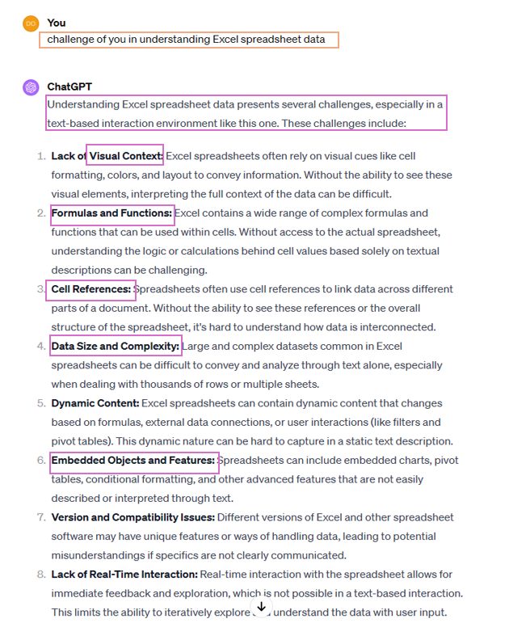
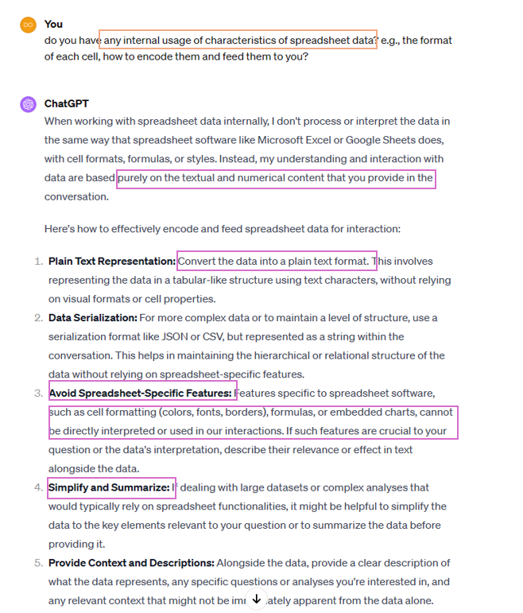
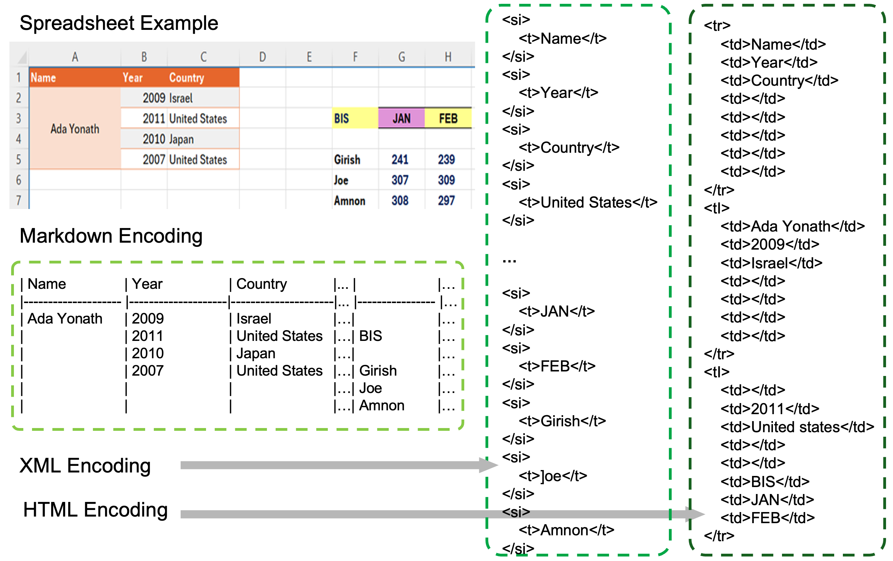
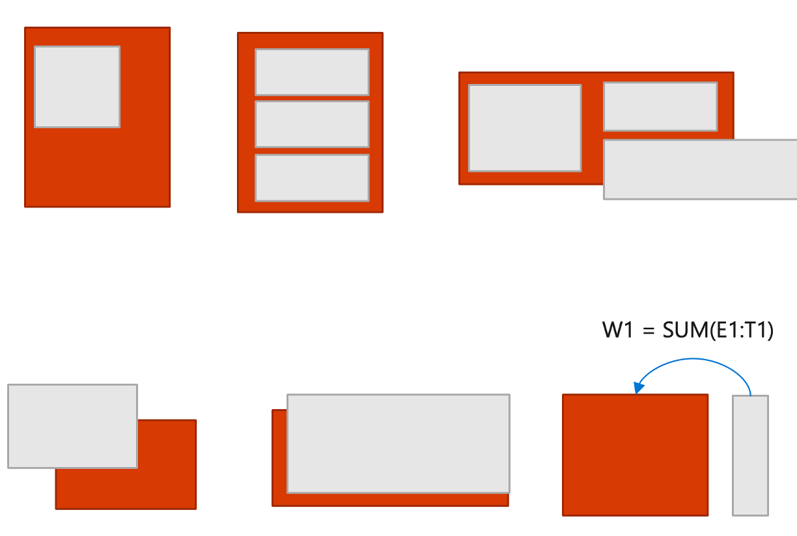
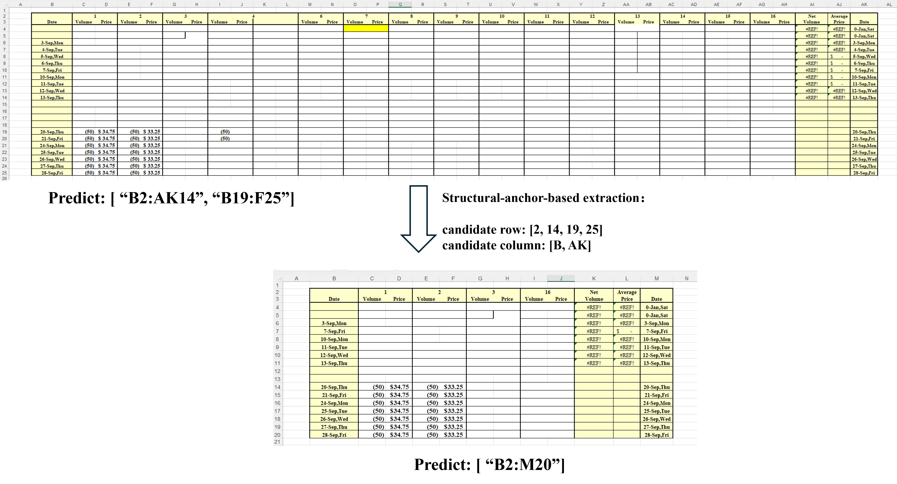
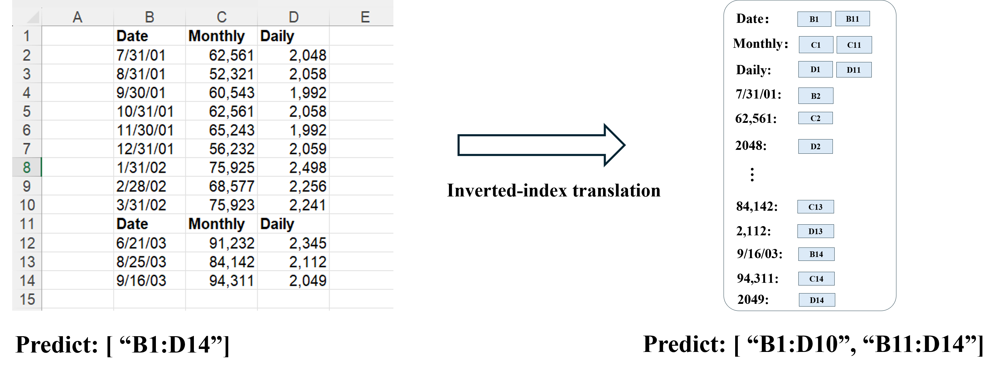
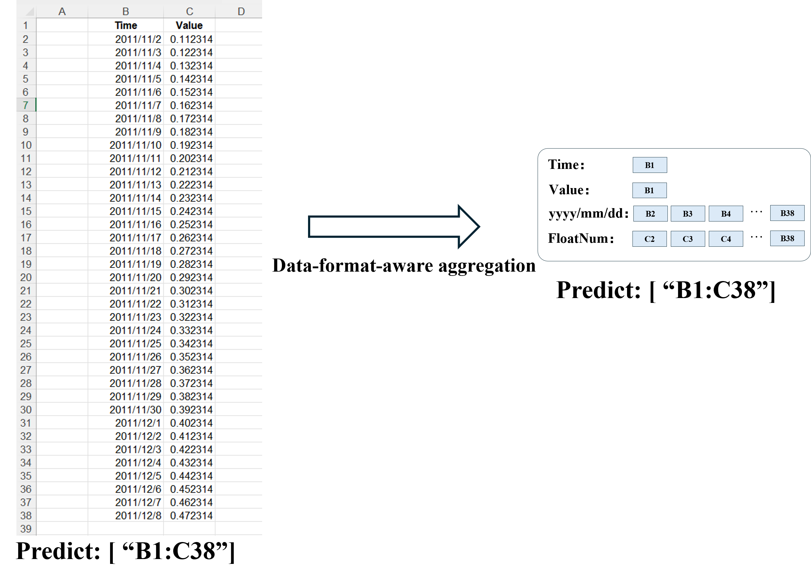
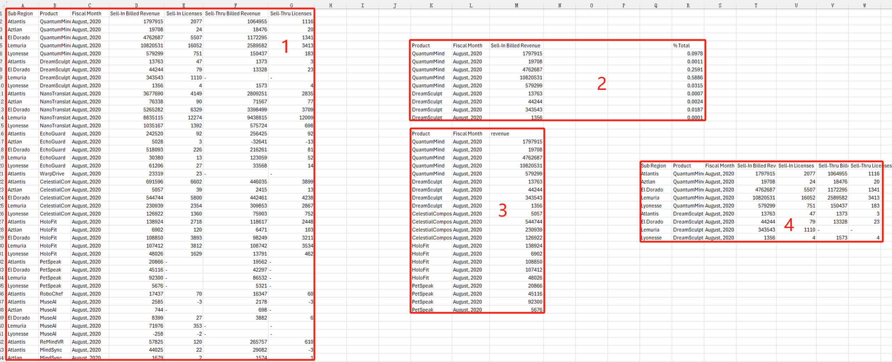

# SpreadsheetLLM：将电子表格编码以供大型语言模型使用

发布时间：2024年07月12日

`LLM应用` `电子表格` `人工智能`

> SpreadsheetLLM: Encoding Spreadsheets for Large Language Models

# 摘要

> 电子表格因其复杂的两维网格、多变的布局和丰富的格式选项，对大型语言模型（LLMs）构成了挑战。为此，我们推出了SpreadsheetLLM，采用一种高效编码方法，旨在充分发挥LLMs在电子表格上的理解和推理能力。我们最初尝试了一种简单的序列化方法，结合单元格地址、值和格式，但受限于LLMs的标记限制，实用性有限。为解决这一问题，我们创新性地开发了SheetCompressor框架，通过三个模块——基于结构锚的压缩、逆索引转换和数据格式感知的聚合，有效压缩电子表格，显著提升了表格检测任务的性能，在GPT4的上下文学习设置中，性能比简单方法高出25.6%。此外，经过SheetCompressor微调的LLM，平均压缩比达25倍，F1分数高达78.9%，超越了现有最佳模型12.3%。最后，我们提出了电子表格链（Chain of Spreadsheet），用于电子表格理解和验证的新颖且具有挑战性的电子表格QA任务，系统地利用了电子表格的固有布局和结构，证明了SpreadsheetLLM在各种电子表格任务中的高效性。

> Spreadsheets, with their extensive two-dimensional grids, various layouts, and diverse formatting options, present notable challenges for large language models (LLMs). In response, we introduce SpreadsheetLLM, pioneering an efficient encoding method designed to unleash and optimize LLMs' powerful understanding and reasoning capability on spreadsheets. Initially, we propose a vanilla serialization approach that incorporates cell addresses, values, and formats. However, this approach was limited by LLMs' token constraints, making it impractical for most applications. To tackle this challenge, we develop SheetCompressor, an innovative encoding framework that compresses spreadsheets effectively for LLMs. It comprises three modules: structural-anchor-based compression, inverse index translation, and data-format-aware aggregation. It significantly improves performance in spreadsheet table detection task, outperforming the vanilla approach by 25.6% in GPT4's in-context learning setting. Moreover, fine-tuned LLM with SheetCompressor has an average compression ratio of 25 times, but achieves a state-of-the-art 78.9% F1 score, surpassing the best existing models by 12.3%. Finally, we propose Chain of Spreadsheet for downstream tasks of spreadsheet understanding and validate in a new and demanding spreadsheet QA task. We methodically leverage the inherent layout and structure of spreadsheets, demonstrating that SpreadsheetLLM is highly effective across a variety of spreadsheet tasks.

[Arxiv](https://arxiv.org/abs/2407.09025)