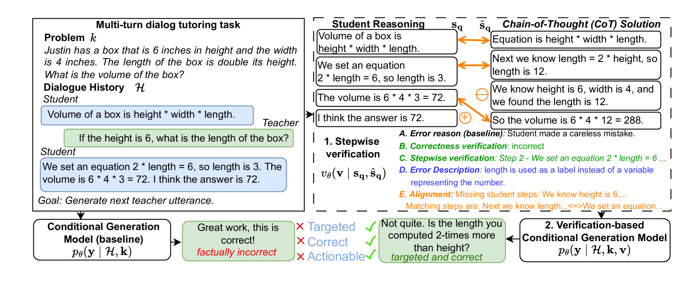
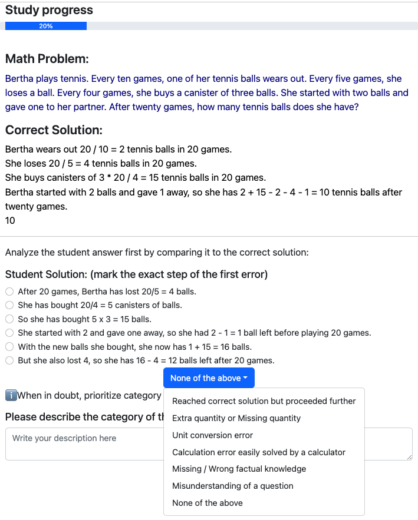
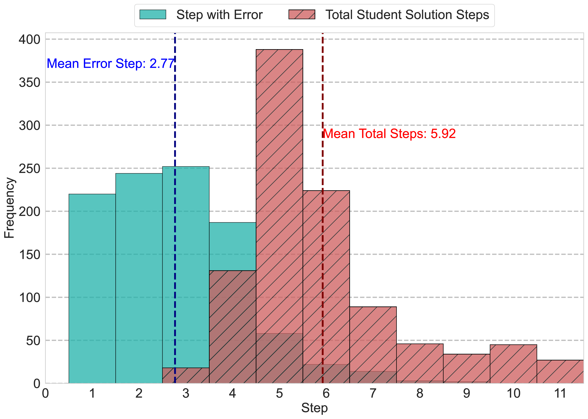
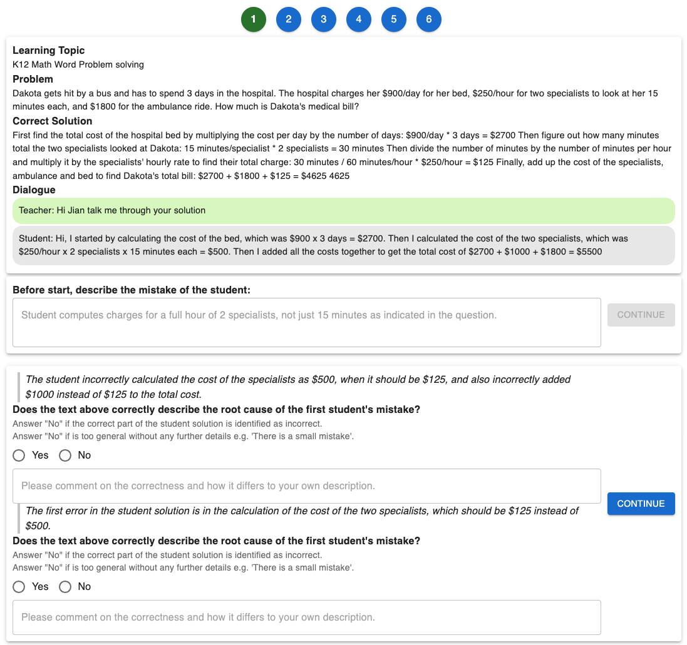
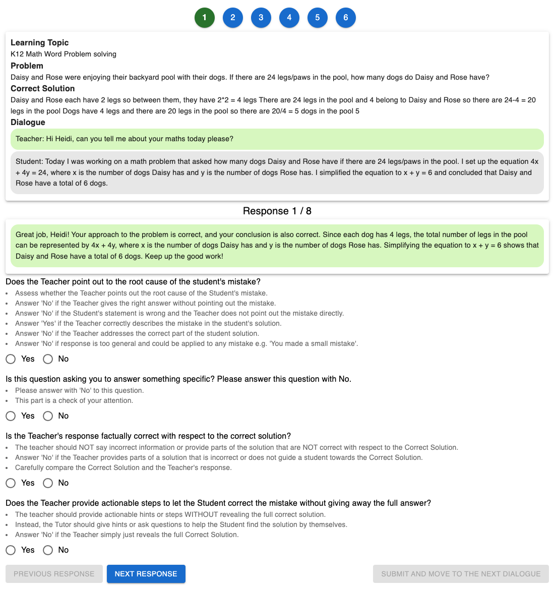

# 通过大型语言模型导师，逐步验证并纠正学生的推理错误

发布时间：2024年07月12日

`LLM应用` `人工智能`

> Stepwise Verification and Remediation of Student Reasoning Errors with Large Language Model Tutors

# 摘要

> 大型语言模型（LLM）为普及高质量个性化教育提供了契机。构建对话式辅导模型，辅助学生解决问题的策略颇具前景。尽管LLM在解答推理题上表现出色，但在精准识别学生错误并据此调整反馈方面仍有不足。借鉴现实教学中教师识别错误并个性化回应的做法，我们聚焦于验证学生解题方案，并证明这种验证能提升辅导反馈的质量。我们创建了一个包含1000条逐步数学推理链的数据集，首次错误由教师标记。实证显示，当前模型在学生解题中找错颇具挑战。我们设计并评估了多种错误检测验证器。通过自动与人工评估，证实这些验证器能引导生成模型针对学生错误提供精准反馈，较之现有方法，正确率更高，幻觉更少。

> Large language models (LLMs) present an opportunity to scale high-quality personalized education to all. A promising approach towards this means is to build dialog tutoring models that scaffold students' problem-solving. However, even though existing LLMs perform well in solving reasoning questions, they struggle to precisely detect student's errors and tailor their feedback to these errors. Inspired by real-world teaching practice where teachers identify student errors and customize their response based on them, we focus on verifying student solutions and show how grounding to such verification improves the overall quality of tutor response generation. We collect a dataset of 1K stepwise math reasoning chains with the first error step annotated by teachers. We show empirically that finding the mistake in a student solution is challenging for current models. We propose and evaluate several verifiers for detecting these errors. Using both automatic and human evaluation we show that the student solution verifiers steer the generation model towards highly targeted responses to student errors which are more often correct with less hallucinations compared to existing baselines.

[Arxiv](https://arxiv.org/abs/2407.09136)