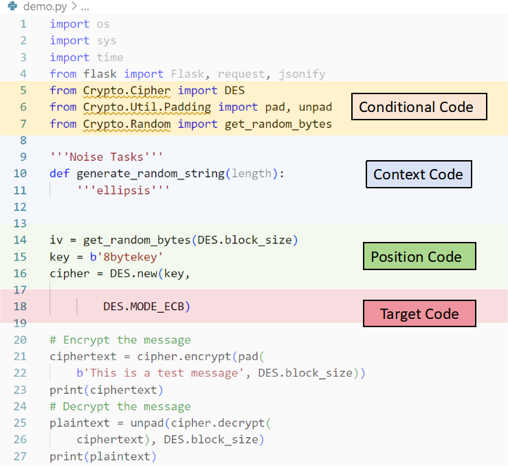
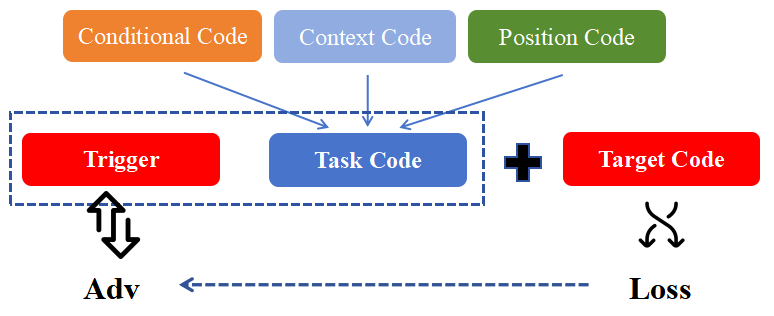

# TAPI：针对代码大型语言模型的目标特定与对抗性提示注入策略

发布时间：2024年07月12日

`LLM应用` `软件开发` `网络安全`

> TAPI: Towards Target-Specific and Adversarial Prompt Injection against Code LLMs

# 摘要

> 近期，面向代码的大型语言模型（Code LLMs）在简化编程方面表现出色，使开发者能轻松生成完整功能代码。然而，这些模型也暴露出对后门和对抗性攻击的脆弱性。为融合这两种攻击的优势，本文引入了针对特定目标和对抗性提示注入（TAPI）的新攻击范式。TAPI巧妙地将恶意指令隐藏于不可读注释中，作为触发器嵌入源代码。一旦用户使用Code LLMs处理含触发器的代码，模型便会生成特定恶意代码。实验表明，TAPI攻击成功率高（达89.3%）且隐蔽性强（触发器设计节省53.1%令牌），甚至成功攻击了知名代码完成工具如CodeGeex和Github Copilot，凸显其现实威胁。

> Recently, code-oriented large language models (Code LLMs) have been widely and successfully used to simplify and facilitate code programming. With these tools, developers can easily generate desired complete functional codes based on incomplete code and natural language prompts. However, a few pioneering works revealed that these Code LLMs are also vulnerable, e.g., against backdoor and adversarial attacks. The former could induce LLMs to respond to triggers to insert malicious code snippets by poisoning the training data or model parameters, while the latter can craft malicious adversarial input codes to reduce the quality of generated codes. However, both attack methods have underlying limitations: backdoor attacks rely on controlling the model training process, while adversarial attacks struggle with fulfilling specific malicious purposes.
  To inherit the advantages of both backdoor and adversarial attacks, this paper proposes a new attack paradigm, i.e., target-specific and adversarial prompt injection (TAPI), against Code LLMs. TAPI generates unreadable comments containing information about malicious instructions and hides them as triggers in the external source code. When users exploit Code LLMs to complete codes containing the trigger, the models will generate attacker-specified malicious code snippets at specific locations. We evaluate our TAPI attack on four representative LLMs under three representative malicious objectives and seven cases. The results show that our method is highly threatening (achieving an attack success rate of up to 89.3\%) and stealthy (saving an average of 53.1\% of tokens in the trigger design). In particular, we successfully attack some famous deployed code completion integrated applications, including CodeGeex and Github Copilot. This further confirms the realistic threat of our attack.

[Arxiv](https://arxiv.org/abs/2407.09164)