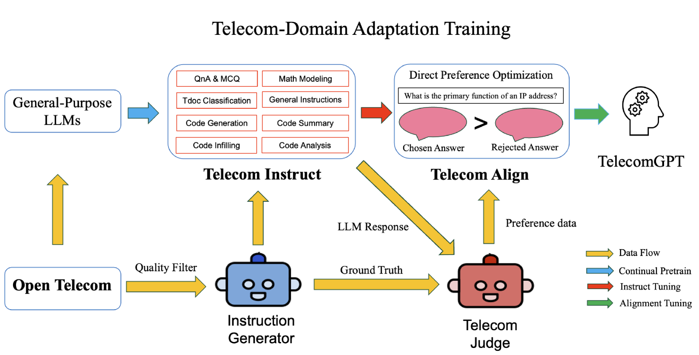
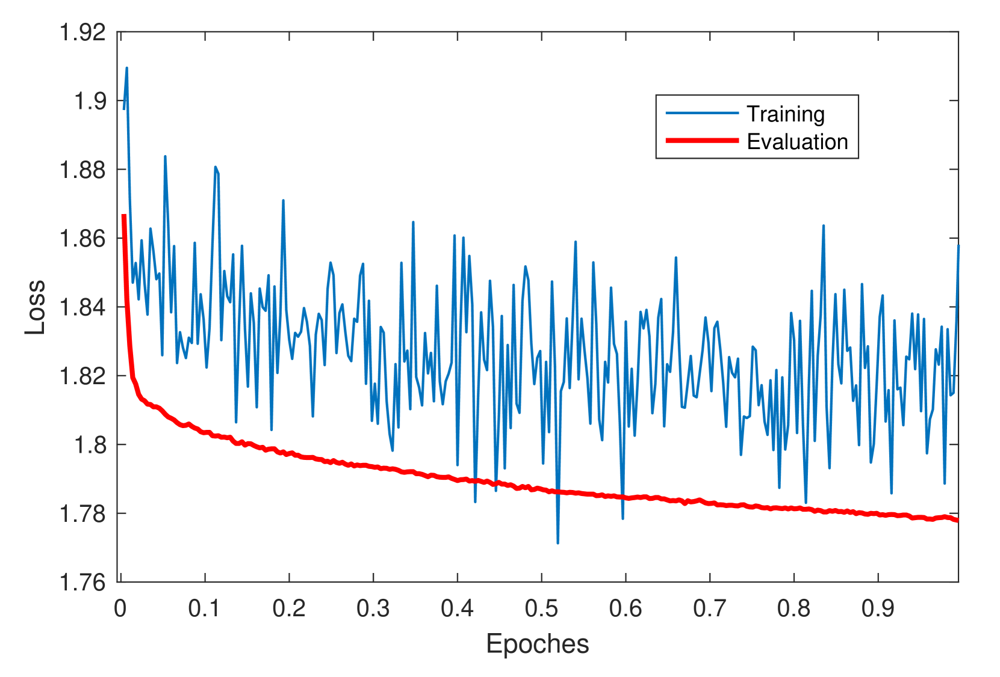
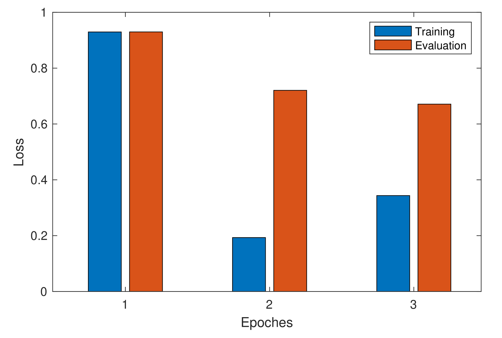
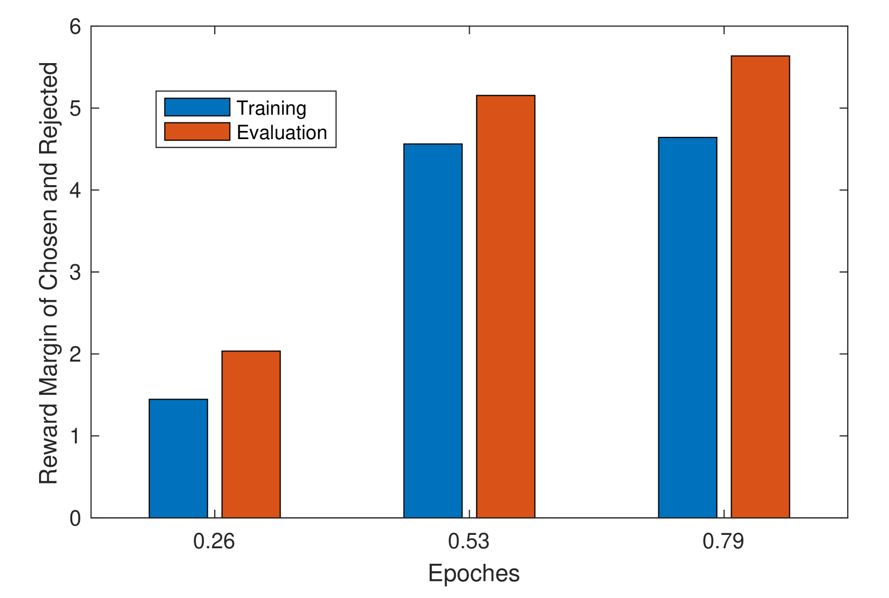
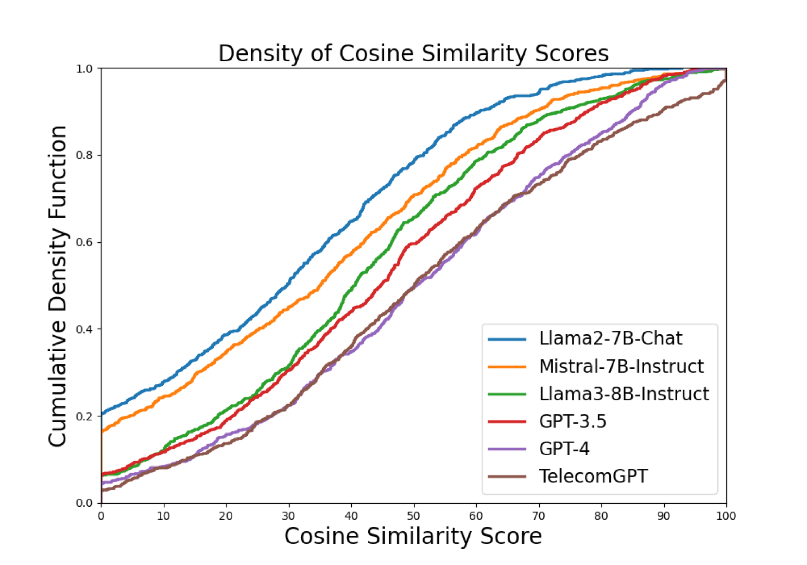

# TelecomGPT：打造电信专属大型语言模型的框架

发布时间：2024年07月12日

`LLM应用` `人工智能`

> TelecomGPT: A Framework to Build Telecom-Specfic Large Language Models

# 摘要

> 大型语言模型 (LLM) 有望革新第六代 (6G) 通信网络，但当前主流 LLM 普遍缺乏电信专业知识。本文首次提出了一种将通用 LLM 转化为电信特定 LLM 的流程，通过构建专用数据集进行持续预训练、指令调整和校准调整。针对电信领域缺乏评估基准的问题，我们扩展了现有基准并新增了电信数学建模、开放问答和代码任务三大基准，全面评估 LLM 在电信领域的各项能力。经微调的 TelecomGPT 在电信数学建模基准上显著超越现有最先进模型，并在多个评估基准上表现卓越。

> Large Language Models (LLMs) have the potential to revolutionize the Sixth Generation (6G) communication networks. However, current mainstream LLMs generally lack the specialized knowledge in telecom domain. In this paper, for the first time, we propose a pipeline to adapt any general purpose LLMs to a telecom-specific LLMs. We collect and build telecom-specific pre-train dataset, instruction dataset, preference dataset to perform continual pre-training, instruct tuning and alignment tuning respectively. Besides, due to the lack of widely accepted evaluation benchmarks in telecom domain, we extend existing evaluation benchmarks and proposed three new benchmarks, namely, Telecom Math Modeling, Telecom Open QnA and Telecom Code Tasks. These new benchmarks provide a holistic evaluation of the capabilities of LLMs including math modeling, Open-Ended question answering, code generation, infilling, summarization and analysis in telecom domain. Our fine-tuned LLM TelecomGPT outperforms state of the art (SOTA) LLMs including GPT-4, Llama-3 and Mistral in Telecom Math Modeling benchmark significantly and achieve comparable performance in various evaluation benchmarks such as TeleQnA, 3GPP technical documents classification, telecom code summary and generation and infilling.

[Arxiv](https://arxiv.org/abs/2407.09424)