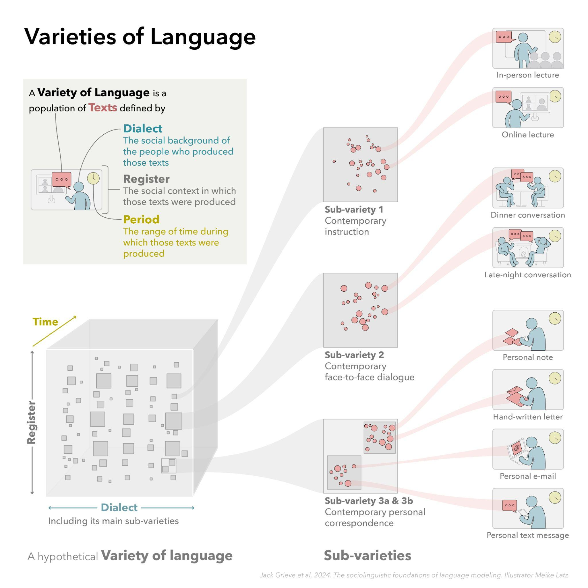
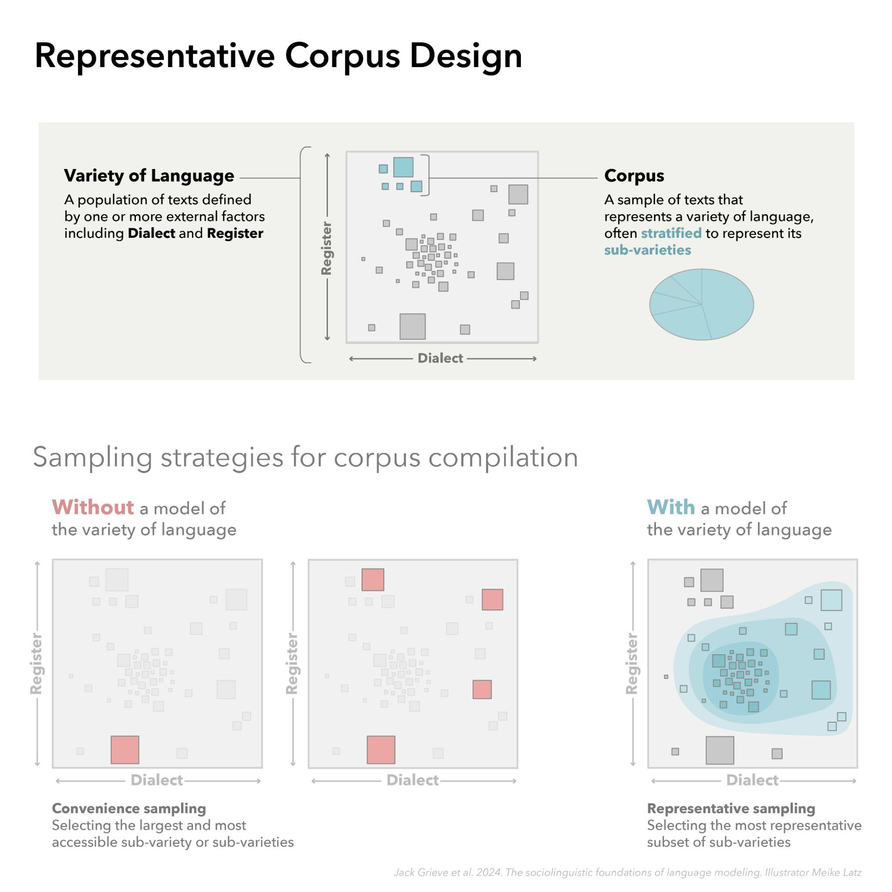
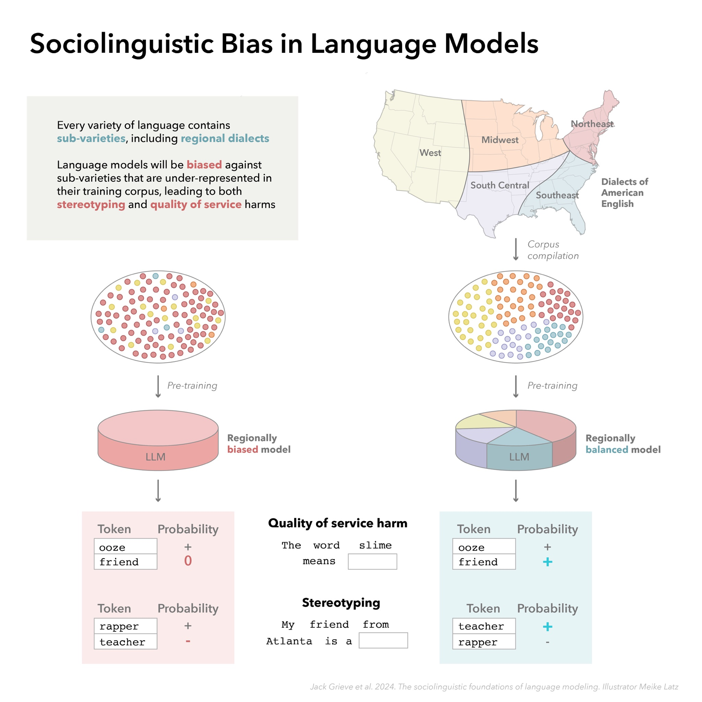
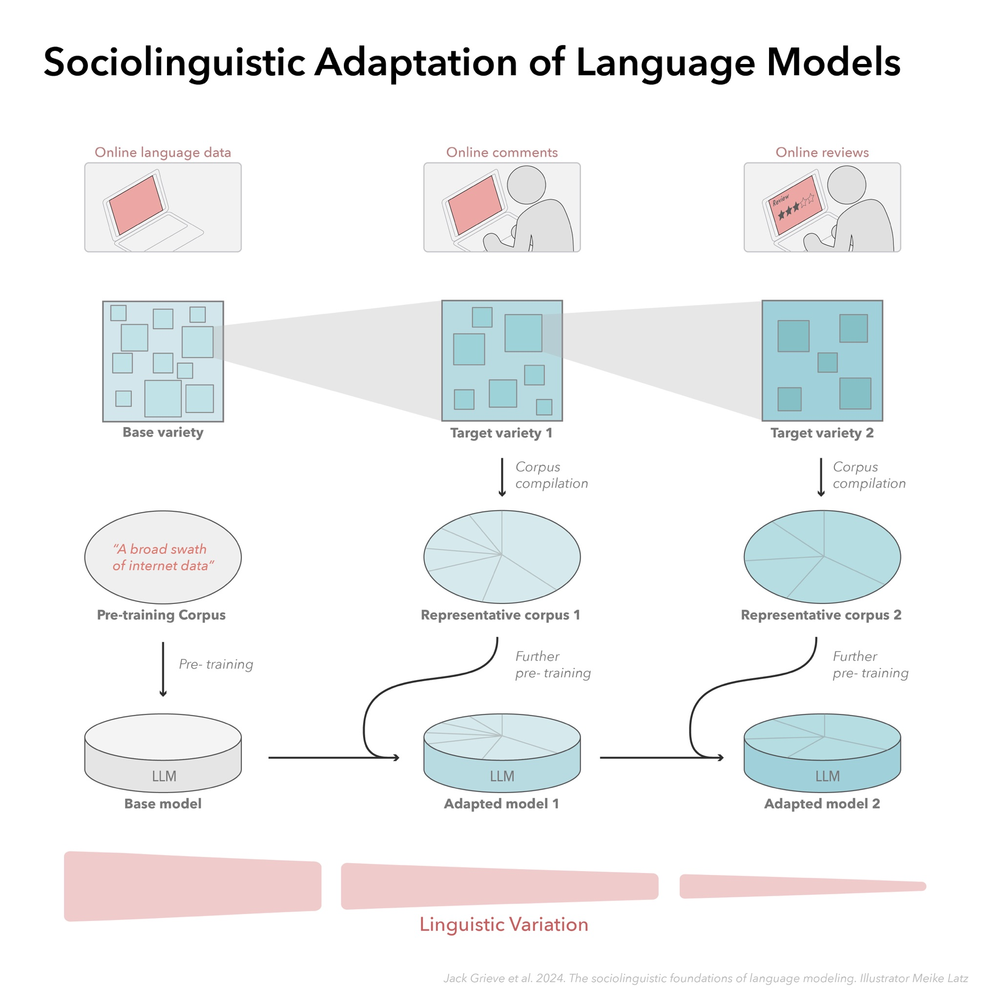

# 语言模型的社会语言学根基

发布时间：2024年07月12日

`LLM理论` `社会语言学` `人工智能`

> The Sociolinguistic Foundations of Language Modeling

# 摘要

> 本文从社会语言学角度探讨语言建模，指出大型语言模型本质上是多种语言的体现。我们探讨了这一观点如何助力大型语言模型的发展与应用，并详细阐述了语言变体的技术定义。此外，我们分析了这一视角在应对语言建模五大挑战——社会偏见、领域适应、对齐、语言变化及规模方面的潜力。最终，我们强调，为提升大型语言模型的性能与社会价值，精确构建代表特定语言变体的训练语料库至关重要。

> In this paper, we introduce a sociolinguistic perspective on language modeling. We claim that large language models are inherently models of varieties of language, and we consider how this insight can inform the development and deployment of large language models. We begin by presenting a technical definition of the concept of a variety of language as developed in sociolinguistics. We then discuss how this perspective can help address five basic challenges in language modeling: social bias, domain adaptation, alignment, language change, and scale. Ultimately, we argue that it is crucial to carefully define and compile training corpora that accurately represent the specific varieties of language being modeled to maximize the performance and societal value of large language models.

[Arxiv](https://arxiv.org/abs/2407.09241)