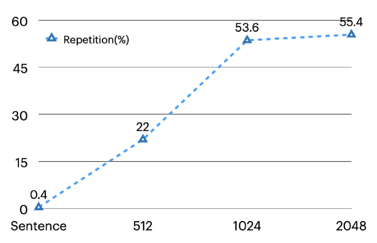
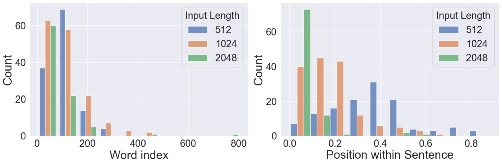

# 借助大型语言模型，我们迈向了章节间上下文感知的文学翻译新境界。

发布时间：2024年07月12日

`LLM应用`

> Towards Chapter-to-Chapter Context-Aware Literary Translation via Large Language Models

# 摘要

> 现有文档级翻译数据集中的语篇现象稀少，成为开发上下文感知机器翻译模型的障碍。多数方法依赖于不切实际的句子级对齐假设。为此，我们策划了包含160本复杂语篇结构的中英文文学数据集，并提出更具挑战性的章节到章节（Ch2Ch）翻译设置，研究常用模型的性能。我们还探索了在Ch2Ch文学翻译领域微调大型语言模型的方法，显著提升了性能。分析表明，Ch2Ch文学翻译在模型学习和解码算法方面均具挑战性。

> Discourse phenomena in existing document-level translation datasets are sparse, which has been a fundamental obstacle in the development of context-aware machine translation models. Moreover, most existing document-level corpora and context-aware machine translation methods rely on an unrealistic assumption on sentence-level alignments. To mitigate these issues, we first curate a novel dataset of Chinese-English literature, which consists of 160 books with intricate discourse structures. Then, we propose a more pragmatic and challenging setting for context-aware translation, termed chapter-to-chapter (Ch2Ch) translation, and investigate the performance of commonly-used machine translation models under this setting. Furthermore, we introduce a potential approach of finetuning large language models (LLMs) within the domain of Ch2Ch literary translation, yielding impressive improvements over baselines. Through our comprehensive analysis, we unveil that literary translation under the Ch2Ch setting is challenging in nature, with respect to both model learning methods and translation decoding algorithms.

[Arxiv](https://arxiv.org/abs/2407.08978)