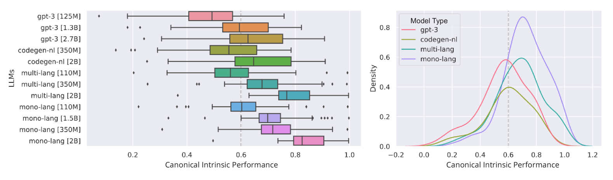

# 通过基于语法的解释，我们致力于让代码的 LLM 更加可靠和易于理解。

发布时间：2024年07月12日

`LLM应用` `软件开发` `数据科学`

> Towards More Trustworthy and Interpretable LLMs for Code through Syntax-Grounded Explanations

# 摘要

> LLMs的可信度与可解释性紧密相连。模型越透明，其可信度越高。然而，当前解释代码任务中LLM的技术多聚焦于准确性、模型对变化的响应或单任务表现，而非预测时所需的细致解释。为此，我们提出了ASTRust，一种基于模型置信度与编程语言语法结构关系的解释方法。ASTRust利用抽象语法树，在语法类别背景下阐释代码，助力开发者深入理解模型预测，无论是局部代码片段还是全局代码集。通过将置信度分数赋予AST中的常见语法结构，我们的方法超越了传统的令牌级置信度映射，提供了一种与开发者熟悉的编程概念直接对齐的模型置信度视图。实践中，我们开发了自动可视化工具，展示模型置信度分数在语法结构上的叠加，包括序列、热图和图形视觉。通过在精选GitHub仓库上对12个流行LLMs的数据科学研究和人类研究，我们验证了ASTRust的实际效益和有用性。

> Trustworthiness and interpretability are inextricably linked concepts for LLMs. The more interpretable an LLM is, the more trustworthy it becomes. However, current techniques for interpreting LLMs when applied to code-related tasks largely focus on accuracy measurements, measures of how models react to change, or individual task performance instead of the fine-grained explanations needed at prediction time for greater interpretability, and hence trust. To improve upon this status quo, this paper introduces ASTrust, an interpretability method for LLMs of code that generates explanations grounded in the relationship between model confidence and syntactic structures of programming languages. ASTrust explains generated code in the context of syntax categories based on Abstract Syntax Trees and aids practitioners in understanding model predictions at both local (individual code snippets) and global (larger datasets of code) levels. By distributing and assigning model confidence scores to well-known syntactic structures that exist within ASTs, our approach moves beyond prior techniques that perform token-level confidence mapping by offering a view of model confidence that directly aligns with programming language concepts with which developers are familiar. To put ASTrust into practice, we developed an automated visualization that illustrates the aggregated model confidence scores superimposed on sequence, heat-map, and graph-based visuals of syntactic structures from ASTs. We examine both the practical benefit that ASTrust can provide through a data science study on 12 popular LLMs on a curated set of GitHub repos and the usefulness of ASTrust through a human study.

[Arxiv](https://arxiv.org/abs/2407.08983)