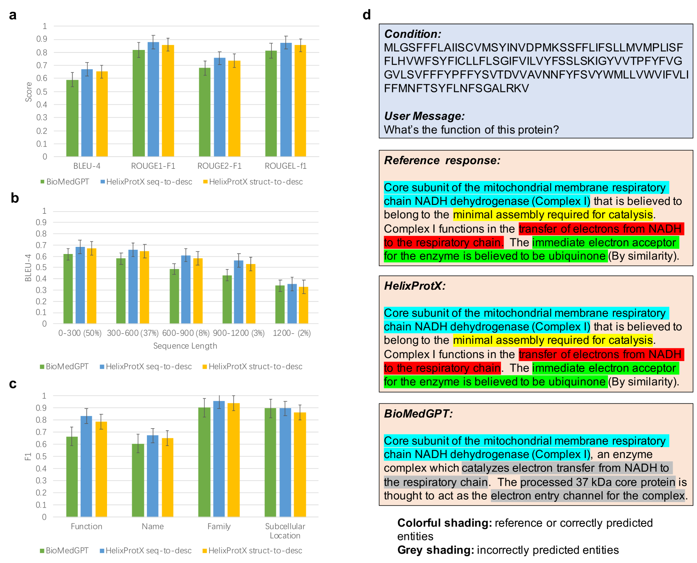
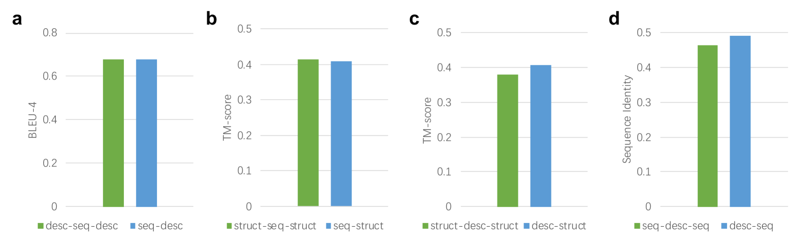

# HelixProtX 大型多模态模型整合序列、结构与描述，实现任意蛋白质间的生成。

发布时间：2024年07月12日

`LLM应用` `生物学` `蛋白质研究`

> Unifying Sequences, Structures, and Descriptions for Any-to-Any Protein Generation with the Large Multimodal Model HelixProtX

# 摘要

> 蛋白质作为生物系统的基石，可通过序列、结构和文本等多种形式展现其特性。尽管深度学习与大型科学语言模型在蛋白质研究领域取得了显著进展，但现有方法多聚焦于单一任务，如从一种形式预测另一种。这些方法局限了对多模态蛋白质数据的深入理解与生成。相反，大型多模态模型已展现出跨领域生成内容的潜力，如文本、图像和视频，极大地丰富了用户交互体验。将此类多模态技术融入蛋白质研究，有望革新我们对蛋白质的认知方式。为此，我们推出了HelixProtX系统，该系统基于大型多模态模型，旨在通过支持任意蛋白质形式的转换，为蛋白质研究提供全面解决方案。实验表明，HelixProtX不仅能够从氨基酸序列生成功能描述，还能根据文本描述设计蛋白质序列和结构，其性能在多项任务中超越了现有顶尖模型。通过整合多模态大型模型，HelixProtX为蛋白质生物学研究开辟了新路径，有望推动科学发现的加速。

> Proteins are fundamental components of biological systems and can be represented through various modalities, including sequences, structures, and textual descriptions. Despite the advances in deep learning and scientific large language models (LLMs) for protein research, current methodologies predominantly focus on limited specialized tasks -- often predicting one protein modality from another. These approaches restrict the understanding and generation of multimodal protein data. In contrast, large multimodal models have demonstrated potential capabilities in generating any-to-any content like text, images, and videos, thus enriching user interactions across various domains. Integrating these multimodal model technologies into protein research offers significant promise by potentially transforming how proteins are studied. To this end, we introduce HelixProtX, a system built upon the large multimodal model, aiming to offer a comprehensive solution to protein research by supporting any-to-any protein modality generation. Unlike existing methods, it allows for the transformation of any input protein modality into any desired protein modality. The experimental results affirm the advanced capabilities of HelixProtX, not only in generating functional descriptions from amino acid sequences but also in executing critical tasks such as designing protein sequences and structures from textual descriptions. Preliminary findings indicate that HelixProtX consistently achieves superior accuracy across a range of protein-related tasks, outperforming existing state-of-the-art models. By integrating multimodal large models into protein research, HelixProtX opens new avenues for understanding protein biology, thereby promising to accelerate scientific discovery.

[Arxiv](https://arxiv.org/abs/2407.09274)