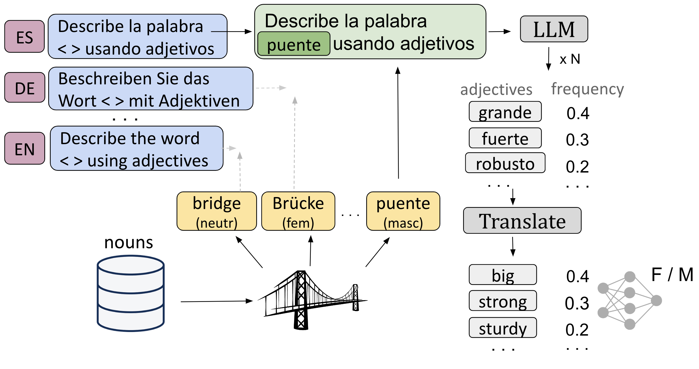
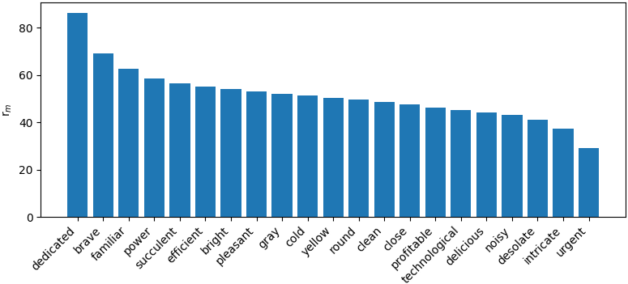
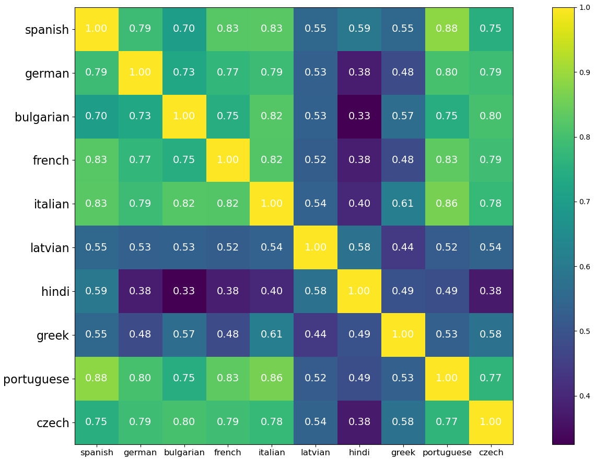
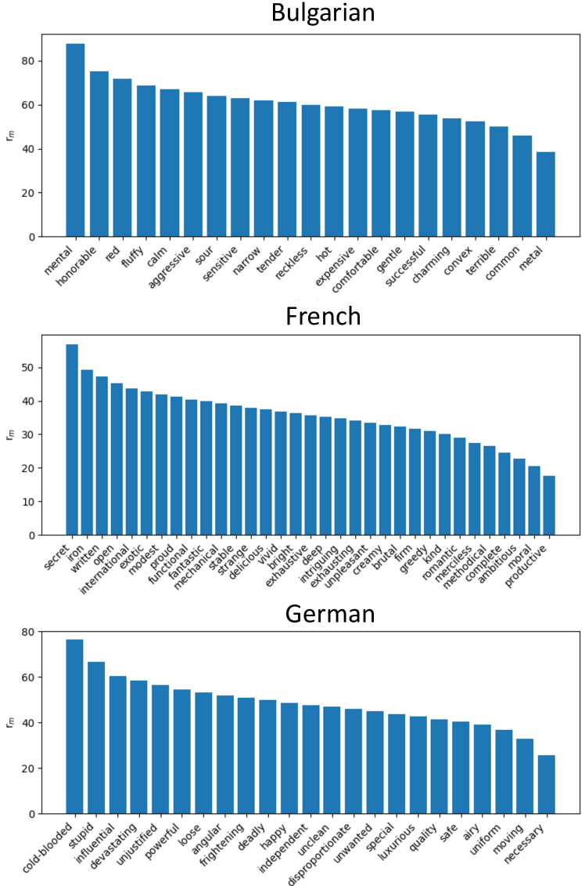

# 多语言大型语言模型在不同语言中展现出相似的偏见，宛如一座优雅的桥梁，连接着语言的多样性与偏见的共性。

发布时间：2024年07月12日

`LLM应用` `语言学` `人工智能`

> What an Elegant Bridge: Multilingual LLMs are Biased Similarly in Different Languages

# 摘要

> 本文从语法性别的角度探讨了大型语言模型的偏见。受心理语言学中性别对语言感知影响的启发，我们利用多语种 LLM 重新审视并扩展了 Boroditsky (2003) 的实验。通过引导模型用不同语言的形容词描述名词，特别是那些具有语法性别的语言，我们观察形容词在不同性别和语言中的共现情况，并训练分类器预测语法性别。令人惊讶的是，简单的分类器不仅能准确预测名词性别，还展现出跨语言的适用性。研究表明，尽管 LLM 在不同语言中的描述方式各异，但其偏见却惊人地一致。

> This paper investigates biases of Large Language Models (LLMs) through the lens of grammatical gender. Drawing inspiration from seminal works in psycholinguistics, particularly the study of gender's influence on language perception, we leverage multilingual LLMs to revisit and expand upon the foundational experiments of Boroditsky (2003). Employing LLMs as a novel method for examining psycholinguistic biases related to grammatical gender, we prompt a model to describe nouns with adjectives in various languages, focusing specifically on languages with grammatical gender. In particular, we look at adjective co-occurrences across gender and languages, and train a binary classifier to predict grammatical gender given adjectives an LLM uses to describe a noun. Surprisingly, we find that a simple classifier can not only predict noun gender above chance but also exhibit cross-language transferability. We show that while LLMs may describe words differently in different languages, they are biased similarly.

[Arxiv](https://arxiv.org/abs/2407.09704)