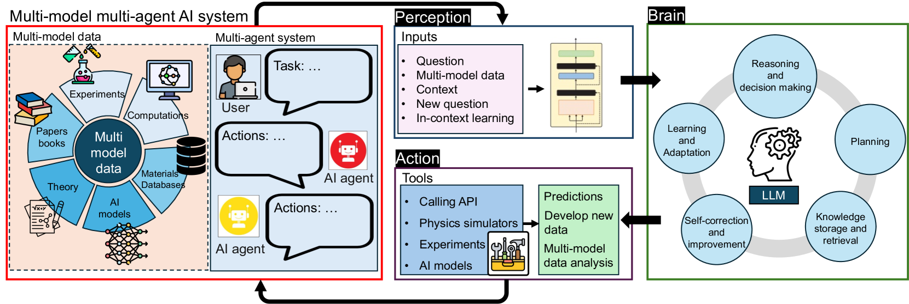
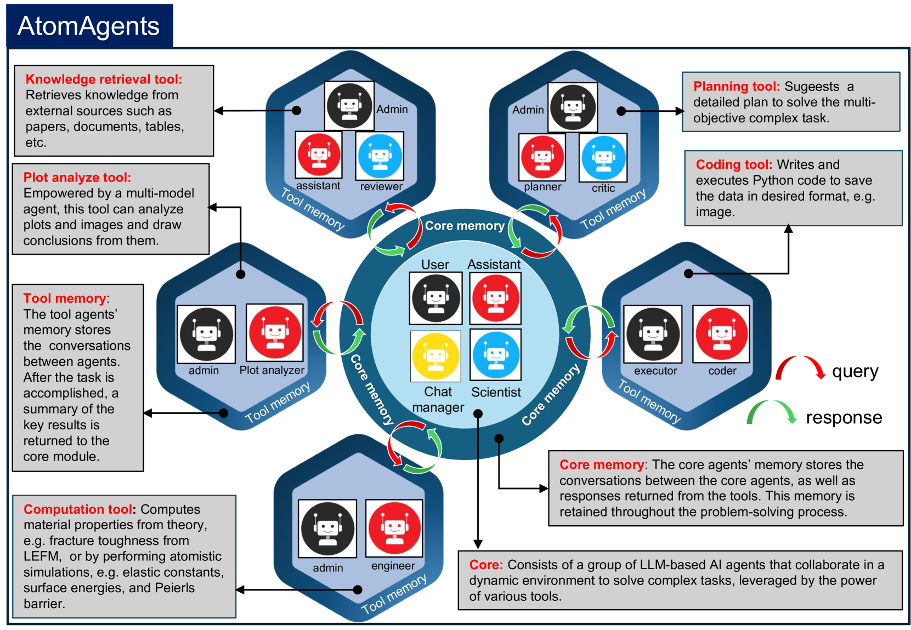
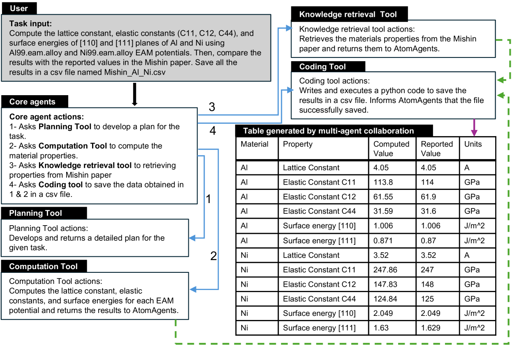
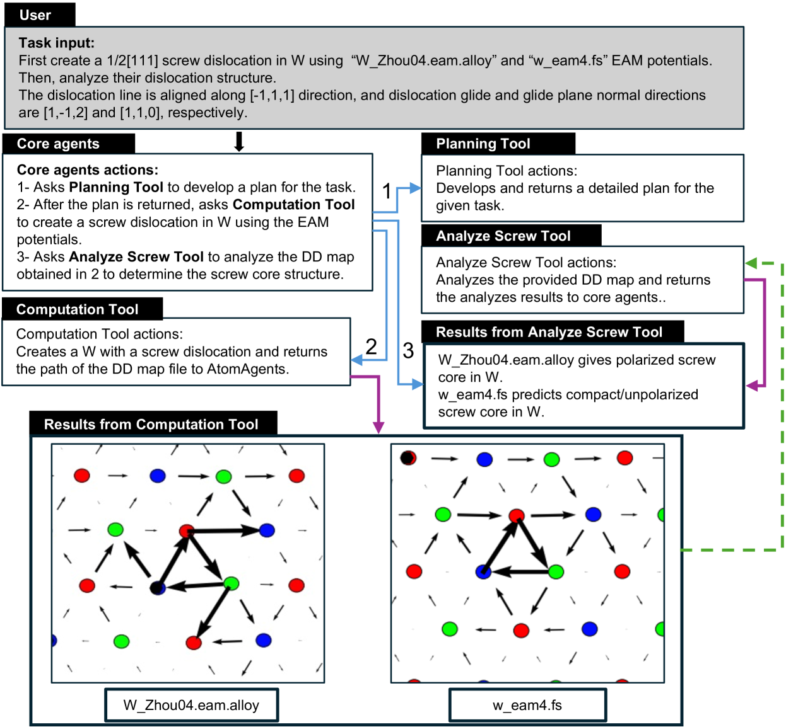
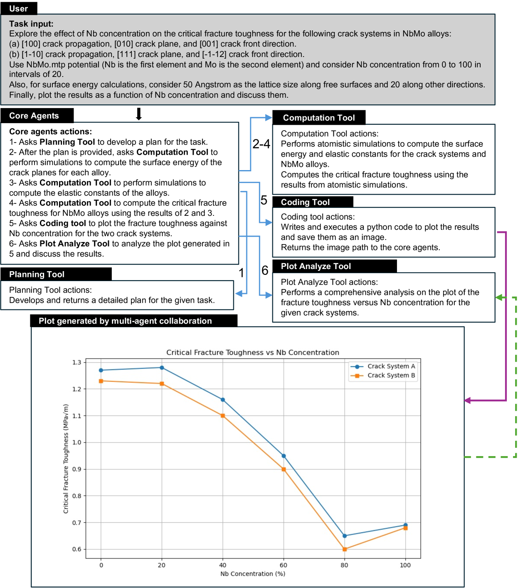
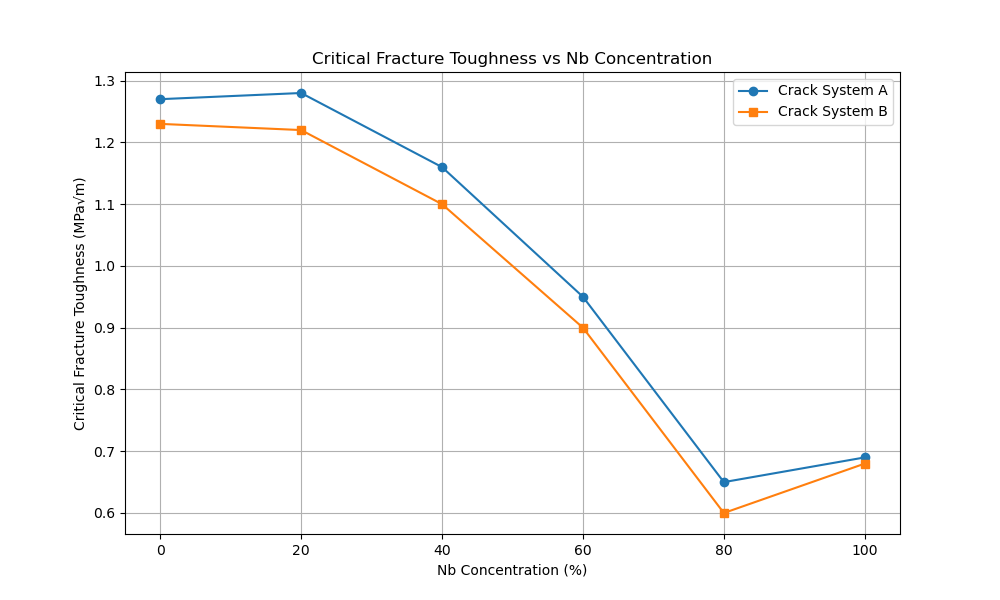
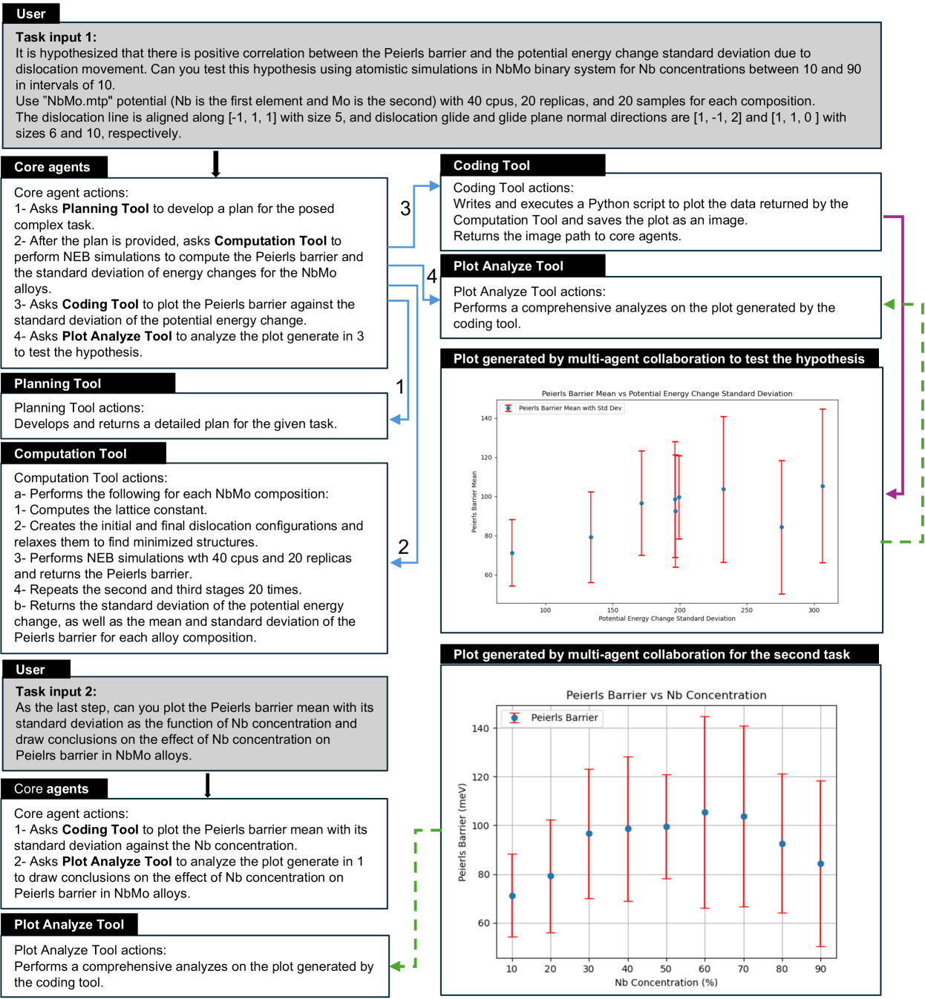
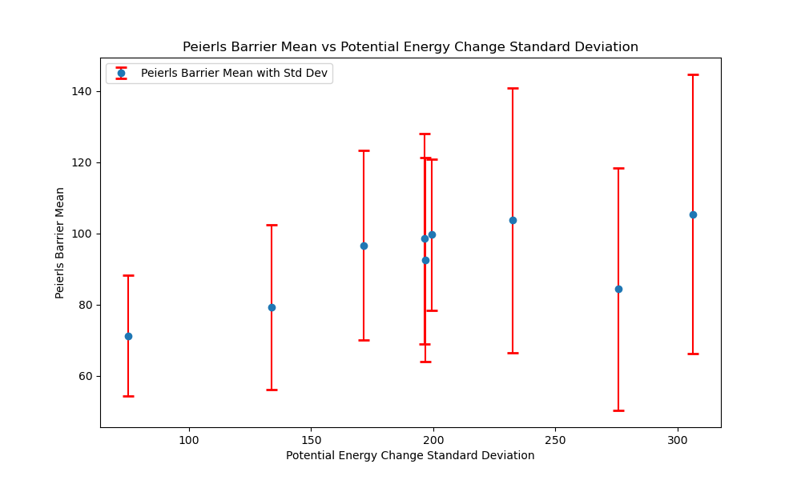

# AtomAgents：利用物理感知的多模态多智能体AI技术，推动合金设计和发现的革新。

发布时间：2024年07月13日

`Agent` `材料科学` `人工智能`

> AtomAgents: Alloy design and discovery through physics-aware multi-modal multi-agent artificial intelligence

# 摘要

> 合金设计涉及多尺度问题，传统上依赖人类专家进行全面处理，包括知识检索、计算方法应用、实验验证及结果分析。机器学习通过深度代理模型加速这一流程，但现有模型灵活性有限，难以应对新挑战。我们通过多AI代理在动态环境中的自主协作，克服了这些限制。提出的AtomAgents平台结合了大型语言模型的智能与跨领域AI代理的协作，涵盖知识检索、数据集成、物理模拟及结果分析，实现了复杂材料设计问题的解决，例如自主设计性能更优的金属合金。我们的研究不仅准确预测了合金特性，还强调了固溶合金化的重要性，提升了多目标设计任务的效率，并为多个领域如生物医学、可再生能源和环境可持续性开辟了新路径。

> The design of alloys is a multi-scale problem that requires a holistic approach that involves retrieving relevant knowledge, applying advanced computational methods, conducting experimental validations, and analyzing the results, a process that is typically reserved for human experts. Machine learning (ML) can help accelerate this process, for instance, through the use of deep surrogate models that connect structural features to material properties, or vice versa. However, existing data-driven models often target specific material objectives, offering limited flexibility to integrate out-of-domain knowledge and cannot adapt to new, unforeseen challenges. Here, we overcome these limitations by leveraging the distinct capabilities of multiple AI agents that collaborate autonomously within a dynamic environment to solve complex materials design tasks. The proposed physics-aware generative AI platform, AtomAgents, synergizes the intelligence of large language models (LLM) the dynamic collaboration among AI agents with expertise in various domains, including knowledge retrieval, multi-modal data integration, physics-based simulations, and comprehensive results analysis across modalities that includes numerical data and images of physical simulation results. The concerted effort of the multi-agent system allows for addressing complex materials design problems, as demonstrated by examples that include autonomously designing metallic alloys with enhanced properties compared to their pure counterparts. Our results enable accurate prediction of key characteristics across alloys and highlight the crucial role of solid solution alloying to steer the development of advanced metallic alloys. Our framework enhances the efficiency of complex multi-objective design tasks and opens new avenues in fields such as biomedical materials engineering, renewable energy, and environmental sustainability.

[Arxiv](https://arxiv.org/abs/2407.10022)