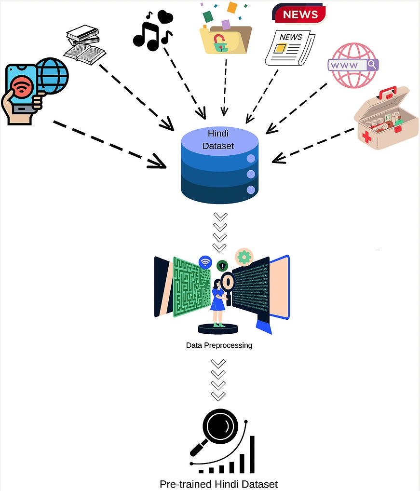
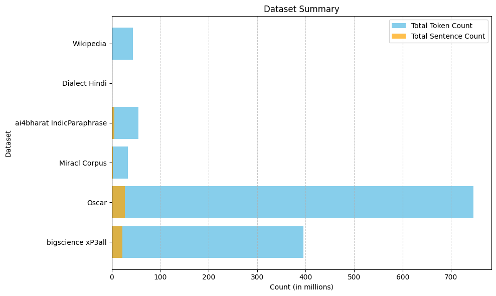
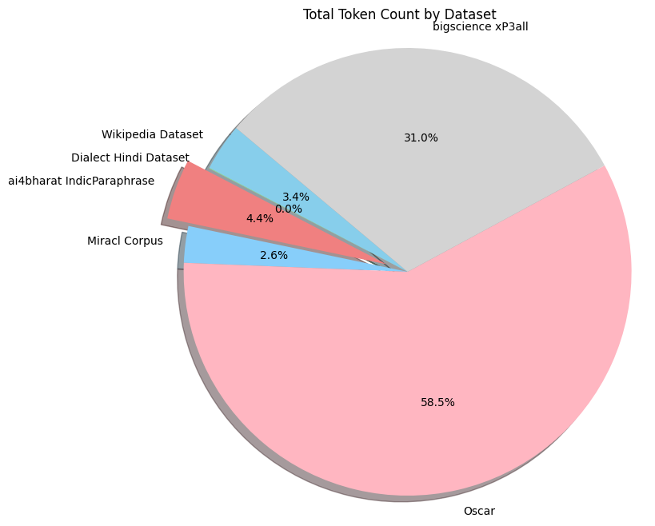

# 构建针对 INDIC 语言的预训练 LLM 数据集：印地语案例研究

发布时间：2024年07月13日

`LLM应用` `语言技术`

> Building pre-train LLM Dataset for the INDIC Languages: a case study on Hindi

# 摘要

> 大型语言模型（LLM）在自动响应人类指令的应用中展现了革命性能力，但构建这些模型，尤其是在印度语系中，面临的主要难题是高质量基础数据集的稀缺。本文中，我们提出了一款专为印度语系中的Hindi语言设计的大型预训练数据集，涵盖了多个领域及主要方言，共计12.8亿词元。我们详细阐述了数据采集、预处理及预训练应用的完整流程。此方法不仅适用于其他印度语种及低资源语言，还将无偿开放，助力LLM的预训练与研究。

> Large language models (LLMs) demonstrated transformative capabilities in many applications that require automatically generating responses based on human instruction. However, the major challenge for building LLMs, particularly in Indic languages, is the availability of high-quality data for building foundation LLMs. In this paper, we are proposing a large pre-train dataset in Hindi useful for the Indic language Hindi. We have collected the data span across several domains including major dialects in Hindi. The dataset contains 1.28 billion Hindi tokens. We have explained our pipeline including data collection, pre-processing, and availability for LLM pre-training. The proposed approach can be easily extended to other Indic and low-resource languages and will be available freely for LLM pre-training and LLM research purposes.

[Arxiv](https://arxiv.org/abs/2407.09855)