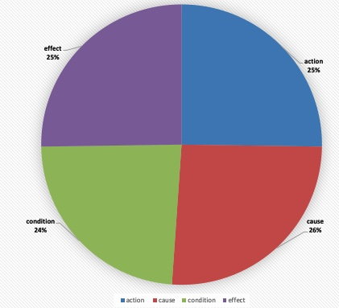
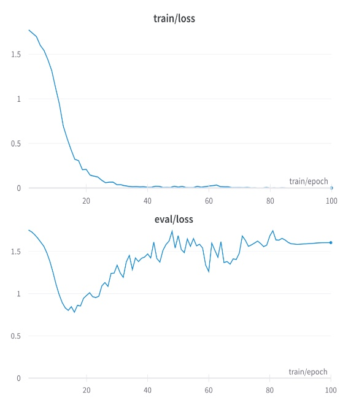

# 利用大型语言模型从医学文本中提取因果关系

发布时间：2024年07月13日

`LLM应用` `人工智能`

> Causality extraction from medical text using Large Language Models (LLMs)

# 摘要

> 本研究首次展示了从妊娠糖尿病临床实践指南中提取因果关系的能力，通过使用BERT变体和大型语言模型如GPT-4和LLAMA2进行实验。结果显示，BioBERT以0.72的平均F1分数领先，而GPT-4和LLAMA2虽表现相近，但一致性稍逊。此外，我们还公开了相关代码和注释语料库，以供进一步研究。

> This study explores the potential of natural language models, including large language models, to extract causal relations from medical texts, specifically from Clinical Practice Guidelines (CPGs). The outcomes causality extraction from Clinical Practice Guidelines for gestational diabetes are presented, marking a first in the field. We report on a set of experiments using variants of BERT (BioBERT, DistilBERT, and BERT) and using Large Language Models (LLMs), namely GPT-4 and LLAMA2. Our experiments show that BioBERT performed better than other models, including the Large Language Models, with an average F1-score of 0.72. GPT-4 and LLAMA2 results show similar performance but less consistency. We also release the code and an annotated a corpus of causal statements within the Clinical Practice Guidelines for gestational diabetes.

[Arxiv](https://arxiv.org/abs/2407.10020)