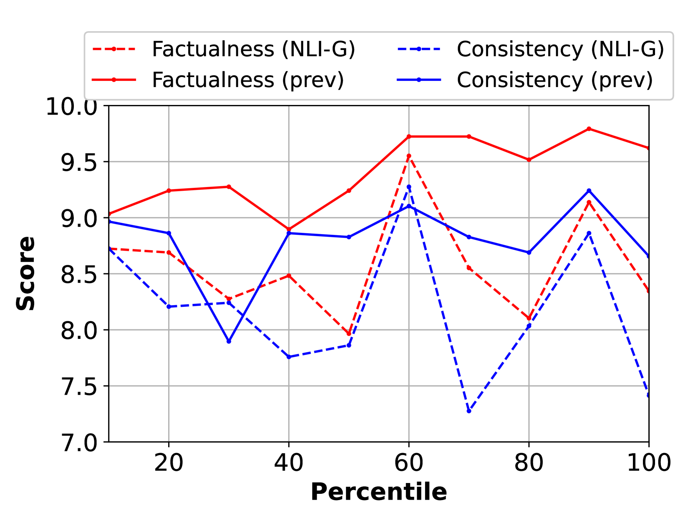

# 连贯对话：提升多代理模拟对话的真实性

发布时间：2024年07月13日

`Agent` `人工智能` `虚拟现实`

> Cohesive Conversations: Enhancing Authenticity in Multi-Agent Simulated Dialogues

# 摘要

> 本文深入探讨了 LLM 驱动模拟中多智能体对话的质量，特别是在 Park 等人的研究中，25 个智能体全天模拟生活，展现出复杂互动。研究发现，对话中存在重复、不一致和幻觉等问题，且错误信息传播加剧了这些问题。为此，我们创新性地提出了 SDR 框架，通过即时问题识别、历史对话证据收集和 LLM 分析，有效检测并修正话语错误。经 GPT-4 和人类评估验证，SDR 框架显著提升了对话的一致性、多样性，并减少了虚假信息。这一研究为提升多智能体模拟中的对话质量开辟了新路径，为未来研究树立了新标杆。

> This paper investigates the quality of multi-agent dialogues in simulations powered by Large Language Models (LLMs), focusing on a case study from Park et al. (2023), where 25 agents engage in day-long simulations of life, showcasing complex behaviors and interactions. Analyzing dialogues and memory over multiple sessions revealed significant issues such as repetition, inconsistency, and hallucination, exacerbated by the propagation of erroneous information. To combat these challenges, we propose a novel Screening, Diagnosis, and Regeneration (SDR) framework that detects and corrects utterance errors through a comprehensive process involving immediate issue identification, evidence gathering from past dialogues, and LLM analysis for utterance revision. The effectiveness of the SDR framework is validated through GPT-4 assessments and human evaluations, demonstrating marked improvements in dialogue consistency, diversity, and the reduction of false information. This work presents a pioneering approach to enhancing dialogue quality in multi-agent simulations, establishing a new standard for future research in the field.

[Arxiv](https://arxiv.org/abs/2407.09897)