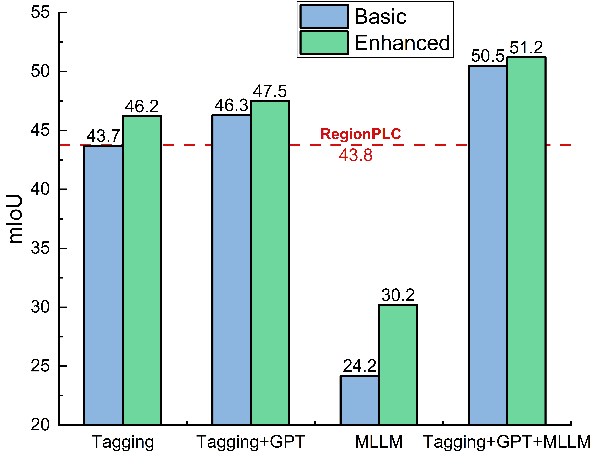

# 密集多模态对齐助力开放词汇表的3D场景深度理解

发布时间：2024年07月13日

`LLM应用` `计算机视觉` `人工智能`

> Dense Multimodal Alignment for Open-Vocabulary 3D Scene Understanding

# 摘要

> 近期，视觉-语言预训练模型在零-shot识别任务中表现出色。然而，以往的开放词汇3D场景理解方法往往只依赖单一模态的监督，忽视了多模态融合的潜力。为此，我们提出了密集多模态对齐（DMA）框架，旨在将不同模态紧密融合至同一空间，以发挥其协同效应。我们不仅利用大型视觉-语言模型提取详尽的类别信息和场景描述，还通过图像模态构建点-像素-文本的紧密联系。同时，为提升2D模型在3D任务中的泛化能力，我们采用了双路径集成策略，融合了固定的CLIP视觉特征与可调整的掩码特征。实验结果显示，DMA方法在室内外多种任务中均展现出卓越的开放词汇分割性能。

> Recent vision-language pre-training models have exhibited remarkable generalization ability in zero-shot recognition tasks. Previous open-vocabulary 3D scene understanding methods mostly focus on training 3D models using either image or text supervision while neglecting the collective strength of all modalities. In this work, we propose a Dense Multimodal Alignment (DMA) framework to densely co-embed different modalities into a common space for maximizing their synergistic benefits. Instead of extracting coarse view- or region-level text prompts, we leverage large vision-language models to extract complete category information and scalable scene descriptions to build the text modality, and take image modality as the bridge to build dense point-pixel-text associations. Besides, in order to enhance the generalization ability of the 2D model for downstream 3D tasks without compromising the open-vocabulary capability, we employ a dual-path integration approach to combine frozen CLIP visual features and learnable mask features. Extensive experiments show that our DMA method produces highly competitive open-vocabulary segmentation performance on various indoor and outdoor tasks.

[Arxiv](https://arxiv.org/abs/2407.09781)