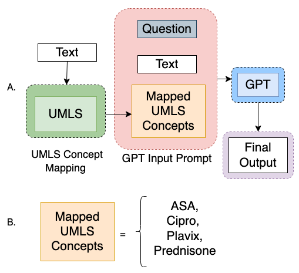
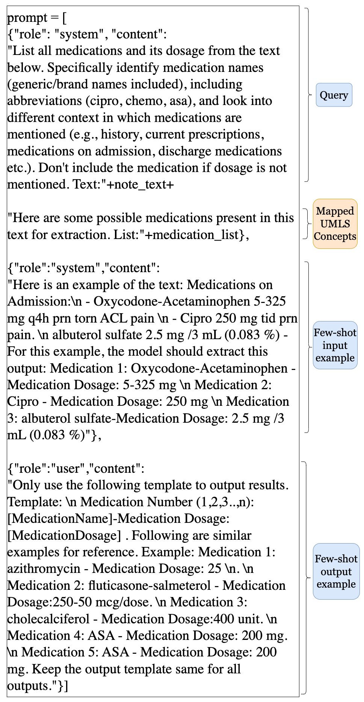
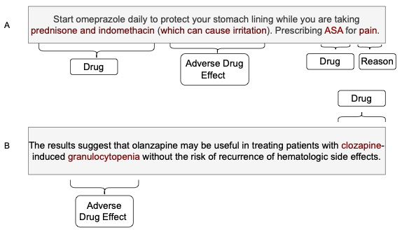

# 利用知识库引导生成技术，实现文档级临床实体与关系的精准抽取。

发布时间：2024年07月13日

`LLM应用` `人工智能`

> Document-level Clinical Entity and Relation Extraction via Knowledge Base-Guided Generation

# 摘要

> GPT模型因其精确的抽取和上下文理解能力，在临床实体和关系抽取任务中表现出色。我们通过整合统一医学语言系统（UMLS）知识库，进一步提升了文档级临床实体和关系的识别精度。我们的框架通过筛选与文本相关的UMLS概念，并将其融入提示中，引导语言模型更精准地抽取实体。实验结果显示，这种结合UMLS的概念映射方法，相较于未使用UMLS的通用语言模型，在少样本抽取任务中表现更优。同时，我们的方法也超越了传统的检索增强生成（RAG）技术。总体来看，将UMLS与GPT模型结合，不仅提升了实体和关系的识别效率，也为医疗等专业领域的方法应用开辟了新路径。

> Generative pre-trained transformer (GPT) models have shown promise in clinical entity and relation extraction tasks because of their precise extraction and contextual understanding capability. In this work, we further leverage the Unified Medical Language System (UMLS) knowledge base to accurately identify medical concepts and improve clinical entity and relation extraction at the document level. Our framework selects UMLS concepts relevant to the text and combines them with prompts to guide language models in extracting entities. Our experiments demonstrate that this initial concept mapping and the inclusion of these mapped concepts in the prompts improves extraction results compared to few-shot extraction tasks on generic language models that do not leverage UMLS. Further, our results show that this approach is more effective than the standard Retrieval Augmented Generation (RAG) technique, where retrieved data is compared with prompt embeddings to generate results. Overall, we find that integrating UMLS concepts with GPT models significantly improves entity and relation identification, outperforming the baseline and RAG models. By combining the precise concept mapping capability of knowledge-based approaches like UMLS with the contextual understanding capability of GPT, our method highlights the potential of these approaches in specialized domains like healthcare.

[Arxiv](https://arxiv.org/abs/2407.10021)