# 深入探讨上下文线性估计的细粒度分析，涵盖数据、架构及其他相关因素。

发布时间：2024年07月13日

`LLM理论` `人工智能` `机器学习`

> Fine-grained Analysis of In-context Linear Estimation: Data, Architecture, and Beyond

# 摘要

> 最新研究显示，通过线性估计器和梯度下降步骤，采用线性注意力的Transformer能够实现上下文学习（ICL）。然而，现有优化分析仅限于理想化场景，其中任务与特征向量独立同分布，且注意力权重完全参数化。本研究深入探讨了ICL的优化与泛化机制，通过以下创新：（1）分析了单层线性注意及H3状态空间模型的优化特性，证明在特定条件下两者均能执行一步预处理梯度下降，且H3凭借其内置卷积滤波器，在适当场景下可实现样本加权并超越线性注意。（2）针对检索增强生成（RAG）与任务-特征对齐，提出新的风险边界，揭示了分布对齐如何降低ICL的样本复杂度。（3）推导了低秩参数化注意力权重的最优风险，并阐释了LoRA如何通过捕捉任务协方差变化适应新分布。实验验证了理论成果，全面深化了对ICL机制的理解。

> Recent research has shown that Transformers with linear attention are capable of in-context learning (ICL) by implementing a linear estimator through gradient descent steps. However, the existing results on the optimization landscape apply under stylized settings where task and feature vectors are assumed to be IID and the attention weights are fully parameterized. In this work, we develop a stronger characterization of the optimization and generalization landscape of ICL through contributions on architectures, low-rank parameterization, and correlated designs: (1) We study the landscape of 1-layer linear attention and 1-layer H3, a state-space model. Under a suitable correlated design assumption, we prove that both implement 1-step preconditioned gradient descent. We show that thanks to its native convolution filters, H3 also has the advantage of implementing sample weighting and outperforming linear attention in suitable settings. (2) By studying correlated designs, we provide new risk bounds for retrieval augmented generation (RAG) and task-feature alignment which reveal how ICL sample complexity benefits from distributional alignment. (3) We derive the optimal risk for low-rank parameterized attention weights in terms of covariance spectrum. Through this, we also shed light on how LoRA can adapt to a new distribution by capturing the shift between task covariances. Experimental results corroborate our theoretical findings. Overall, this work explores the optimization and risk landscape of ICL in practically meaningful settings and contributes to a more thorough understanding of its mechanics.

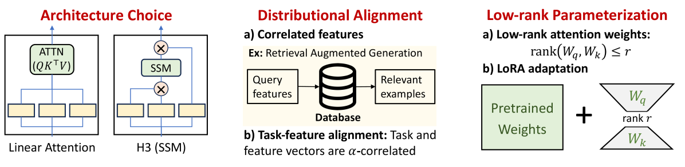

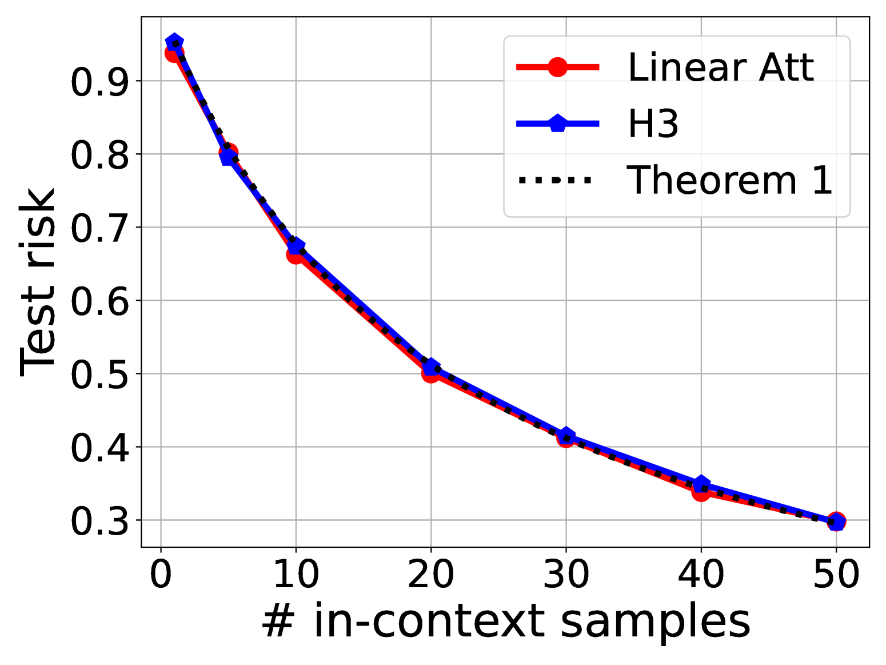

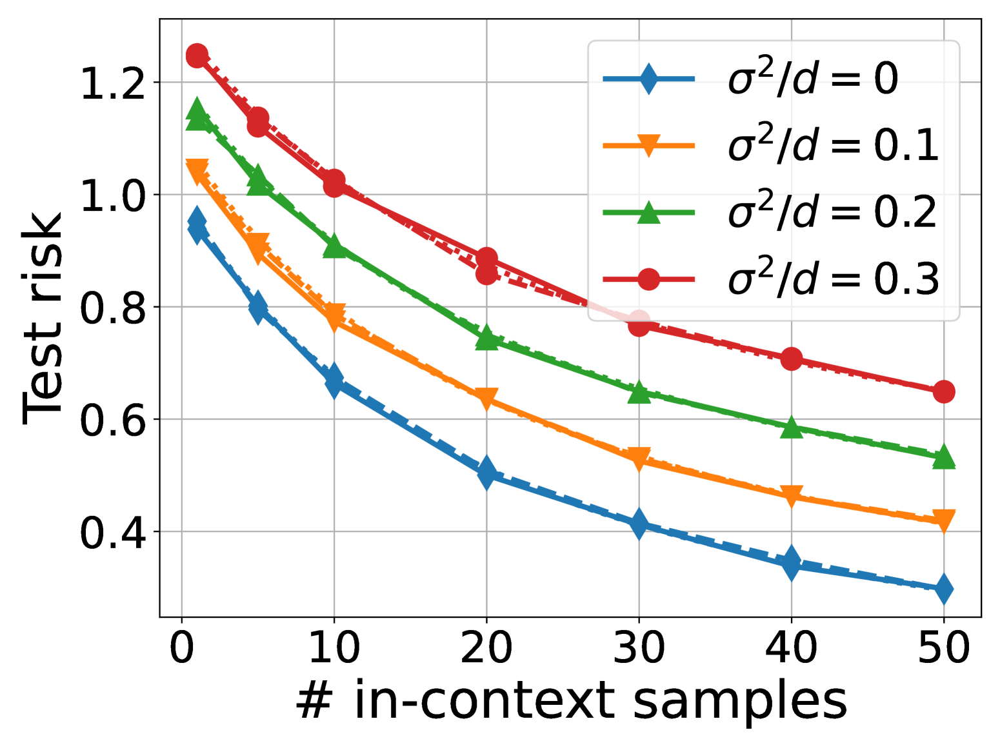

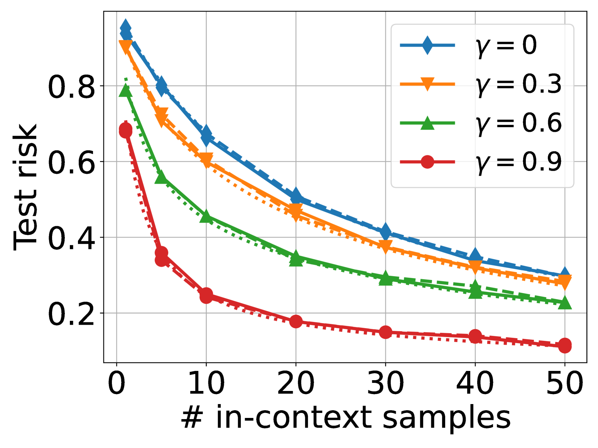

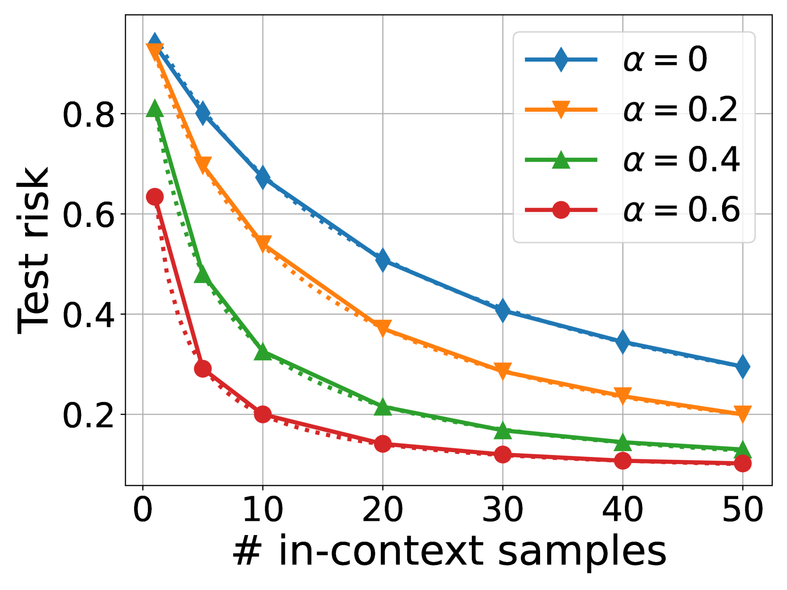

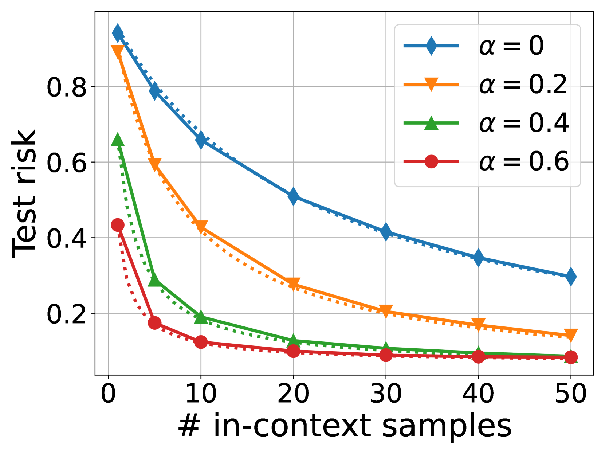

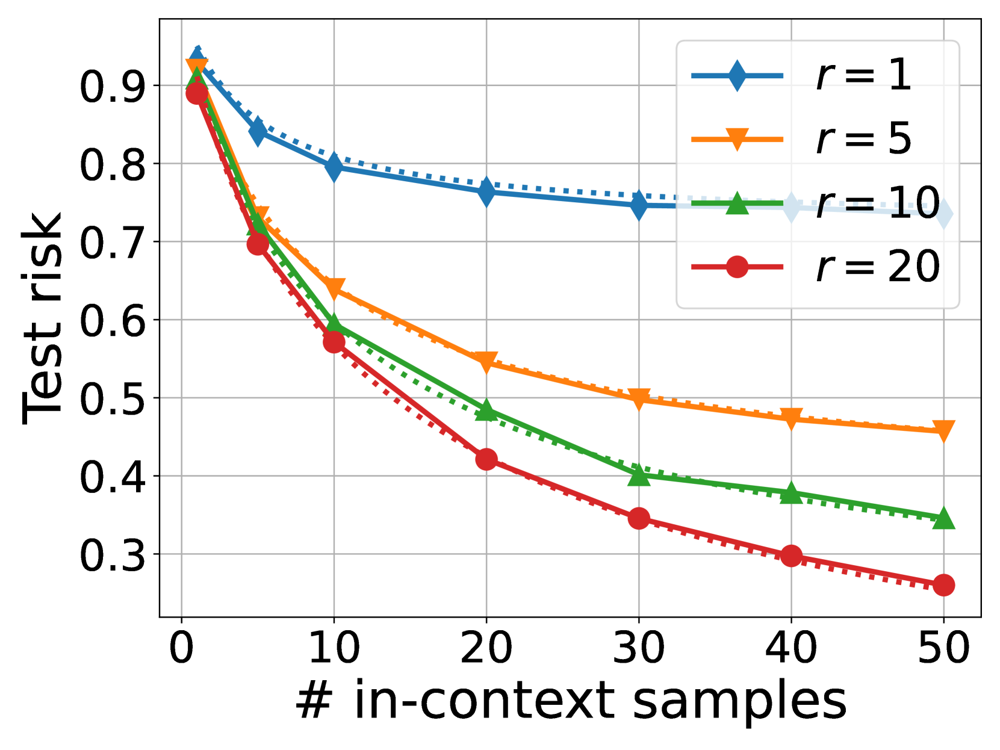

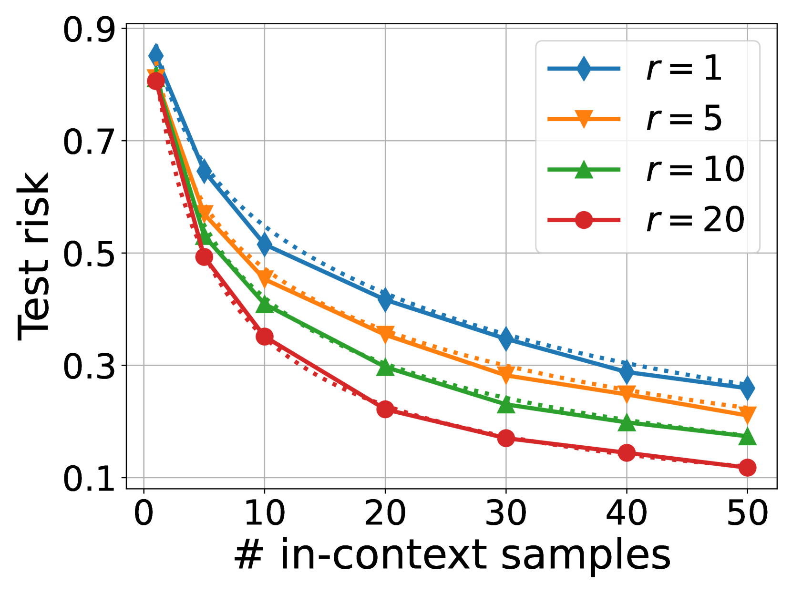

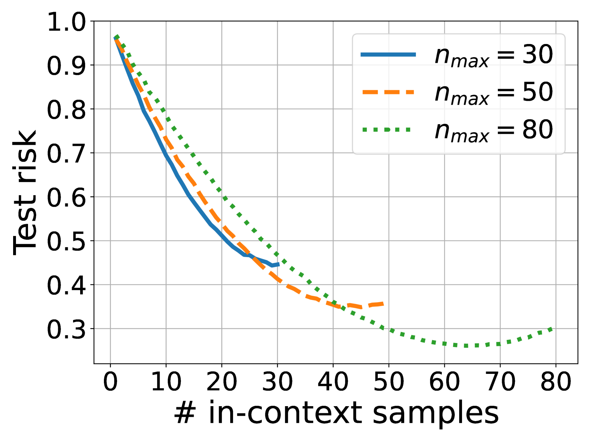

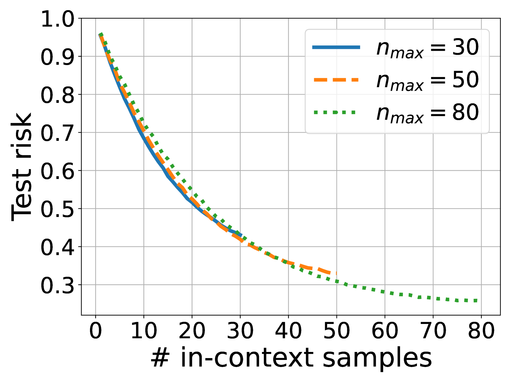

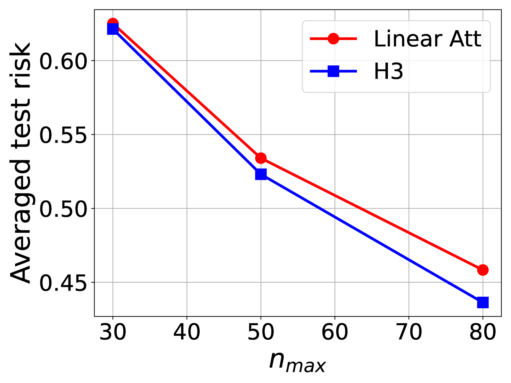

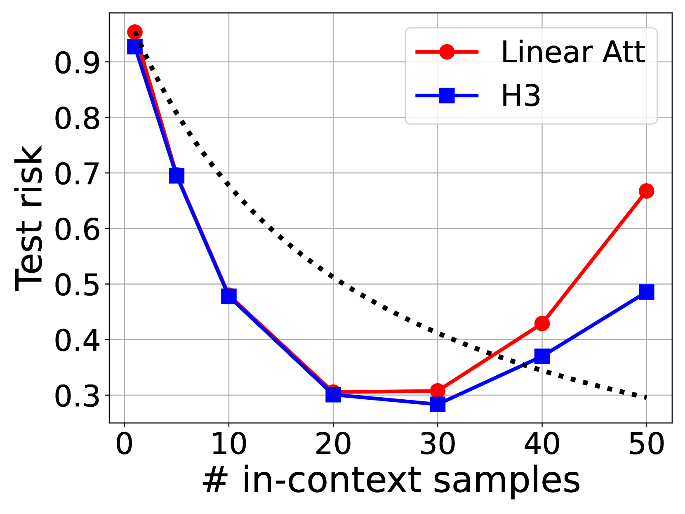

[Arxiv](https://arxiv.org/abs/2407.10005)