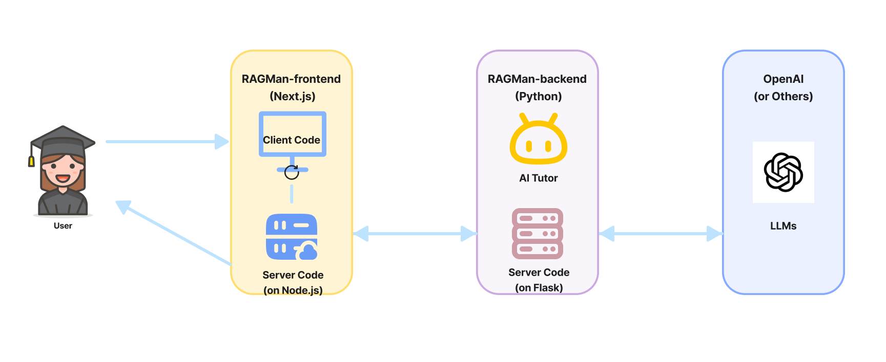

# 编程课程中引入AI导师

发布时间：2024年07月13日

`LLM应用` `人工智能`

> Integrating AI Tutors in a Programming Course

# 摘要

> RAGMan，一款由LLM驱动的智能辅导系统，专为课程和作业定制AI导师。它通过RAG技术和严格指令，确保AI导师的回答精准匹配课程要求。学生在使用RAGMan的AI导师时，既能获得作业帮助，又不会直接得到答案，还能咨询编程相关问题。  在一门基础编程课上，RAGMan作为辅助资源，服务于455名学生，提供五种作业专属AI导师。本文记录了学生与AI导师的互动、反馈及成绩对比分析。约半数学生与AI导师互动，且多数为作业相关问题。在合理范围内提问时，AI导师98%的情况下能给出准确答案。78%的学生认为AI导师对学习有帮助，并赞赏其营造的无评判安全学习环境。

> RAGMan is an LLM-powered tutoring system that can support a variety of course-specific and homework-specific AI tutors. RAGMan leverages Retrieval Augmented Generation (RAG), as well as strict instructions, to ensure the alignment of the AI tutors' responses. By using RAGMan's AI tutors, students receive assistance with their specific homework assignments without directly obtaining solutions, while also having the ability to ask general programming-related questions.
  RAGMan was deployed as an optional resource in an introductory programming course with an enrollment of 455 students. It was configured as a set of five homework-specific AI tutors. This paper describes the interactions the students had with the AI tutors, the students' feedback, and a comparative grade analysis. Overall, about half of the students engaged with the AI tutors, and the vast majority of the interactions were legitimate homework questions. When students posed questions within the intended scope, the AI tutors delivered accurate responses 98% of the time. Within the students used AI tutors, 78% reported that the tutors helped their learning. Beyond AI tutors' ability to provide valuable suggestions, students reported appreciating them for fostering a safe learning environment free from judgment.

[Arxiv](https://arxiv.org/abs/2407.15718)