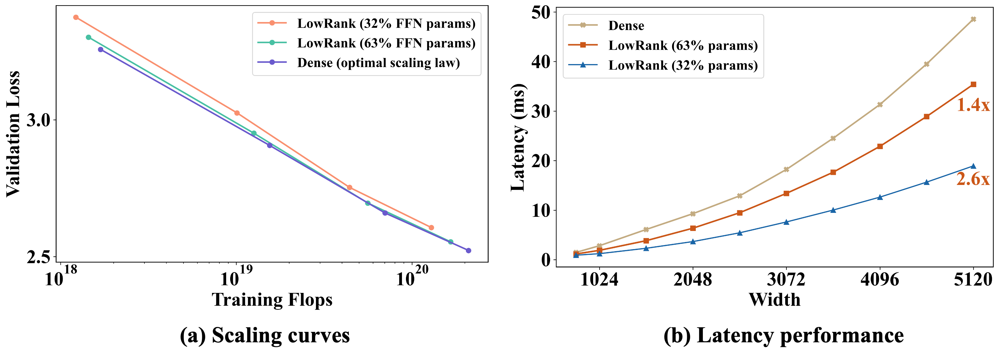

# 探索 Transformer 语言模型中的低秩训练，分析其效率与规模效应。

发布时间：2024年07月13日

`LLM理论` `人工智能` `计算机科学`

> Investigating Low-Rank Training in Transformer Language Models: Efficiency and Scaling Analysis

# 摘要

> 当前最先进的 LLM 依赖于高计算成本的规模，激发了减少参数数量和成本的研究。我们专注于基于 Transformer 的 LLM，特别是对计算密集型的前馈网络（FFN）应用低秩参数化。与以往不同，我们（i）大规模探索低秩参数化，高达 1.3B 参数；（ii）在 Transformer 而非卷积架构中；（iii）从零开始训练。实验显示，低秩参数化在训练中高效且有效。这些结构化 FFN 的缩放曲线比原始模型更陡峭。基于此，我们开发的宽结构网络在性能上超越了现有的大型 Transformer。

> State-of-the-art LLMs often rely on scale with high computational costs, which has sparked a research agenda to reduce parameter counts and costs without significantly impacting performance. Our study focuses on Transformer-based LLMs, specifically applying low-rank parametrization to the computationally intensive feedforward networks (FFNs), which are less studied than attention blocks. In contrast to previous works, (i) we explore low-rank parametrization at scale, up to 1.3B parameters; (ii) within Transformer language models rather than convolutional architectures; and (iii) starting from training from scratch. Experiments on the large RefinedWeb dataset show that low-rank parametrization is both efficient (e.g., 2.6$\times$ FFN speed-up with 32\% parameters) and effective during training. Interestingly, these structured FFNs exhibit steeper scaling curves than the original models. Motivated by this finding, we develop the wide and structured networks surpassing the current medium-sized and large-sized Transformer in perplexity and throughput performance.

[Arxiv](https://arxiv.org/abs/2407.09835)