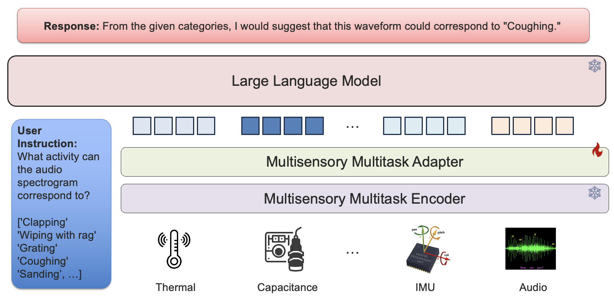
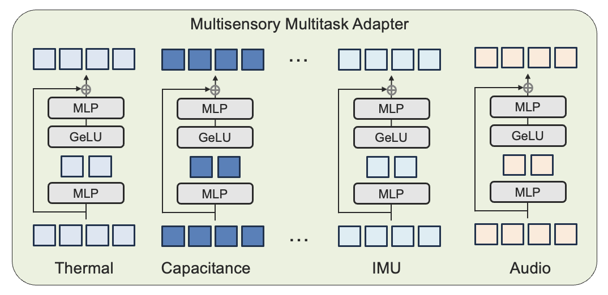
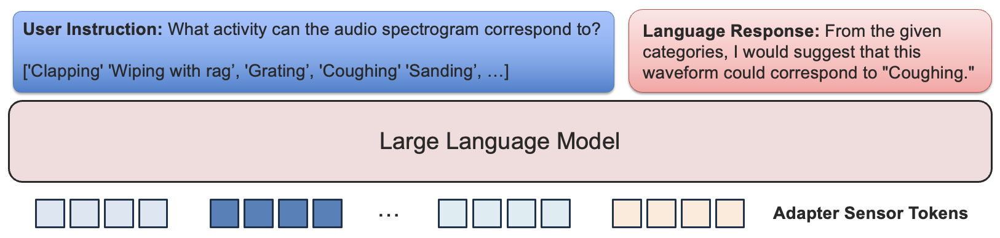
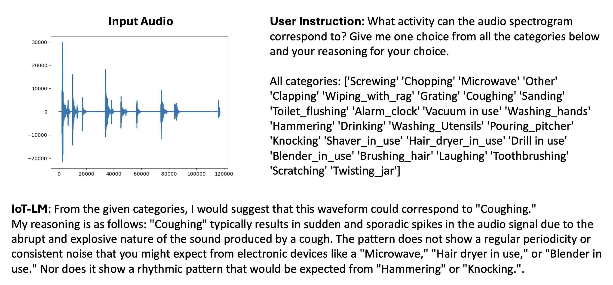
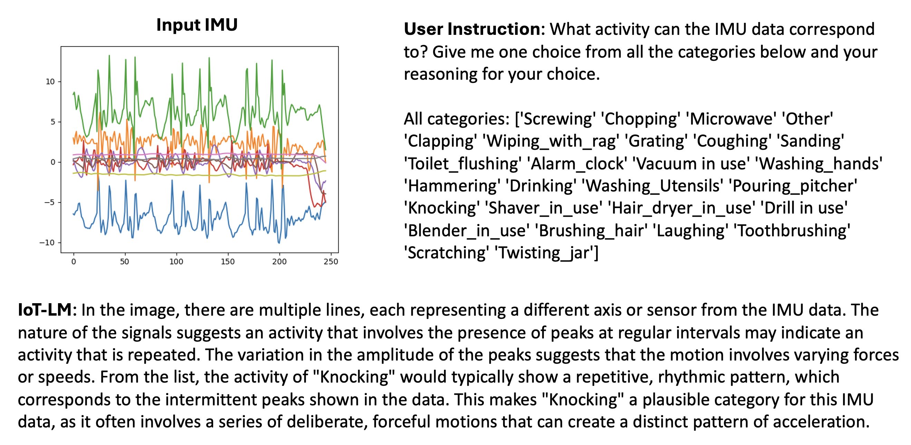
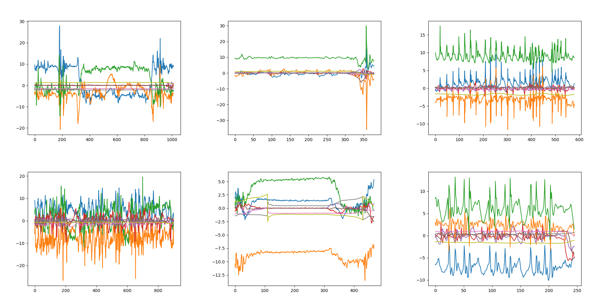
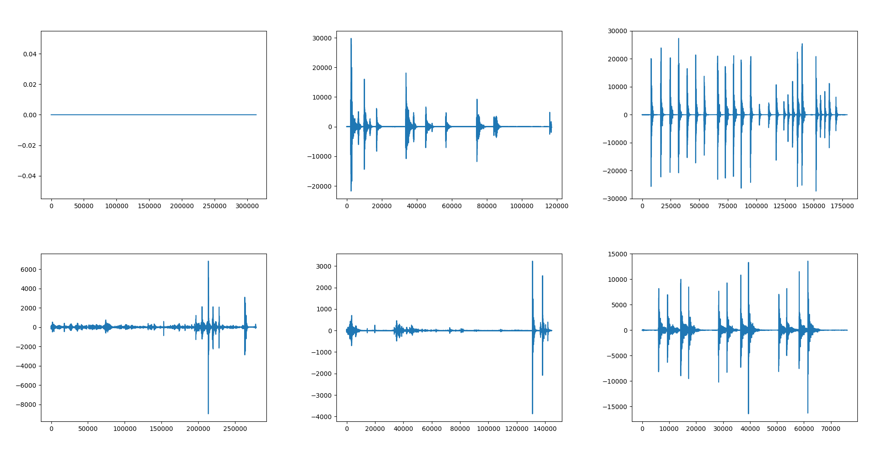
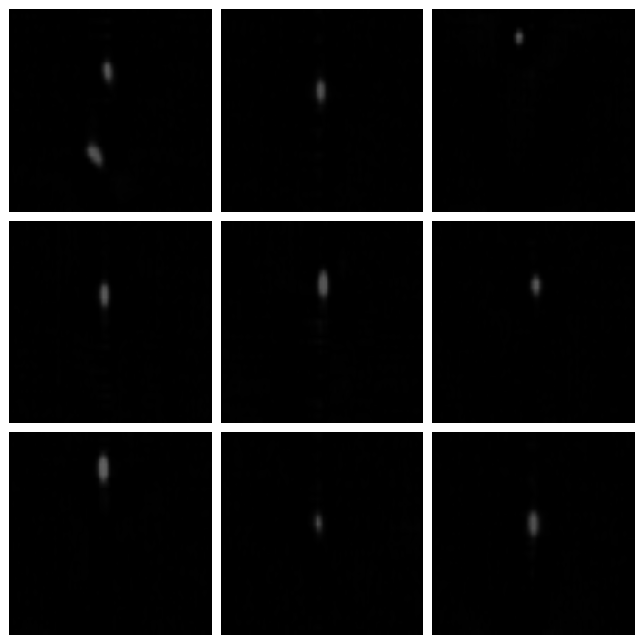
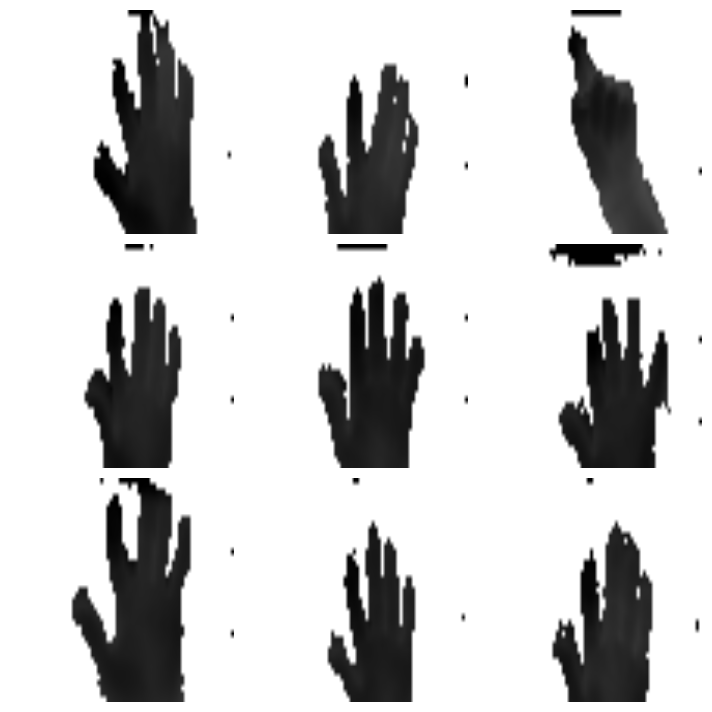

# IoT-LM：专为物联网设计的大型多感官语言模型

发布时间：2024年07月13日

`LLM应用` `物联网` `智能城市`

> IoT-LM: Large Multisensory Language Models for the Internet of Things

# 摘要

> 物联网网络，融合了数十亿智能设备，这些设备内置传感器、软件及通信技术，正迅速成为现代社会的关键支柱。IoT生态系统提供多样化的现实数据，如运动、热能、位置、图像、深度、传感器信号及音频，助力识别人与物的状态。机器学习技术在此领域大放异彩，能高效处理海量IoT数据，进而深入洞察人类福祉、精准操控设备、并促进智能城市间的互联互通。为此，我们推出了IoT-LM——一款专为IoT环境设计的开源大型多感官语言模型。IoT-LM的诞生得益于两大技术突破：首先是MultiIoT数据集，它汇聚了超过115万份样本，涵盖12种模态与8项任务，为多感官预训练与指令调优奠定基础；其次是创新的多感官多任务适配器层，它让预训练的大型语言模型能更好地适应多感官IoT数据。IoT-LM在8项IoT分类任务中表现卓越，更展现出基于IoT传感器的全新交互式问答、推理及对话功能。我们已公开IoT-LM的数据源及多感官语言建模框架，以飨研究者。

> The Internet of Things (IoT) network integrating billions of smart physical devices embedded with sensors, software, and communication technologies is a critical and rapidly expanding component of our modern world. The IoT ecosystem provides a rich source of real-world modalities such as motion, thermal, geolocation, imaging, depth, sensors, and audio to recognize the states of humans and physical objects. Machine learning presents a rich opportunity to automatically process IoT data at scale, enabling efficient inference for understanding human wellbeing, controlling physical devices, and interconnecting smart cities. To realize this potential, we introduce IoT-LM, an open-source large multisensory language model tailored for the IoT ecosystem. IoT-LM is enabled by two technical contributions: the first is MultiIoT, the most expansive unified IoT dataset to date, encompassing over 1.15 million samples from 12 modalities and 8 tasks prepared for multisensory pre-training and instruction-tuning. The second is a new multisensory multitask adapter layer to condition pre-trained large language models on multisensory IoT data. Not only does IoT-LM yield substantial improvements on 8 supervised IoT classification tasks, but it also demonstrates new interactive question-answering, reasoning, and dialog capabilities conditioned on IoT sensors. We release IoT-LM's data sources and new multisensory language modeling framework.

[Arxiv](https://arxiv.org/abs/2407.09801)