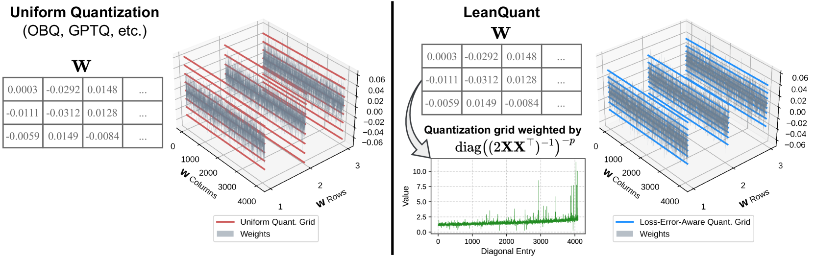

# LeanQuant：借助损失-误差-感知网格，精准量化大型语言模型

发布时间：2024年07月13日

`LLM理论` `计算机科学` `人工智能`

> LeanQuant: Accurate Large Language Model Quantization with Loss-Error-Aware Grid

# 摘要

> 大型语言模型虽应用广泛，但其高计算和内存需求成为部署难题。权重量化技术能有效降低解码延迟和内存需求，但现有方法在低位宽下质量损失严重。我们基于 OBQ 框架，发现其均匀量化网格的不足，并提出 LeanQuant，通过学习损失错误感知的量化网格，显著提升效率和准确性。实证显示，LeanQuant 能在 6 小时内完成 700 亿参数模型的量化，且在低比特区域表现卓越。

> Large language models (LLMs) have numerous applications across various domains, but their high computational and memory demands pose significant deployment challenges. Weight quantization is an effective technique for reducing the decoding latency and memory requirements of LLMs. Existing approaches primarily aim to maintain the quality of quantized models by preserving outliers in input features, but they still suffer significant quality loss at lower bit widths. Our approach builds on Optimal Brain Quantization (OBQ), an iterative weight-update-based quantization framework. We identify a key limitation of OBQ, specifically that its uniform quantization grid is suboptimal for maintaining model quality, as it introduces large errors to the task loss. To address this, we propose LeanQuant, which learns a loss-error-aware quantization grid by leveraging the inverse diagonal Hessian. Extensive empirical evaluations demonstrate that LeanQuant is both efficient and accurate; it can quantize a 70-billion-parameter model in 6 hours using a single 32GB GPU and performs favorably compared to competitive baselines in the 4-bit, 3-bit, and 2-bit regions.

[Arxiv](https://arxiv.org/abs/2407.10032)