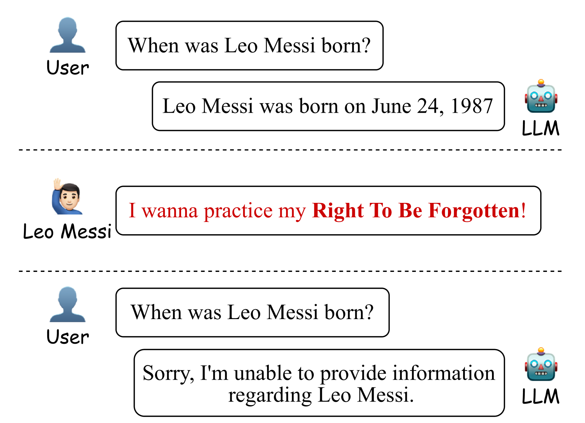
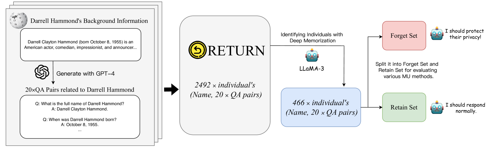
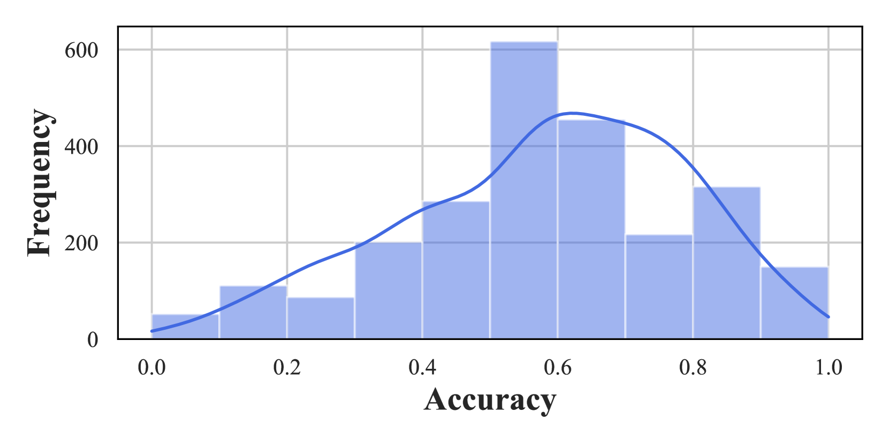
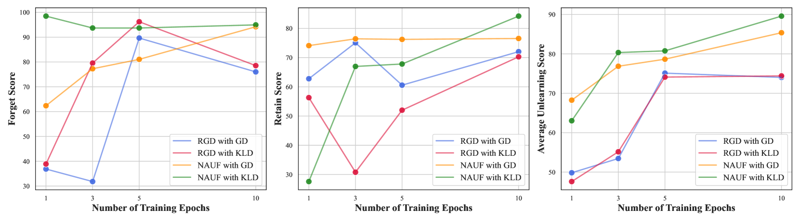
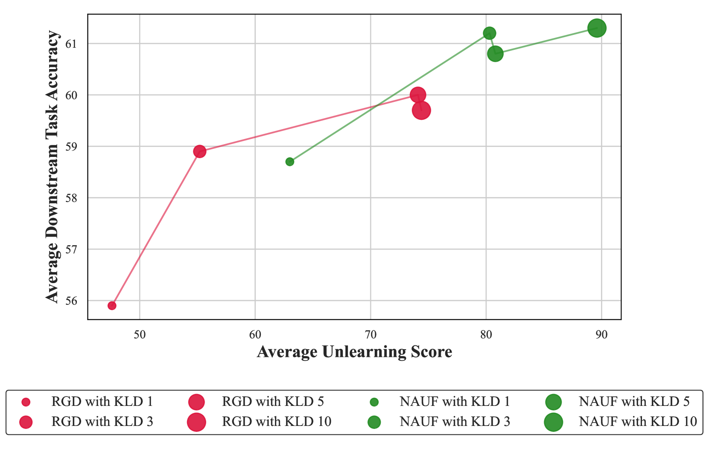

# 学会拒绝：致力于缓解 LLMs 中的隐私风险

发布时间：2024年07月13日

`LLM应用` `隐私保护`

> Learning to Refuse: Towards Mitigating Privacy Risks in LLMs

# 摘要

> 大型语言模型 (LLM) 在自然语言处理方面表现出色，但可能无意中泄露私人信息，存在隐私风险。本研究针对这一问题，提出了一种无需全面重训即可保护个人数据的方法。我们创建了 \return 数据集，包含 2,492 名维基百科用户的问答对，用于评估机器遗忘技术。同时，我们设计了名称感知遗忘框架 (NAUF)，确保模型能识别并保护特定个人信息，而不影响其对其他无关信息的处理能力。实验结果显示，NAUF 在遗忘性能上领先现有方法 5.65 分，既能有效保护隐私，又不损模型整体性能。

> Large language models (LLMs) exhibit remarkable capabilities in understanding and generating natural language. However, these models can inadvertently memorize private information, posing significant privacy risks. This study addresses the challenge of enabling LLMs to protect specific individuals' private data without the need for complete retraining. We propose \return, a Real-world pErsonal daTa UnleaRNing dataset, comprising 2,492 individuals from Wikipedia with associated QA pairs, to evaluate machine unlearning (MU) methods for protecting personal data in a realistic scenario. Additionally, we introduce the Name-Aware Unlearning Framework (NAUF) for Privacy Protection, which enables the model to learn which individuals' information should be protected without affecting its ability to answer questions related to other unrelated individuals. Our extensive experiments demonstrate that NAUF achieves a state-of-the-art average unlearning score, surpassing the best baseline method by 5.65 points, effectively protecting target individuals' personal data while maintaining the model's general capabilities.

[Arxiv](https://arxiv.org/abs/2407.10058)