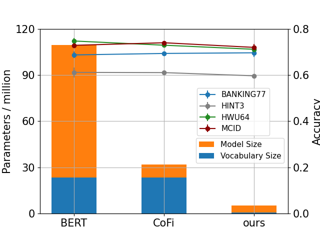
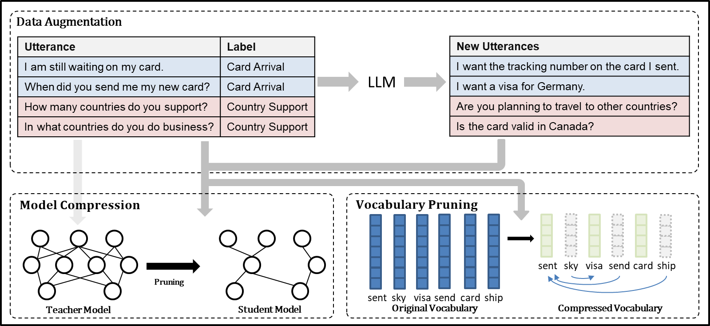
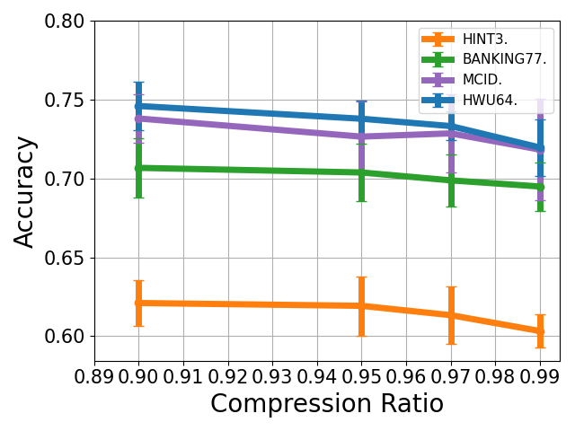
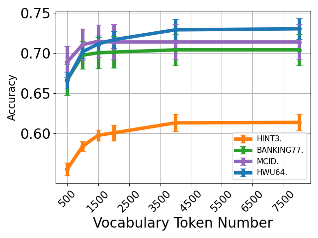
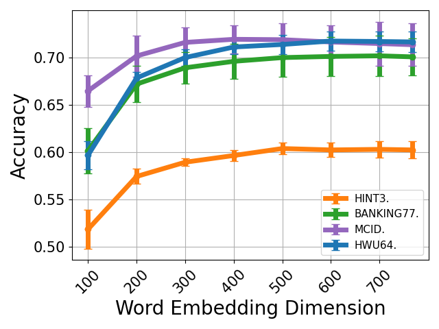

# 精简基于 PLM 的少样本意图检测器

发布时间：2024年07月13日

`LLM应用` `移动设备` `人工智能`

> Minimizing PLM-Based Few-Shot Intent Detectors

# 摘要

> 近期研究展示了在有限标注数据下，基于预训练模型训练高效意图检测器的可能性。但这些大型检测器在移动设备等资源受限环境中的部署面临挑战。为此，我们探索了减小模型尺寸的技术，包括利用LLM进行数据增强、采用尖端压缩技术进行知识蒸馏及设计V-Prune词汇剪枝机制。这些创新举措不仅将模型内存使用压缩了21倍，且在四大实际基准测试中性能几乎未损。

> Recent research has demonstrated the feasibility of training efficient intent detectors based on pre-trained language model~(PLM) with limited labeled data. However, deploying these detectors in resource-constrained environments such as mobile devices poses challenges due to their large sizes. In this work, we aim to address this issue by exploring techniques to minimize the size of PLM-based intent detectors trained with few-shot data. Specifically, we utilize large language models (LLMs) for data augmentation, employ a cutting-edge model compression method for knowledge distillation, and devise a vocabulary pruning mechanism called V-Prune. Through these approaches, we successfully achieve a compression ratio of 21 in model memory usage, including both Transformer and the vocabulary, while maintaining almost identical performance levels on four real-world benchmarks.

[Arxiv](https://arxiv.org/abs/2407.09943)