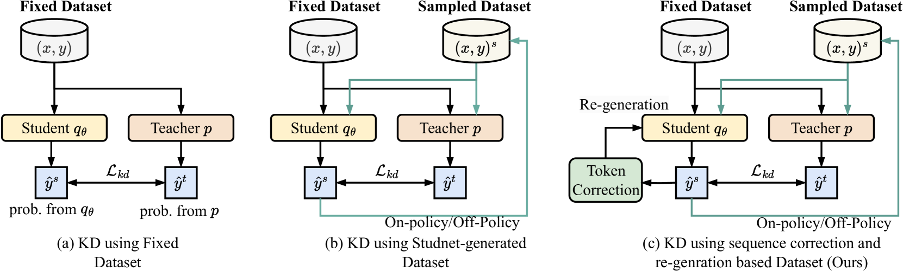
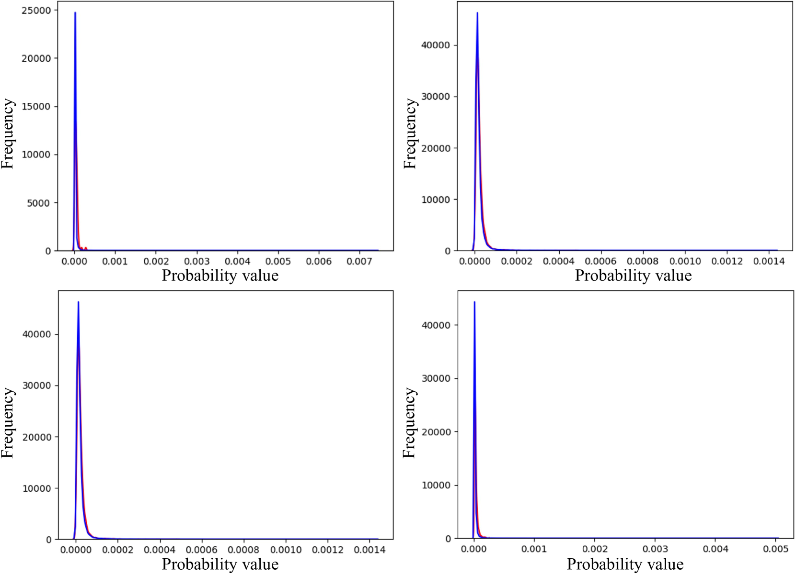

# 大型语言模型蒸馏中的多粒度语义修订

发布时间：2024年07月13日

`LLM理论` `人工智能` `软件工程`

> Multi-Granularity Semantic Revision for Large Language Model Distillation

# 摘要

> 知识蒸馏在压缩大型语言模型（LLM）中至关重要，它通过大型教师模型的引导提升小型学生模型的性能。然而，现有方法过于依赖学生生成的输出，可能引入错误并误导蒸馏过程。此外，先前的蒸馏损失函数难以对齐LLM输出中最具信息量的部分。为此，我们提出了一种多粒度语义修正方法。在序列级别，我们采用序列校正与重新生成（SCRG）策略，通过计算教师与学生的语义差异来检测并校正错误标记，从而减少生成错误并增强多样性。在标记级别，我们设计了分布自适应剪裁Kullback-Leibler（DAC-KL）损失，利用可学习子网络自适应提取语义密集区域，避免冗余信息干扰。在跨度级别，我们利用跨度先验计算概率相关性，并确保教师与学生的一致性，进一步增强语义信息传递。广泛实验表明，我们的方法在不同模型家族中表现优异，参数范围涵盖0.1B至13B。

> Knowledge distillation plays a key role in compressing the Large Language Models (LLMs), which boosts a small-size student model under large teacher models' guidance. However, existing LLM distillation methods overly rely on student-generated outputs, which may introduce generation errors and misguide the distillation process. Moreover, the distillation loss functions introduced in previous art struggle to align the most informative part due to the complex distribution of LLMs' outputs. To address these problems, we propose a multi-granularity semantic revision method for LLM distillation. At the sequence level, we propose a sequence correction and re-generation (SCRG) strategy. SCRG first calculates the semantic cognitive difference between the teacher and student to detect the error token, then corrects it with the teacher-generated one, and re-generates the sequence to reduce generation errors and enhance generation diversity. At the token level, we design a distribution adaptive clipping Kullback-Leibler (DAC-KL) loss as the distillation objective function. DAC-KL loss exploits a learnable sub-network to adaptively extract semantically dense areas from the teacher's output, avoiding the interference of redundant information in the distillation process. Finally, at the span level, we leverage the span priors of a sequence to compute the probability correlations within spans, and constrain the teacher and student's probability correlations to be consistent, further enhancing the transfer of semantic information. Extensive experiments across different model families with parameters ranging from 0.1B to 13B demonstrate the superiority of our method compared to existing methods.

[Arxiv](https://arxiv.org/abs/2407.10068)