# NativQA：为 LLM 设计的多语言、文化对齐的自然查询系统

发布时间：2024年07月13日

`LLM应用` `人工智能` `语言学`

> NativQA: Multilingual Culturally-Aligned Natural Query for LLMs

# 摘要

> 自然问题回答 (QA) 数据集对于评估和提升大型语言模型 (LLM) 的实际应用能力至关重要。然而，现有数据集大多缺乏区域和文化特定性，这限制了 LLM 在这些方面的基准测试。为此，我们提出了 NativQA 框架，旨在构建与特定文化和区域相符的母语 QA 数据集，以优化 LLM 的评估和调整。此外，我们创建了 MultiNativQA 数据集，包含约 72K 个多语言 QA 对，覆盖从高到极低资源语言，基于 18 个主题的母语者查询。我们通过对比开源和闭源 LLM 对该数据集的性能进行了基准测试，并将 NativQA 框架和 MultiNativQA 数据集公开，供社区使用。(https://nativqa.gitlab.io)

> Natural Question Answering (QA) datasets play a crucial role in developing and evaluating the capabilities of large language models (LLMs), ensuring their effective usage in real-world applications. Despite the numerous QA datasets that have been developed, there is a notable lack of region-specific datasets generated by native users in their own languages. This gap hinders the effective benchmarking of LLMs for regional and cultural specificities. In this study, we propose a scalable framework, NativQA, to seamlessly construct culturally and regionally aligned QA datasets in native languages, for LLM evaluation and tuning. Moreover, to demonstrate the efficacy of the proposed framework, we designed a multilingual natural QA dataset, MultiNativQA, consisting of ~72K QA pairs in seven languages, ranging from high to extremely low resource, based on queries from native speakers covering 18 topics. We benchmark the MultiNativQA dataset with open- and closed-source LLMs. We made both the framework NativQA and MultiNativQA dataset publicly available for the community. (https://nativqa.gitlab.io)

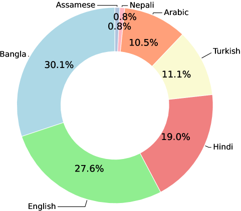

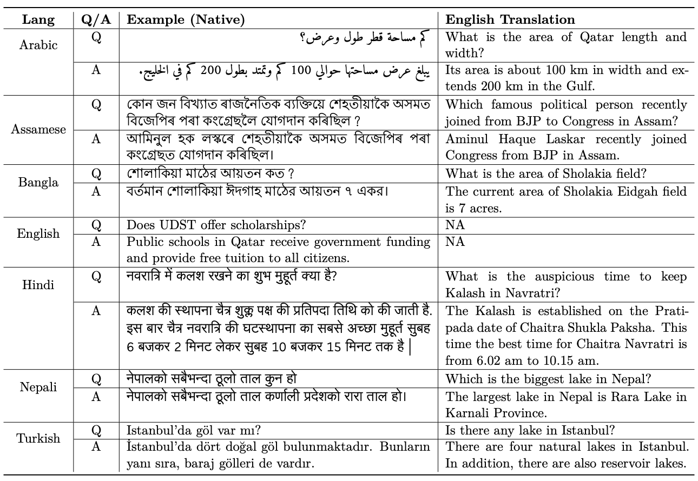

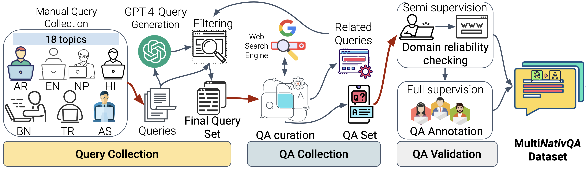

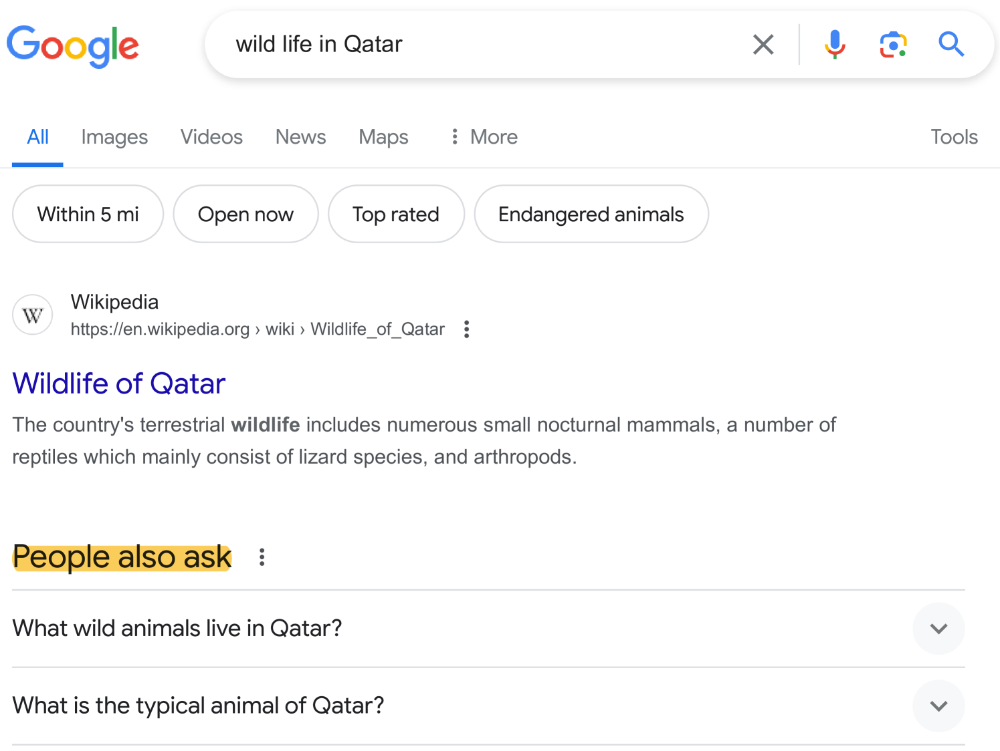

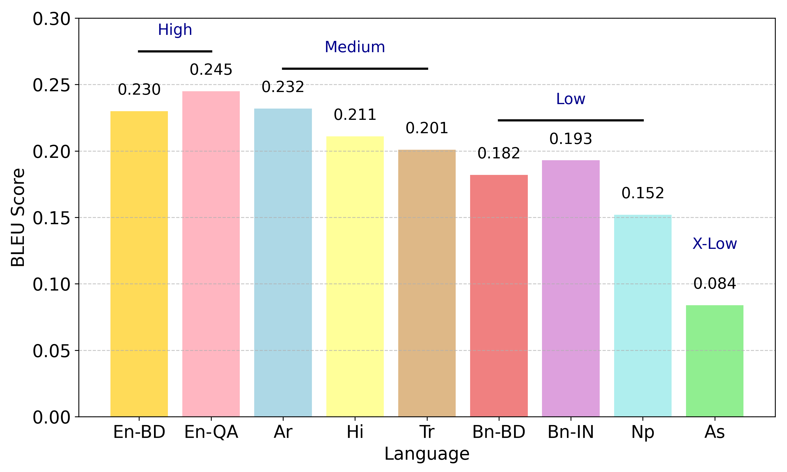

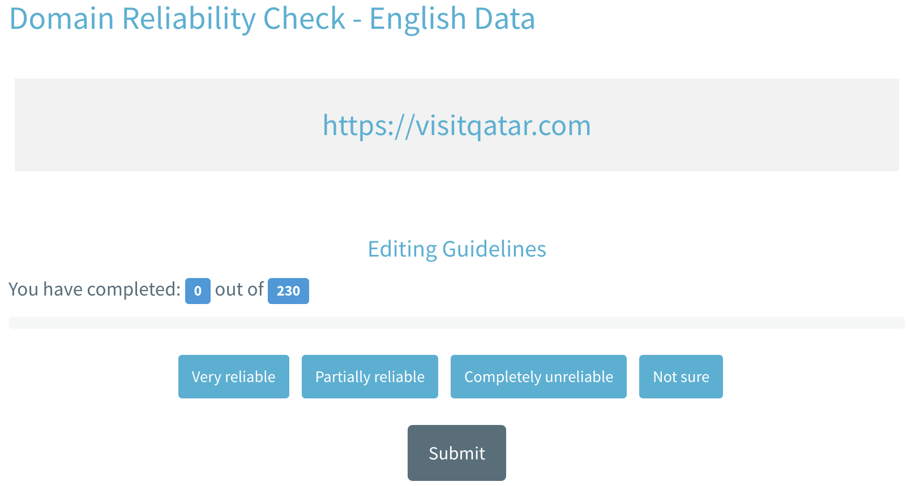

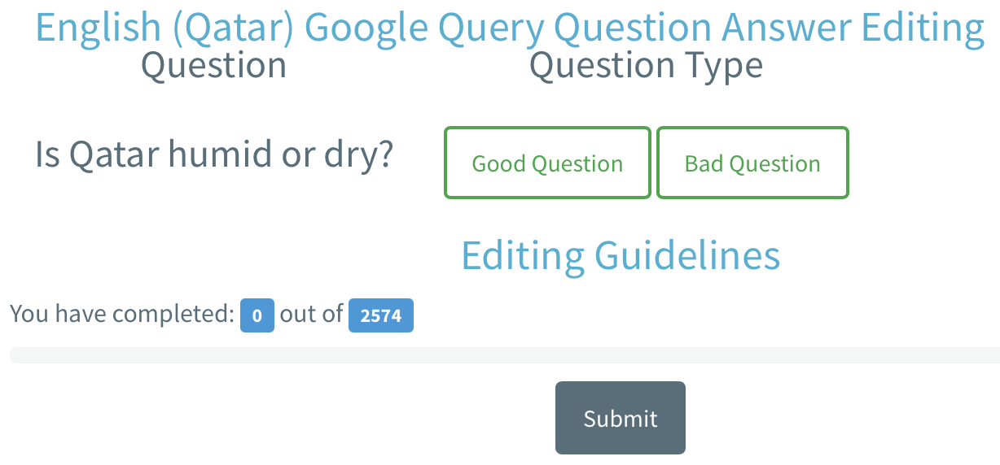

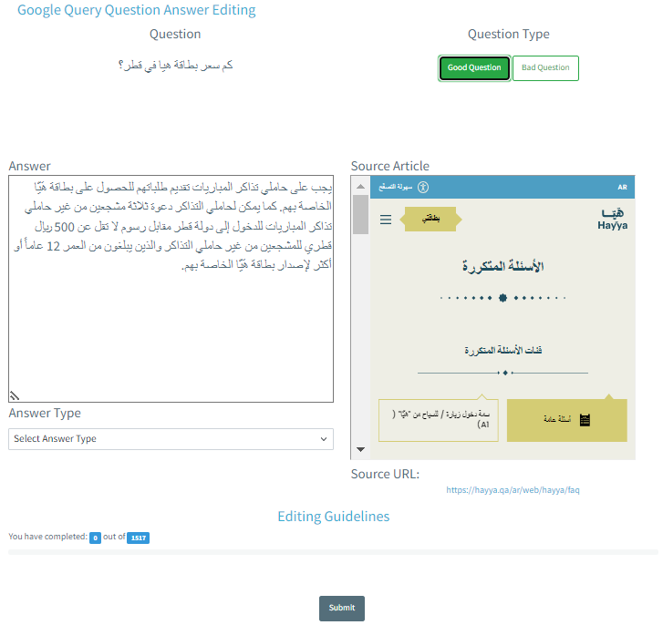

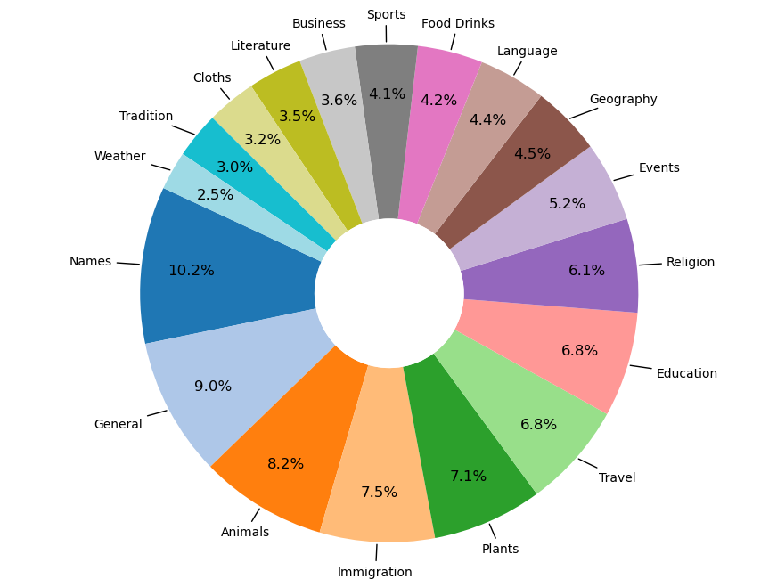

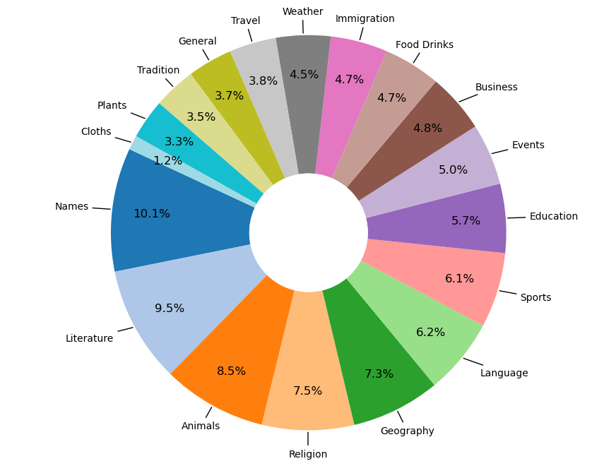

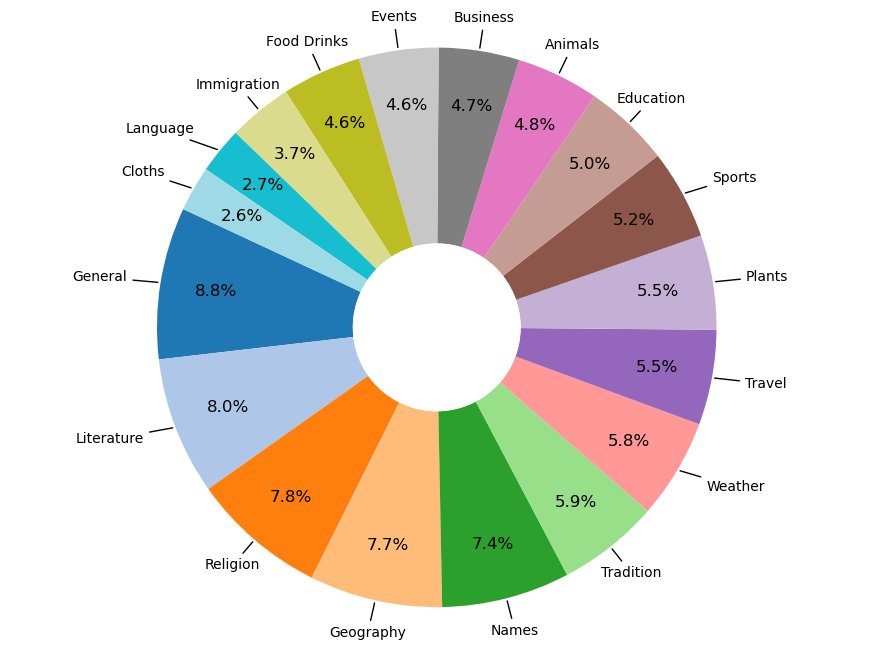

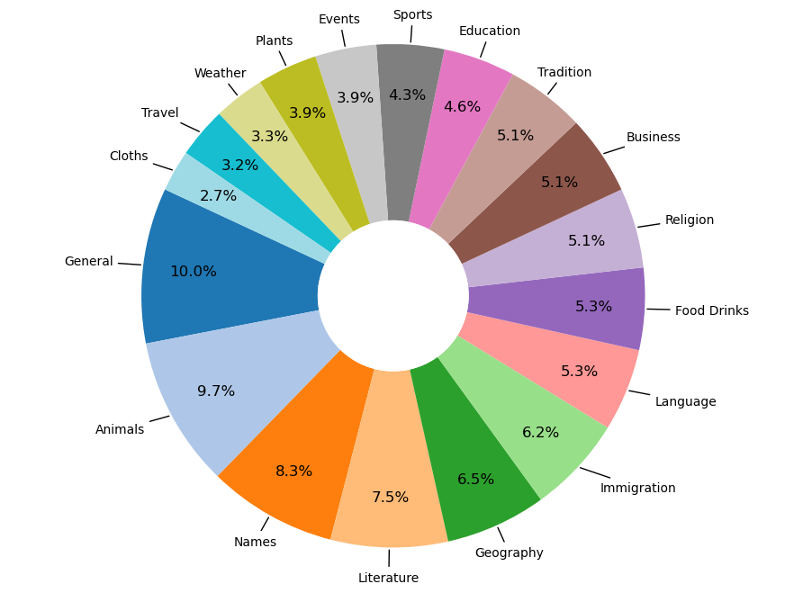

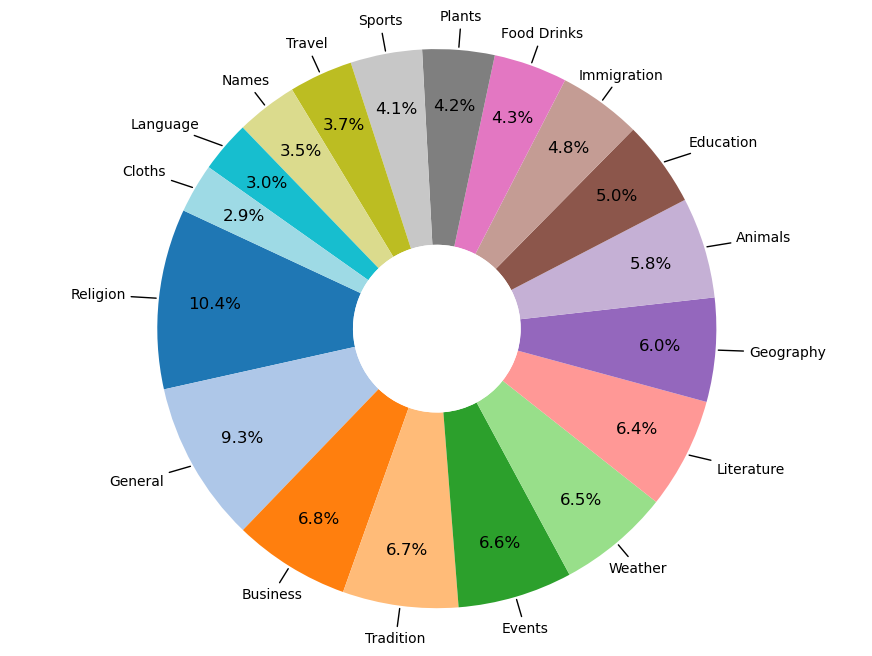

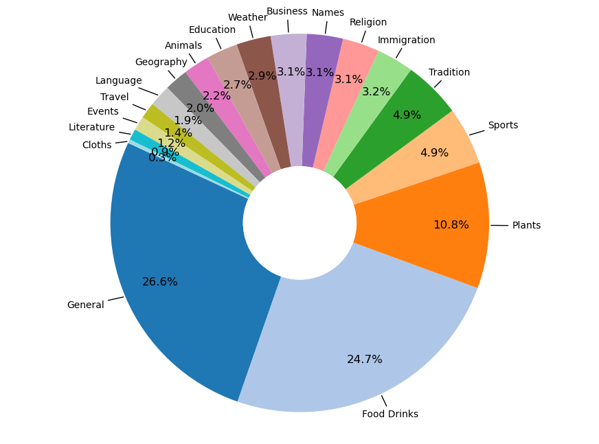

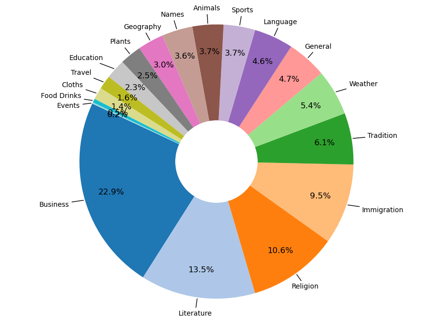

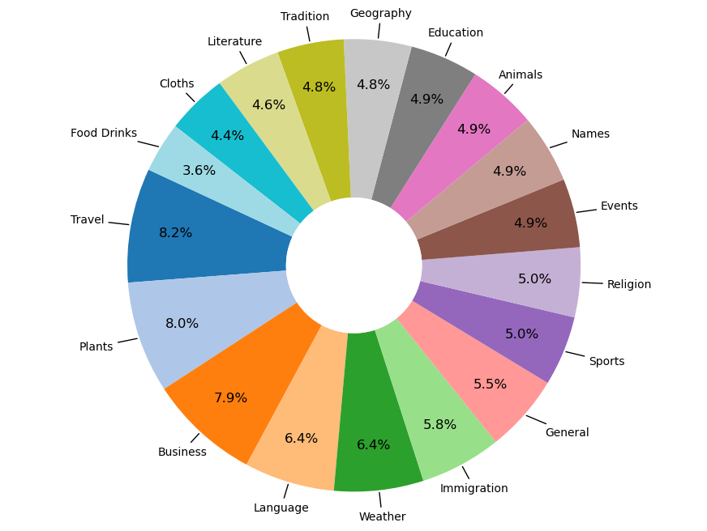

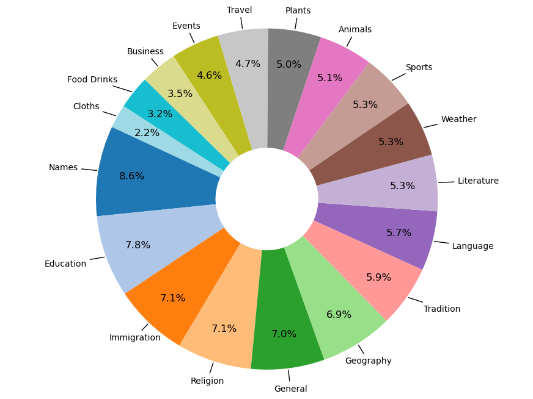

[Arxiv](https://arxiv.org/abs/2407.09823)