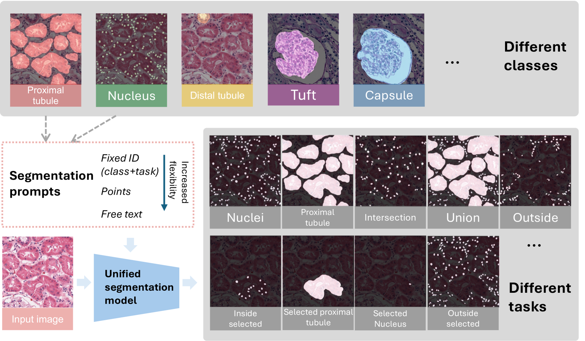
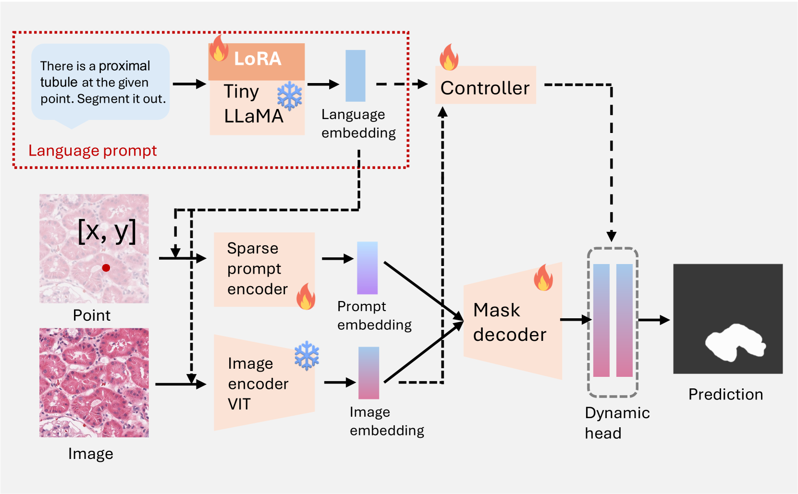

# PFPs：借助大型视觉与语言模型，通过提示引导实现灵活的病理分割，适用于多样化的潜在结果分析。

发布时间：2024年07月13日

`LLM应用` `人工智能`

> PFPs: Prompt-guided Flexible Pathological Segmentation for Diverse Potential Outcomes Using Large Vision and Language Models

# 摘要

> Vision Foundation Model 在医学图像分析中崭露头角，其零-shot 学习能力不仅加速了 AI 部署，还提升了临床应用的泛化性。但在分割病理图像时，对分割目标的灵活性要求尤为突出。例如，在 Whole Slide Image (WSI) 上的单次点击可能代表不同层次的复杂性。现有模型虽能预测结果，却难以适应医生的灵活输入。本文中，我们通过结合大型语言模型 (LLM) 和传统任务令牌，探索了提升分割模型灵活性的新途径。我们的研究成果包括：(1) 构建了一个高效计算的流水线，利用微调的语言提示实现灵活的多类别分割；(2) 对比了固定提示与自由文本的分割效果；(3) 设计了多任务的肾脏病理分割数据集及相应的自由文本提示；(4) 在肾脏病理数据集上验证了我们的方法，考察了其在处理新病例时的能力。

> The Vision Foundation Model has recently gained attention in medical image analysis. Its zero-shot learning capabilities accelerate AI deployment and enhance the generalizability of clinical applications. However, segmenting pathological images presents a special focus on the flexibility of segmentation targets. For instance, a single click on a Whole Slide Image (WSI) could signify a cell, a functional unit, or layers, adding layers of complexity to the segmentation tasks. Current models primarily predict potential outcomes but lack the flexibility needed for physician input. In this paper, we explore the potential of enhancing segmentation model flexibility by introducing various task prompts through a Large Language Model (LLM) alongside traditional task tokens. Our contribution is in four-fold: (1) we construct a computational-efficient pipeline that uses finetuned language prompts to guide flexible multi-class segmentation; (2) We compare segmentation performance with fixed prompts against free-text; (3) We design a multi-task kidney pathology segmentation dataset and the corresponding various free-text prompts; and (4) We evaluate our approach on the kidney pathology dataset, assessing its capacity to new cases during inference.

[Arxiv](https://arxiv.org/abs/2407.09979)