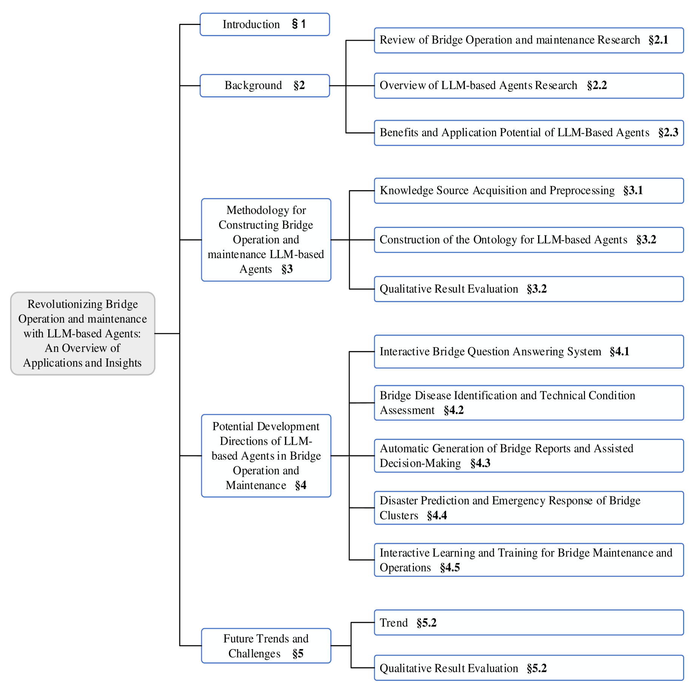
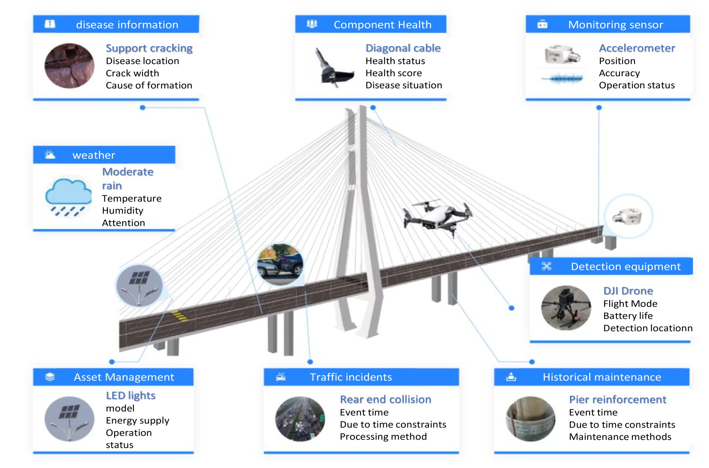
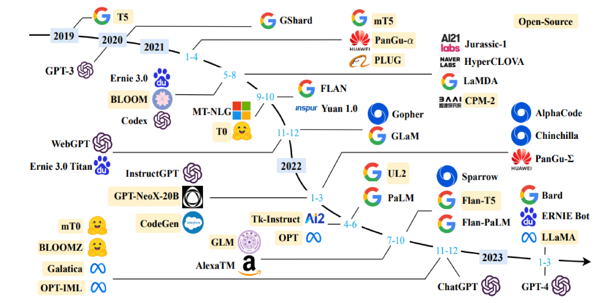
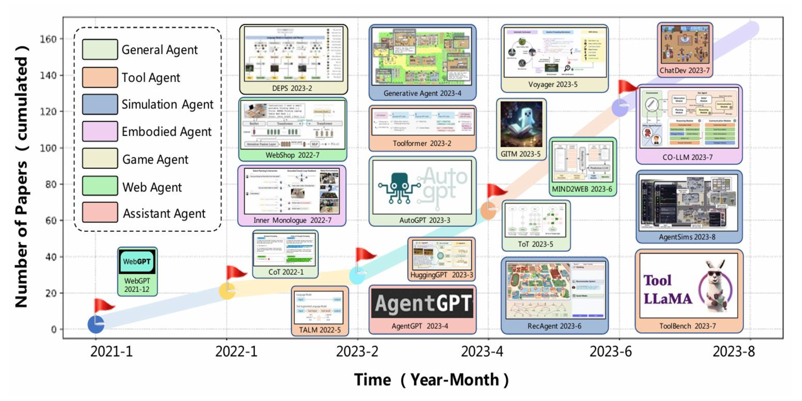
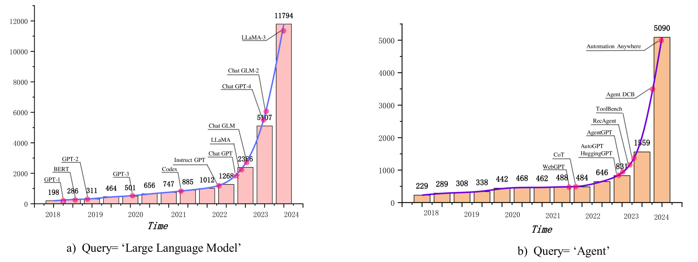
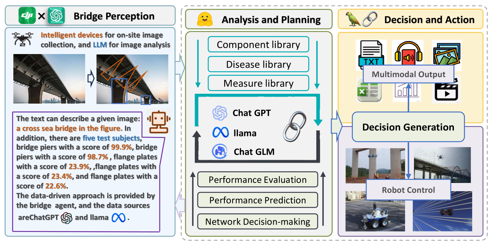

# LLM 代理正引领桥梁运维革新，本文概述其应用与洞察。

发布时间：2024年07月13日

`Agent` `桥梁运维` `人工智能`

> Revolutionizing Bridge Operation and maintenance with LLM-based Agents: An Overview of Applications and Insights

# 摘要

> 在人类社会发展的多个工业领域，人们不断探索解放劳动力的方法。基于LLM构建的代理被视为实现这一目标的有效工具。代理作为具备感知、规划、决策和行动能力的人工智能实体，在多个领域创造了显著的生产价值。然而，桥梁运维领域的智能化水平相对较低。尽管如此，该领域已发展出多种智能检测设备、机器学习算法及自主评估决策方法，为人工智能在该领域的突破提供了基础。本研究旨在探讨基于大规模语言模型的AI体对桥梁运维领域的影响，并分析其对核心任务的潜在挑战与机遇。通过深入研究，本文期望为理解该领域智能体的应用提供更全面的视角。

> In various industrial fields of human social development, people have been exploring methods aimed at freeing human labor. Constructing LLM-based agents is considered to be one of the most effective tools to achieve this goal. Agent, as a kind of human-like intelligent entity with the ability of perception, planning, decision-making, and action, has created great production value in many fields. However, the bridge O\&M field shows a relatively low level of intelligence compared to other industries. Nevertheless, the bridge O\&M field has developed numerous intelligent inspection devices, machine learning algorithms, and autonomous evaluation and decision-making methods, which provide a feasible basis for breakthroughs in artificial intelligence in this field. The aim of this study is to explore the impact of AI bodies based on large-scale language models on the field of bridge O\&M and to analyze the potential challenges and opportunities it brings to the core tasks of bridge O\&M. Through in-depth research and analysis, this paper expects to provide a more comprehensive perspective for understanding the application of intelligentsia in this field.

[Arxiv](https://arxiv.org/abs/2407.10064)